API Reference
=============
Here are all public functions in the uAdmin, their format, and how to use them in the project.

* `uadmin.Action`_
* `uadmin.AdminPage`_
* `uadmin.All`_
* `uadmin.AllowedIPs`_
* `uadmin.Approval`_
* `uadmin.ApprovalAction`_
* `uadmin.ApprovalHandleFunc`_
* `uadmin.BindIP`_
* `uadmin.BlockedIPs`_
* `uadmin.CacheTranslation`_
* `uadmin.CheckRateLimit`_
* `uadmin.Choice`_
* `uadmin.ClearDB`_
* `uadmin.CookieTimeout`_
* `uadmin.Count`_
* `uadmin.CustomTranslation`_
* `uadmin.DashboardMenu`_
* `uadmin.Database`_
* `uadmin.DataType`_
* `uadmin.DBSettings`_
* `uadmin.DEBUG`_
* `uadmin.DebugDB`_
* `uadmin.DefaultMediaPermission`_
* `uadmin.Delete`_
* `uadmin.DeleteList`_
* `uadmin.EmailFrom`_
* `uadmin.EmailPassword`_
* `uadmin.EmailSMTPServer`_
* `uadmin.EmailSMTPServerPort`_
* `uadmin.EmailUsername`_
* `uadmin.EncryptKey`_
* `uadmin.ERROR`_
* `uadmin.ErrorHandleFunc`_
* `uadmin.F`_
* `uadmin.FieldType`_
* `uadmin.Filter`_
* `uadmin.FilterBuilder`_
* `uadmin.FilterList`_
* `uadmin.GenerateBase32`_
* `uadmin.GenerateBase64`_
* `uadmin.Get`_
* `uadmin.GetDB`_
* `uadmin.GetForm`_
* `uadmin.GetID`_
* `uadmin.GetSetting`_
* `uadmin.GetString`_
* `uadmin.GetStringer`_
* `uadmin.GetUserFromRequest`_
* `uadmin.GroupPermission`_
* `uadmin.HideInDashboarder`_
* `uadmin.INFO`_
* `uadmin.IsAuthenticated`_
* `uadmin.JSONMarshal`_
* `uadmin.Language`_
* `uadmin.Log`_
* `uadmin.LogAdd`_
* `uadmin.LogDelete`_
* `uadmin.LogEdit`_
* `uadmin.Login`_
* `uadmin.Login2FA`_
* `uadmin.Logout`_
* `uadmin.LogRead`_
* `uadmin.MaxImageHeight`_
* `uadmin.MaxImageWidth`_
* `uadmin.MaxUploadFileSize`_
* `uadmin.Model`_
* `uadmin.ModelSchema`_
* `uadmin.NewModel`_
* `uadmin.NewModelArray`_
* `uadmin.OptimizeSQLQuery`_
* `uadmin.OK`_
* `uadmin.OTPAlgorithm`_
* `uadmin.OTPDigits`_
* `uadmin.OTPPeriod`_
* `uadmin.OTPSkew`_
* `uadmin.PageLength`_
* `uadmin.Port`_
* `uadmin.Preload`_
* `uadmin.PublicMedia`_
* `uadmin.RateLimit`_
* `uadmin.RateLimitBurst`_
* `uadmin.Register`_
* `uadmin.RegisterInlines`_
* `uadmin.RenderHTML`_
* `uadmin.ReportingLevel`_
* `uadmin.ReportTimeStamp`_
* `uadmin.RestrictSessionIP`_
* `uadmin.RetainMediaVersions`_
* `uadmin.ReturnJSON`_
* `uadmin.RootURL`_
* `uadmin.Salt`_
* `uadmin.Save`_
* `uadmin.Schema`_
* `uadmin.SendEmail`_
* `uadmin.Session`_
* `uadmin.Setting`_
* `uadmin.SettingCategory`_
* `uadmin.SiteName`_
* `uadmin.StartSecureServer`_
* `uadmin.StartServer`_
* `uadmin.Tf`_
* `uadmin.Theme`_
* `uadmin.Trail`_
* `uadmin.Translate`_
* `uadmin.Update`_
* `uadmin.User`_
* `uadmin.UserGroup`_
* `uadmin.UserPermission`_
* `uadmin.ValidateIP`_
* `uadmin.Version`_
* `uadmin.WARNING`_
* `uadmin.WORKING`_

Functions
---------

**uadmin.Action**
^^^^^^^^^^^^^^^^^
Action is the process of doing something where you can check the status of your activities in the uAdmin project.

Type:

.. code-block:: go

    int

There are 11 types of actions:

* **Added** - Saved a new record
* **Custom** - For any other action that you would like to log
* **Deleted** - Deleted a record
* **LoginDenied** - User invalid login
* **LoginSuccessful** - User login
* **Logout** - User logout
* **Modified** - Save an existing record
* **PasswordResetDenied** - A password reset attempt was rejected
* **PasswordResetRequest** - A password reset was received
* **PasswordResetSuccessful** - A password was reset
* **Read** - Opened a record

Open "LOGS" in the uAdmin dashboard. You can see the Action field inside it as shown below.

.. image:: assets/actionhighlighted.png

|

Now go to the main.go. Let's add each methods of actions in the log.

.. code-block:: go

    func main(){
        // Some codes
        for i := 0; i < 11; i++ {
            // Initialize the log model
            log := uadmin.Log{}

            // Call each methods of action based on the specific loop count
            switch i {
            case 0:
                log.Action = uadmin.Action(0).Added()
            case 1:
                log.Action = uadmin.Action(0).Custom()
            case 2:
                log.Action = uadmin.Action(0).Deleted()
            case 3:
                log.Action = uadmin.Action(0).LoginDenied()
            case 4:
                log.Action = uadmin.Action(0).LoginSuccessful()
            case 5:
                log.Action = uadmin.Action(0).Logout()
            case 6:
                log.Action = uadmin.Action(0).Modified()
            case 7:
                log.Action = uadmin.Action(0).PasswordResetDenied()
            case 8:
                log.Action = uadmin.Action(0).PasswordResetRequest()
            case 9:
                log.Action = uadmin.Action(0).PasswordResetSuccessful()
            default:
                log.Action = uadmin.Action(0).Read()
            }

            // Add the method to the logs
            log.Save()
        }
    }

Once you are done, rebuild your application. Check your "LOGS" again to see the result.

.. image:: assets/actionlist.png

|

As expected, all types of actions were added in the logs. Good job man!

More examples of this function can be found in `uadmin.Log`_.
    
**uadmin.AdminPage**
^^^^^^^^^^^^^^^^^^^^
AdminPage fetches records from the database with some standard rules such as sorting data, multiples of, and setting a limit that can be used in pagination.

Function:

.. code-block:: go

    func(order string, asc bool, offset int, limit int, a interface{}, query interface{}, args ...interface{}) (err error)

Parameters:

    **order string:** Is the field you want to specify in the database.

    **asc bool:** true in ascending order, false in descending order.

    **offset int:** Is the starting point of your list.

    **limit int:** Is the number of records that you want to display in your application.

    **a interface{}:** Is the variable where the model was initialized

    **query interface{}:** Is an action that you want to perform in your database

    **args ...interface{}:** Is the series of arguments for query input

Used in the tutorial:

* `uAdmin Tutorial Part 8 - Customizing your API Handler`_

.. _uAdmin Tutorial Part 8 - Customizing your API Handler: https://uadmin-docs.readthedocs.io/en/latest/tutorial/part8.html

Create a file named admin_page_list.go inside the api folder with the following codes below:

.. code-block:: go

    // AdminPageHandler !
    func AdminPageHandler(w http.ResponseWriter, r *http.Request) {
        r.URL.Path = strings.TrimPrefix(r.URL.Path, "/admin_page_list")

        todo := []models.Todo{}

        // "id" - order the todo model by id field
        // false - to sort in descending order
        // 0 - start at index 0
        // 3 - get three records
        // &todo - todo model to execute
        // id > ? - a query where id is greater than the value
        // 0 - a value to be set in ?
        uadmin.AdminPage("id", false, 0, 3, &todo, "id > ?", 0) // <-- place it here

        uadmin.ReturnJSON(w, r, todo)
    }

Establish a connection in the main.go to the API by using http.HandleFunc. It should be placed after the uadmin.Register and before the StartServer.

.. code-block:: go

    func main() {
        // Some codes

        // AdminPageHandler
        http.HandleFunc("/api/", api.AdminPageHandler)
    }

api is the folder name while AdminPageHandler is the name of the function inside admin_page_list.go.

Run your application and see what happens.

.. image:: assets/adminpagelistapi.png
   :align: center

**uadmin.All**
^^^^^^^^^^^^^^
All fetches all object in the database.

Function:

.. code-block:: go

    func(a interface{}) (err error)

Parameter:

    **a interface{}:** Is the variable where the model was initialized

Used in the tutorial:

* `uAdmin Tutorial Part 7 - Introduction to API`_
* `uAdmin Tutorial Part 12 - Storing the data to HTML`_

.. _uAdmin Tutorial Part 7 - Introduction to API: https://uadmin-docs.readthedocs.io/en/latest/tutorial/part7.html
.. _uAdmin Tutorial Part 12 - Storing the data to HTML: https://uadmin-docs.readthedocs.io/en/latest/tutorial/part12.html

Before we proceed to the example, read `Tutorial Part 7 - Introduction to API`_ to familiarize how API works in uAdmin.

.. _Tutorial Part 7 - Introduction to API: https://uadmin-docs.readthedocs.io/en/latest/tutorial/part7.html

Create a file named friend_list.go inside the api folder with the following codes below:

.. code-block:: go

    // FriendListHandler !
    func FriendListHandler(w http.ResponseWriter, r *http.Request) {
        r.URL.Path = strings.TrimPrefix(r.URL.Path, "/friend_list")

        friend := []models.Friend{}
        uadmin.All(&friend) // <-- place it here

        uadmin.ReturnJSON(w, r, friend)
    }

Establish a connection in the main.go to the API by using http.HandleFunc. It should be placed after the uadmin.Register and before the StartServer.

.. code-block:: go

    func main() {
        // Some codes

        // FriendListHandler
        http.HandleFunc("/friend_list/", api.FriendListHandler) // <-- place it here
    }

api is the folder name while FriendListHandler is the name of the function inside friend_list.go.

Run your application and see what happens.

.. image:: assets/friendlistapi.png
   :align: center

**uadmin.AllowedIPs**
^^^^^^^^^^^^^^^^^^^^^
AllowedIPs is a list of allowed IPs to access uAdmin interface in one of the following formats:

- "*" = Allow all
- "" = Allow none
- "192.168.1.1" = Only allow this IP
- "192.168.1.0/24" = Allow all IPs from 192.168.1.1 to 192.168.1.254

You can also create a list of the above formats using comma to separate them.

For example: "192.168.1.1, 192.168.1.2, 192.168.0.0/24"

Type:

.. code-block:: go

    string

Go to the main.go and assign your IP address connected on your PC in the AllowedIPs function.

.. code-block:: go

    func main() {
        // Your IP address
        uadmin.AllowedIPs = "192.168.1.1"
    }

Run your application and see what happens.

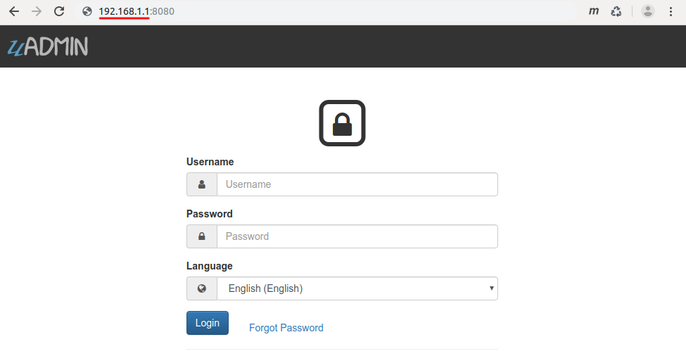

**uadmin.Approval**
^^^^^^^^^^^^^^^^^^^
Approval is a feature used to set an approval permission in the field.

Structure:

.. code-block:: go

    type Approval struct {
        ModelName           string
        ModelPK             uint
        ColumnName          string
        OldValue            string
        NewValue            string
        NewValueDescription string
        ChangedBy           string
        ChangeDate          time.Time
        ApprovalAction      ApprovalAction
        ApprovalBy          string
        ApprovalDate        *time.Time
        ViewRecord          string
        UpdatedBy           string
    }

Here are the following fields and their definitions:

* **ModelName** - The name of the Model in small letters
* **ModelPK** - Used to uniquely identify each row in the table
* **ColumnName** - The name of the column in the model
* **OldValue** - A value that was assigned before
* **NewValue** - A value that you want to replace from the old value
* **NewValueDescription** - A value that was stored from the new value after saving
* **ChangedBy** - Returns the username who changed the value of the field record
* **ChangeDate** - The date when the value of the field record was changed
* **ApprovalAction** - A selection of approval actions. There are two selections: Approved and Declined.
* **ApprovalBy** - Returns the username who approved the value of the field record
* **ApprovalDate** - The date when the value of the field record was approved
* **ViewRecord** - A link to view the information of the actual record
* **UpdatedBy** - Returns the username who updated the record

There are 2 functions that you can use in Approval:

* **Save()** - Saves the object in the database
* **String()** - Returns the Model Name, Model PK, and Column Name

There are 2 ways you can do for initialization process using this function: one-by-one and by group.

One-by-one initialization:

.. code-block:: go

    func main(){
        // Some codes
        approval := uadmin.Approval{}
        approval.ModelName = "Model Name"
        approval.ModelPK = 1
        approval.ColumnName = "Column Name"
    }

By group initialization:

.. code-block:: go

    func main(){
        // Some codes
        approval := uadmin.Approval{
            ModelName:  "Model Name",
            ModelPK:    1,
            ColumnName: "Column Name",
        }
    }

In this example, we will use “by group” initialization process.

Suppose the user has assigned a name by mistake and the approver has rejected the record by mistake.

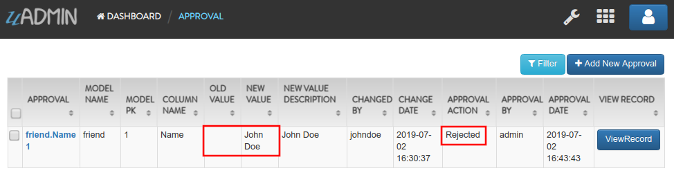

|

Go to the main.go and apply the following codes below:

.. code-block:: go

    func main(){
        // Some codes

        // Get the record in the user model where the approver is an admin
        approver := uadmin.User{}
        uadmin.Get(&approver, "id = ?", 1)

        // Get the record in the user model where johndoe is the user
        user := uadmin.User{}
        uadmin.Get(&user, "id = ?", 2)

        // Get an old approval record
        a := uadmin.Approval{}
        uadmin.Get(&a, "id = ?", 1)

        // Assign the date and time today
        now := time.Now()

        // Subtract the time by one hour
        then := now.Add(-time.Hour)

        // Assign a value that you want to update in the old record
        b := uadmin.Approval{
            OldValue:            a.NewValueDescription,
            NewValue:            "Jane Doe",
            NewValueDescription: "Jane Doe",
            ChangedBy:           user.Username,
            ChangeDate:          then,
            ApprovalAction:      uadmin.ApprovalAction(0).Approved(),
            ApprovalBy:          approver.Username,
            ApprovalDate:        &now,
        }

        // Update the record here
        uadmin.Update(&a, "old_value", b.OldValue, "id = ?", 1)
        uadmin.Update(&a, "new_value", b.NewValue, "id = ?", 1)
        uadmin.Update(&a, "new_value_description", b.NewValueDescription, "id = ?", 1)
        uadmin.Update(&a, "changed_by", b.ChangedBy, "id = ?", 1)
        uadmin.Update(&a, "change_date", b.ChangeDate, "id = ?", 1)
        uadmin.Update(&a, "approval_action", b.ApprovalAction, "id = ?", 1)
        uadmin.Update(&a, "approval_by", b.ApprovalBy, "id = ?", 1)
        uadmin.Update(&a, "approval_date", b.ApprovalDate, "id = ?", 1)

        // Get the record in the friend model based on the model primary key
        friend := models.Friend{}
        uadmin.Get(&friend, "id = ?", a.ModelPK)

        // Update the name to the Friend model based on the model primary key
        uadmin.Update(&friend, "name", a.NewValue, "id = ?", a.ModelPK)
    }

Run your application and see what happens.

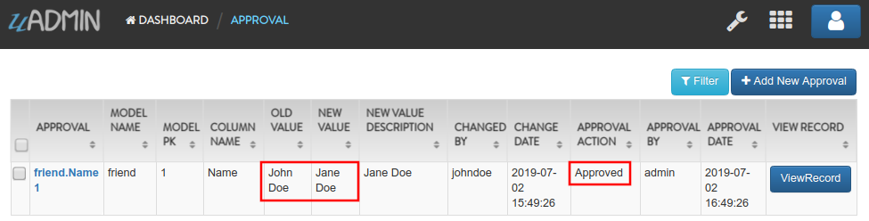

|

As expected, the old approval record has been updated. Now click on View Record button to see if the name of the Friend and the approval status were updated.

.. image:: assets/friendnameapprovalupdated.png
   :align: center

**uadmin.ApprovalAction**
^^^^^^^^^^^^^^^^^^^^^^^^^
ApprovalAction is a selection of approval actions. There are two functions: Approved and Rejected.

Type:

.. code-block:: go

    int

See `uadmin.Approval`_  and `uadmin.ApprovalHandleFunc`_ for the examples.

**uadmin.ApprovalHandleFunc**
^^^^^^^^^^^^^^^^^^^^^^^^^^^^^
ApprovalHandleFunc is a function that will be called everytime a model is called. It receives a parameter for an approval system model.

Function:

.. code-block:: go

    func(a *uadmin.Approval)

Before you proceed to this example, see `uadmin.Approval`_, `Approval Tag`_, or `Approval System`_.

.. _Approval Tag: https://uadmin-docs.readthedocs.io/en/latest/tags.html#approval
.. _Approval System: https://uadmin-docs.readthedocs.io/en/latest/system_reference.html#approval

Suppose you have this email in the Friend model that has an ID of 1.

.. image:: assets/johndoeoldemail.png
   :align: center

|

Go to the main.go and apply the following codes below:

.. code-block:: go

    func main() {
        // Some codes

        // Generic approval validation based on the model that was called
        uadmin.ApprovalHandleFunc = func(a *uadmin.Approval) {

            // Check whether a model name is friend and approval action is
            // Approved
            if a.ModelName == "friend" && a.ApprovalAction == a.ApprovalAction.Approved() {

                // Initialize a Friend model
                f := models.Friend{}

                // Get the record based on the model primary key
                uadmin.Get(&f, "id = ?", a.ModelPK)

                // Assign an email
                f.Email = "uadmin-support@email.com"

                // Save changes
                uadmin.Save(&f)
            }
        }
    }

From uAdmin dashboard, go to Approvals model, click the existing record in the list, choose Approved in Approval Action then click Save button below.

.. image:: assets/friendemailapproved.png

|

Click View Button on the right side of the record to see the result.

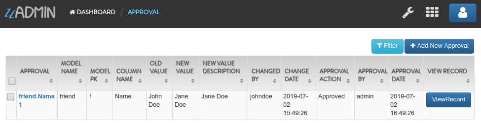

|

As expected, the email on that record was changed.

.. image:: assets/uadminsupportemail.png
   :align: center

**uadmin.BindIP**
^^^^^^^^^^^^^^^^^
BindIP is the IP the application listens to.

Type:

.. code-block:: go

    string

Go to the main.go. Connect to the server using a loopback IP address (127.x.x.x). Let's say **127.0.0.2**.

.. code-block:: go

    func main() {
        // Some codes
        uadmin.BindIP = "127.0.0.2" // <--  place it here
    }

If you run your code,

.. code-block:: bash

    [   OK   ]   Initializing DB: [12/12]
    [   OK   ]   Server Started: http://127.0.0.2:8080
             ___       __          _
      __  __/   | ____/ /___ ___  (_)___
     / / / / /| |/ __  / __  __ \/ / __ \
    / /_/ / ___ / /_/ / / / / / / / / / /
    \__,_/_/  |_\__,_/_/ /_/ /_/_/_/ /_/

In the Server Started, it will redirect you to the IP address of **127.0.0.2**.

But if you connect to other private IP addresses, it will not work as shown below (User connects to 127.0.0.3).

.. image:: tutorial/assets/bindiphighlighted.png

**uadmin.BlockedIPs**
^^^^^^^^^^^^^^^^^^^^^
BlockedIPs is a list of blocked IPs from accessing uAdmin interface in one of the following formats:

- "*" = Block all
- "" = Block none
- "192.168.1.1" = Only block this IP
- "192.168.1.0/24" = Block all IPs from 192.168.1.1 to 192.168.1.254

You can also create a list of the above formats using comma to separate them.

For example: "192.168.1.1, 192.168.1.2, 192.168.0.0/24"

Type:

.. code-block:: go

    string

Go to the main.go and assign your IP address connected on your PC in the BlockedIPs function.

.. code-block:: go

    func main() {
        // Your IP address
        uadmin.BlockedIPs = "192.168.1.1"
    }

Run your application and see what happens.

.. image:: assets/blockedipsresult.png

**uadmin.CacheTranslation**
^^^^^^^^^^^^^^^^^^^^^^^^^^^
CacheTranslation allows a translation to store data in a cache memory.

Type:

.. code-block:: go

    bool

Example:

.. code-block:: go

    package main

    import (
        "github.com/uadmin/uadmin"
    )

    func main() {
        // Allows a translation to store data in a cache memory
        uadmin.CacheTranslation = true

        // Prohibits a translation to store data in a cache memory
        uadmin.CacheTranslation = false
    }

**uadmin.CheckRateLimit**
^^^^^^^^^^^^^^^^^^^^^^^^^
CheckRateLimit checks the maximum number of requests/second for any unique IP.

Function:

.. code-block:: go

    func(r *http.Request) bool

Before we proceed to the example, read `Tutorial Part 7 - Introduction to API`_ to familiarize how API works in uAdmin.

.. _Tutorial Part 7 - Introduction to API: https://uadmin-docs.readthedocs.io/en/latest/tutorial/part7.html

Create a file named check_rate_limit.go inside the api folder with the following codes below:

.. code-block:: go

    package api

    import (
        "net/http"
        "strings"

        "github.com/uadmin/uadmin"
    )

    // CheckRateLimitHandler !
    func CheckRateLimitHandler(w http.ResponseWriter, r *http.Request) {
        // r.URL.Path creates a new path called /check_rate_limit
        r.URL.Path = strings.TrimPrefix(r.URL.Path, "/check_rate_limit")

        // Call the function to check the status of the rate limit
        checkRateLimit := uadmin.CheckRateLimit(r)

        // Print the result
        uadmin.Trail(uadmin.DEBUG, "Rate Limit: %t", checkRateLimit)
    }

Establish a connection in the main.go to the API by using http.HandleFunc. It should be placed after the uadmin.Register and before the StartServer.

.. code-block:: go

    func main() {
        // Some codes

        // CheckRateLimitHandler
        http.HandleFunc("/check_rate_limit/", api.CheckRateLimitHandler)
    }

api is the folder name while CheckRateLimitHandler is the name of the function inside check_rate_limit.go.

Run your application and go to the check_rate_limit URL path in the address bar using your IP address (e.g. 0.0.0.0:8080/check_rate_limit).

.. image:: assets/checkratelimiturl.png
   :align: center

This will not display anything in the webpage but a white screen. Go to your terminal to see the result.

.. code-block:: bash

    [  DEBUG ]   Rate Limit: true

It means the website is working properly. Now go to admin URL path in the address bar (e.g. 0.0.0.0:8080/admin). From uAdmin dashboard, click on "SETTINGS".

.. image:: api/assets/settingshighlighted.png

|

Change the value of either the Rate Limit or Rate Limit Burst to 0.

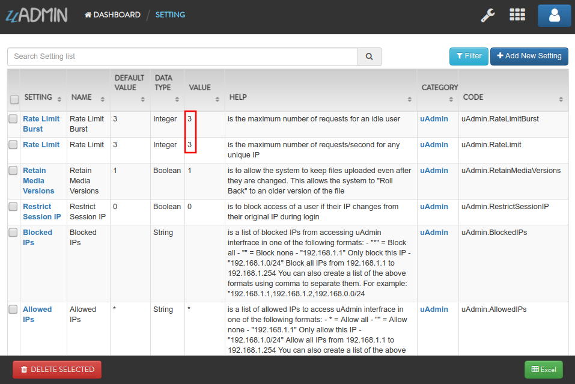

|

Result

.. code-block:: bash

    Slow down. You are going too fast!

Now go to check_rate_limit URL path in the address bar (e.g. 0.0.0.0:8080/check_rate_limit).

.. image:: assets/checkratelimiturl.png
   :align: center

This will not display anything in the webpage but a white screen. Go to your terminal to see the result.

.. code-block:: bash

    [  DEBUG ]   Rate Limit: false

It means the website is crashing. In order to work, either delete the uadmin.db file on your project folder or apply the method shown in `uadmin.RateLimit`_ or `uadmin.RateLimitBurst`_ where the value is higher than zero.

**uadmin.Choice**
^^^^^^^^^^^^^^^^^
Choice is a struct for the list of choices.

Structure:

.. code-block:: go

    type Choice struct {
        V        string
        K        uint
        Selected bool
    }

Suppose I have four records in my Category model.

* Education ID = 4
* Family ID = 3
* Work ID = 2
* Travel ID = 1

.. image:: assets/categorylist.png

And you have the given fields in the Todo model.

.. code-block:: go

    type Todo struct {
        uadmin.Model
        Name        string
        Description string `uadmin:"html"`
        Category    Category
        CategoryID  uint
        TargetDate  time.Time
        Progress    int `uadmin:"progress_bar"`
    }

Inside the main function, apply `uadmin.Schema`_ function that calls a model name of "todo" that accesses the category field in the docS variable. Limit the choices by getting the second and fourth record only in the category field.

.. code-block:: go

    // Initialize docS variable that calls the category field of the
    // Todo model in the schema
    docS := uadmin.Schema["todo"].FieldByName("category")

    // LimitChoicesTo is based on the fetched records to be appended in the
    // drop down list.
    docS.LimitChoicesTo = func(m interface{}, u *uadmin.User) []uadmin.Choice {
        // Build choices
        choices := []uadmin.Choice{
            {
                V:        "-",
                K:        0,
                Selected: false,
            },
        }

        // Initialize an array of Category model
        categorylist := []models.Category{}

        // Get the second and fourth record
        uadmin.Filter(&categorylist, "id IN (2,4)")

        // Loop the fetched records
        for _, c := range categorylist {
            // Append by getting the ID and string of each category records
            choices = append(choices, uadmin.Choice{
                V:        uadmin.GetString(c),
                K:        uadmin.GetID(reflect.ValueOf(c)),
                Selected: false,
            })
        }
        return choices
    }

Run your application, go to the Todo model and see what happens in the Category field.

.. image:: assets/choiceeducation.png

|

When you notice, the value of the Category field is empty by default. You can also type whatever you want to search in the choices list above. For this example, let's choose "Education".

Once you are done, save the record and see what happens.

.. image:: assets/choiceeducationresult.png

Congrats, now you know how to create a choice by building an empty choice, fetching records from the database, and appending the fetched records in the drop down list.

**uadmin.ClearDB**
^^^^^^^^^^^^^^^^^^
ClearDB clears the database object.

Function:

.. code-block:: go

    func()

Suppose I have two databases in my project folder.

.. image:: assets/twodatabases.png

|

And I set the Name to **uadmin.db** on Database Settings in main.go.

.. code-block:: go

    func main(){
        uadmin.Database = &uadmin.DBSettings{
            Type: "sqlite",
            Name: "uadmin.db",
        }
        // Some codes
    }

Let's create a new file in the models folder named "expression.go" with the following codes below:

.. code-block:: go

    package models

    import "github.com/uadmin/uadmin"

    // ---------------- DROP DOWN LIST ----------------
    // Status ...
    type Status int

    // Keep ...
    func (s Status) Keep() Status {
        return 1
    }

    // ClearDatabase ...
    func (s Status) ClearDatabase() Status {
        return 2
    }
    // -----------------------------------------------

    // Expression model ...
    type Expression struct {
        uadmin.Model
        Name   string `uadmin:"required"`
        Status Status `uadmin:"required"`
    }
    
    // Save ...
    func (e *Expression) Save() {
        // If Status is equal to ClearDatabase(), the database
        // will reset and open a new one which is todolist.db.
        if e.Status == e.Status.ClearDatabase() {
            uadmin.ClearDB()        // <-- Place it here

            // Database configurations
            uadmin.Database = &uadmin.DBSettings{
                Type: "sqlite",
                Name: "todolist.db",
            }

            // Returns a pointer to the DB
            uadmin.GetDB()
        }

        // Override save
        uadmin.Save(e)
    }

Register your Expression model in the main function.

.. code-block:: go

    func main() {

        // Some codes

        uadmin.Register(
            // Some registered models
            models.Expression{}, // <-- place it here
        )

        // Some codes
    }

Run the application. Go to the Expressions model and add at least 3 interjections, all Status set to "Keep".

.. image:: assets/expressionkeep.png

|

Now create another data, this time set the Status as "Clear Database" and see what happens.

.. image:: assets/cleardatabase.png

|

Your account will automatically logout in the application. Login your account again, go to the Expressions model and see what happens.

.. image:: assets/cleardatabasesecondmodel.png

|

As expected, all previous records were gone in the model. It does not mean that they were deleted. It's just that you have opened a new database called "todolist.db". Check out the other models that you have. You may notice that something has changed in your database.

**uadmin.CookieTimeout**
^^^^^^^^^^^^^^^^^^^^^^^^
CookieTimeout is the timeout of a login cookie in seconds.

Type:

.. code-block:: go

    int

Let's apply this function in the main.go.

.. code-block:: go

    func main() {
        // Some codes
        uadmin.CookieTimeout = 10 // <--  place it here
    }

.. WARNING::
   Use it at your own risk. Once the cookie expires, your account will be permanently deactivated. In this case, you must have an extra admin account in the User database.

Login your account, wait for 10 seconds and see what happens.

.. image:: tutorial/assets/loginform.png

It will redirect you to the login form because your cookie has already been expired.

**uadmin.Count**
^^^^^^^^^^^^^^^^
Count return the count of records in a table based on a filter.

Function:

.. code-block:: go

    func(a interface{}, query interface{}, args ...interface{}) int

Parameters:

    **a interface{}:** Is the variable where the model was initialized

    **query interface{}:** Is an action that you want to perform in your database

    **args ...interface{}:** Is the series of arguments for query input

Used in the tutorial:

* `uAdmin Tutorial Part 6 - Back-end Validation`_

.. _uAdmin Tutorial Part 6 - Back-end Validation: https://uadmin-docs.readthedocs.io/en/latest/tutorial/part6.html

Suppose you have ten records in your Todo model.

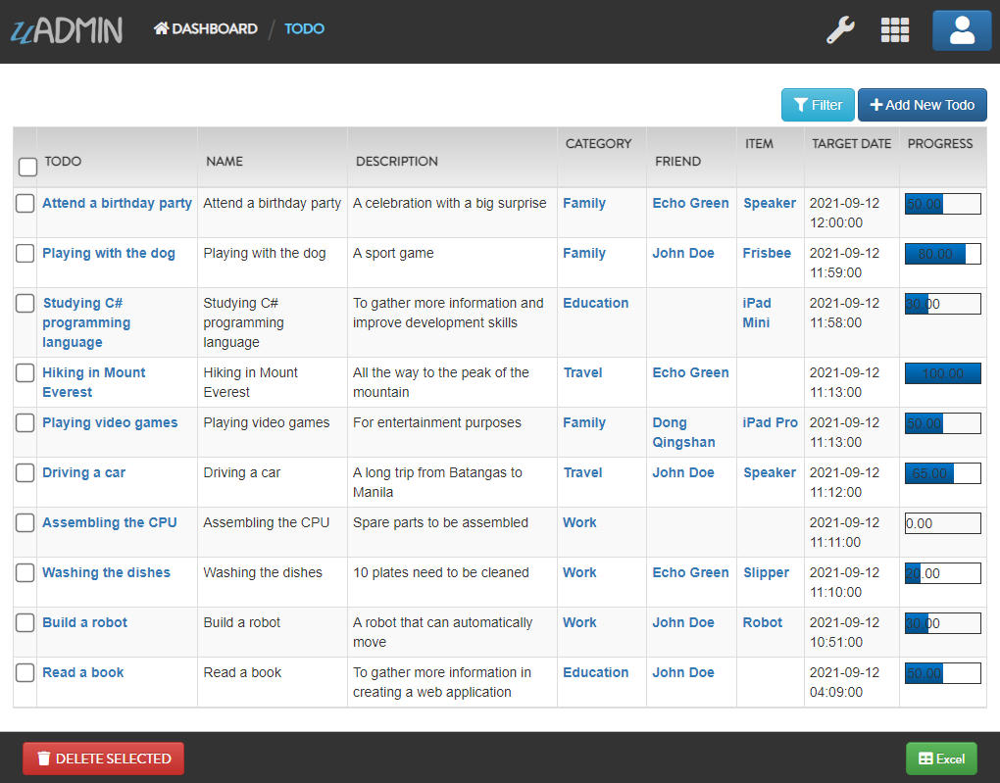

Go to the main.go. Let's count how many todos do you have with a friend in your model.

.. code-block:: go

    func main(){
        // Some codes

        // Initialize the Todo model in the todo variable
        todo := models.Todo{}

        // Initialize the Friend model in the todo variable
        friend := models.Friend{}

        // Fetch the first record from the database
        uadmin.Get(&friend, "id=?", todo.FriendID)

        // Return the count of records in a table based on a Get function to  
        // be stored in the total variable
        total := uadmin.Count(&todo, "friend_id = ?", todo.FriendID)

        // Print the result
        uadmin.Trail(uadmin.INFO, "You have %v todos with a friend in your list.", total)
    }

Check your terminal to see the result.

.. code-block:: bash

    [  INFO  ]   You have 5 todos with a friend in your list.

**uadmin.CustomTranslation**
^^^^^^^^^^^^^^^^^^^^^^^^^^^^
CustomTranslation is a list of string where you could add URLs to JSON files that uAdmin will save for translation.

Type:

.. code-block:: go

    []string

Suppose that English is the only active language in your application. Go to the main.go and apply the following codes below. It should be placed before uadmin.Register.

.. code-block:: go

    func main(){
        // Place it here
        uadmin.CustomTranslation = []string{"models/custom", "models/todo_custom"}

        uadmin.Register(
            // Some codes
        )
    }

From your project folder, go to static/i18n/models. You will notice that two JSON files are created in the models folder.

.. image:: assets/customtranslationcreate.png

Every JSON file is per language. In other words, if you have 2 languages available in your application, there will be a total of 4 created JSON files.

**uadmin.DashboardMenu**
^^^^^^^^^^^^^^^^^^^^^^^^
DashboardMenu is a system in uAdmin that is used to add, modify and delete the elements of a model.

Structure:

.. code-block:: go

    type DashboardMenu struct {
        Model
        MenuName string `uadmin:"required;list_exclude;multilingual;filter"`
        URL      string `uadmin:"required"`
        ToolTip  string
        Icon     string `uadmin:"image"`
        Cat      string `uadmin:"filter"`
        Hidden   bool   `uadmin:"filter"`
    }

There is a function that you can use in DashboardMenu:

* **String()** - Returns the MenuName

Go to the main.go and apply the following codes below after the RegisterInlines section.

.. code-block:: go

    func main(){

        // Some codes

        dashboardmenu := uadmin.DashboardMenu{
            MenuName: "Expressions",
            URL:      "expression",
            ToolTip:  "",
            Icon:     "/media/images/expression.png",
            Cat:      "Yeah!",
            Hidden:   false,
        }

        // This will create a new model based on the information assigned in
        // the dashboardmenu variable.
        uadmin.Save(&dashboardmenu)

        // Returns the MenuName
        uadmin.Trail(uadmin.INFO, "String() returns %s.", dashboardmenu.String())
    }

Now run your application and see what happens.

**Terminal**

.. code-block:: bash

    [  INFO  ]   String() returns Expressions.

.. image:: assets/expressionmodelcreated.png

**uadmin.Database**
^^^^^^^^^^^^^^^^^^^
Database is the active Database settings.

Structure:

.. code-block:: go

    *uadmin.DBSettings

There are 6 fields that you can use in this function:

* **Host** - returns a string. It is an IP address where the database was hosted.
* **Name** - returns a string. This will generate a database file in your project folder.
* **Password** - returns a password string
* **Port** - returns an int. It is the port used for http or https server.
* **Type** - returns a string. There are 2 types: SQLLite and MySQL.
* **User** - returns a user string

Go to the main.go in your Todo list project. Add the codes below above the uadmin.Register.

.. code-block:: go

    func main(){
        database := uadmin.Database
        database.Host = "192.168.149.108"
        database.Name = "todolist.db"
        database.Password = "admin"
        database.Port = 8000
        database.Type = "sqlite"
        database.User = "admin"
    }

If you run your code,

.. code-block:: bash

    [   OK   ]   Initializing DB: [12/12]
    [   OK   ]   Initializing Languages: [185/185]
    [  INFO  ]   Auto generated admin user. Username: admin, Password: admin.
    [   OK   ]   Server Started: http://0.0.0.0:8000
             ___       __          _
      __  __/   | ____/ /___ ___  (_)___
     / / / / /| |/ __  / __  __ \/ / __ \
    / /_/ / ___ / /_/ / / / / / / / / / /
    \__,_/_/  |_\__,_/_/ /_/ /_/_/_/ /_/

The todolist.db file is automatically created in your main project folder.

.. image:: tutorial/assets/todolistdbhighlighted.png

|

See `uadmin.DBSettings`_ for the process of configuring your database in MySQL.

**uadmin.DataType**
^^^^^^^^^^^^^^^^^^^
Type:

.. code-block:: go

    int

DataType has 7 functions:

* **Boolean()** - A data type that has one of two possible values (usually denoted true and false), intended to represent the two truth values of logic and Boolean algebra
* **DateTime()** - Provides functionality for measuring and displaying time
* **File()** - A data type used in order to upload a file in the database
* **Float()** - Used in various programming languages to define a variable with a fractional value
* **Image()** - Used to upload and crop an image in the database
* **Integer()** - Used to represent a whole number that ranges from -2147483647 to 2147483647 for 9 or 10 digits of precision
* **String()** - Used to represent text rather than numbers

See `uadmin.Setting`_ for the examples.

**uadmin.DBSettings**
^^^^^^^^^^^^^^^^^^^^^
DBSettings is a feature that allows a user to configure the settings of a database.

Structure:

.. code-block:: go

    type DBSettings struct {
        Type     string // SQLLite, MySQL
        Name     string // File/DB name
        User     string
        Password string
        Host     string
        Port     int
    }

Go to the main.go in your Todo list project. Add the codes below above the uadmin.Register.

.. code-block:: go

    func main() {
        uadmin.Database = &uadmin.DBSettings{
            Type:      "sqlite",
            Name:      "todolist.db",
            User:      "admin",
            Password:  "admin",
            Host:      "192.168.149.108",
            Port:      8000,
        }
        // Some codes
    }

If you run your code,

.. code-block:: bash

    [   OK   ]   Initializing DB: [12/12]
    [   OK   ]   Initializing Languages: [185/185]
    [  INFO  ]   Auto generated admin user. Username: admin, Password: admin.
    [   OK   ]   Server Started: http://0.0.0.0:8000
             ___       __          _
      __  __/   | ____/ /___ ___  (_)___
     / / / / /| |/ __  / __  __ \/ / __ \
    / /_/ / ___ / /_/ / / / / / / / / / /
    \__,_/_/  |_\__,_/_/ /_/ /_/_/_/ /_/

The todolist.db file is automatically created in your main project folder.

.. image:: tutorial/assets/todolistdbhighlighted.png

|

You can also migrate your application into the MySQL database server. In order to do that, you must have the `MySQL Workbench`_ application installed on your computer. Open your MySQL Workbench and set up your Connection Name (example below is uadmin). Hostname, Port and Username are automatically provided for you but you can change the values there if you wish to. For this example, let's apply the following information below.

.. _MySQL Workbench: https://dev.mysql.com/downloads/workbench/

.. image:: assets/mysqlsetup.png

|

Click Test Connection to see if the connection is working properly.

.. image:: assets/mysqlprompt.png
   :align: center

|

Result

.. image:: assets/testconnectionresult.png
   :align: center

|

Once you are done with the connection testing, click OK on the bottom right corner. You will see the interface of the application. Let's create a new schema by right clicking the area on the bottom left corner highlighted below then select "Create Schema".

.. image:: assets/rightclickarea.png

|

Input the value of the schema name as "todo" then click Apply.

.. image:: assets/schemasetuptodo.png

|

You will see the Apply SQL Script to the Database form. Leave it as it is and click Apply.

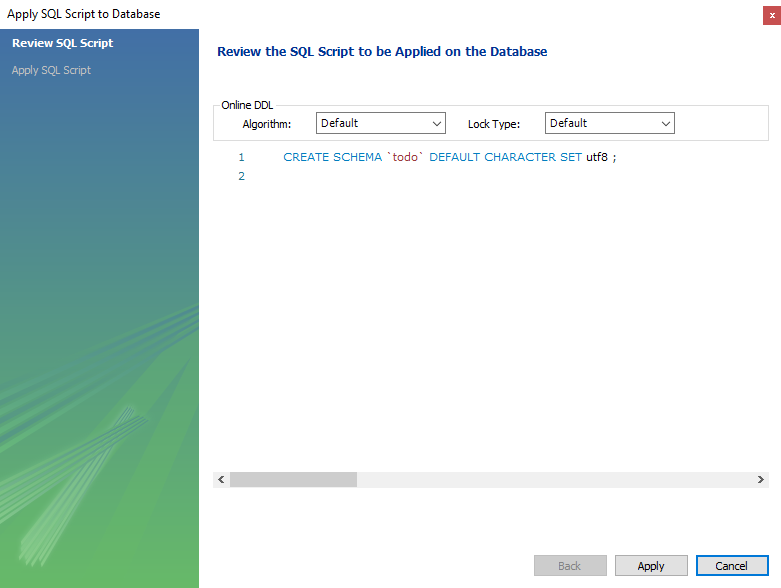

|

Your todo schema has been created in the MySQL. Congrats!

.. image:: assets/todocreatedmysql.png
   :align: center

|

Now go back to your todo list project. Open main.go and apply the following codes below:

.. code-block:: go

    uadmin.Database = &uadmin.DBSettings{
        Type:     "mysql",
        Name:     "todo",
        User:     "root",
        Password: "todolist",
        Host:     "127.0.0.1",
        Port:     3306,
    }

The information above is well-based on the database configuration settings in MySQL Workbench.

Once you are done, run your application and see what happens.

.. code-block:: bash

    [   OK   ]   Initializing Languages: [185/185]
    [  INFO  ]   Auto generated admin user. Username:admin, Password:admin.
    [   OK   ]   Server Started: http://0.0.0.0:8080

Open your browser and type the IP address above. Then login using “admin” as username and password.

.. image:: tutorial/assets/loginform.png

|

You will be greeted by the uAdmin dashboard. System models are built in to uAdmin, and the rest are the ones we created, in this case TODOS model.

.. image:: tutorial/assets/uadmindashboard.png

|

Now open your MySQL Workbench. On todo database in the schema panel, the tables are automatically generated from your uAdmin dashboard.

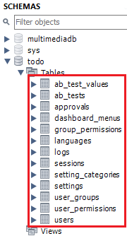

Congrats, now you know how to configure your database settings in both SQLite and MySQL.

**uadmin.DEBUG**
^^^^^^^^^^^^^^^^
DEBUG is the display tag under Trail. It is the process of identifying and removing errors.

Type:

.. code-block:: go

    untyped int

See `uadmin.Trail`_ for the example.

**uadmin.DebugDB**
^^^^^^^^^^^^^^^^^^
DebugDB prints all SQL statements going to DB.

Type:

.. code-block:: go

    bool

Go to the main.go. Set this function as true.

.. code-block:: go

    func main(){
        uadmin.DebugDB = true
        // Some codes
    }

Check your terminal to see the result.

.. code-block:: bash

    [   OK   ]   Initializing DB: [13/13]

    (/home/dev1/go/src/github.com/uadmin/uadmin/db.go:428) 
    [2018-11-10 12:43:07]  [0.09ms]  SELECT count(*) FROM "languages"  WHERE "languages"."deleted_at" IS NULL  
    [0 rows affected or returned ] 

    (/home/dev1/go/src/github.com/uadmin/uadmin/db.go:298) 
    [2018-11-10 12:43:07]  [0.17ms]  SELECT * FROM "languages"  WHERE "languages"."deleted_at" IS NULL AND ((active = 'true'))  
    [1 rows affected or returned ] 

    (/home/dev1/go/src/github.com/uadmin/uadmin/db.go:238) 
    [2018-11-10 12:43:07]  [0.16ms]  SELECT * FROM "languages"  WHERE "languages"."deleted_at" IS NULL AND ((`default` = 'true')) ORDER BY "languages"."id" ASC LIMIT 1  
    [1 rows affected or returned ] 

    (/home/dev1/go/src/github.com/uadmin/uadmin/db.go:162) 
    [2018-11-10 12:43:07]  [0.32ms]  SELECT * FROM "dashboard_menus"  WHERE "dashboard_menus"."deleted_at" IS NULL  
    [13 rows affected or returned ] 

    (/home/dev1/go/src/github.com/uadmin/uadmin/db.go:428) 
    [2018-11-10 12:43:07]  [0.07ms]  SELECT count(*) FROM "users"  WHERE "users"."deleted_at" IS NULL  
    [0 rows affected or returned ] 

**uadmin.DefaultMediaPermission**
^^^^^^^^^^^^^^^^^^^^^^^^^^^^^^^^^
DefaultMediaPermission is the default permission applied to files uploaded to the system.

Type:

.. code-block:: go

    FileMode

A **FileMode** represents a file's mode and permission bits. The bits have the same definition on all systems, so that information about files can be moved from one system to another portably. Not all bits apply to all systems. The only required bit is ModeDir for directories.

In uAdmin, the default media permission is **0644** that means the owner has read and write access to the uploaded files while the group and others have read-only access to them.

For more information on how permissions work, read `File System Permissions`_ or `How to Use UNIX and Linux File Permissions`_.

.. _File System Permissions: https://en.wikipedia.org/wiki/File_system_permissions
.. _How to Use UNIX and Linux File Permissions: https://help.unc.edu/help/how-to-use-unix-and-linux-file-permissions/

Example:

.. code-block:: go

    package main

    import (
        "os"
        "github.com/uadmin/uadmin"
    )

    func main() {
        // No permissions
        uadmin.DefaultMediaPermission = os.FileMode(0000)

        // Read, write, & execute only for owner
        uadmin.DefaultMediaPermission = os.FileMode(0700)

        // Read, write, & execute for owner and group
        uadmin.DefaultMediaPermission = os.FileMode(0700)

        // Read, write, & execute for owner, group and others
        uadmin.DefaultMediaPermission = os.FileMode(0777)

        // Execute
        uadmin.DefaultMediaPermission = os.FileMode(0111)

        // Write
        uadmin.DefaultMediaPermission = os.FileMode(0222)

        // Write & execute
        uadmin.DefaultMediaPermission = os.FileMode(0333)

        // Read
        uadmin.DefaultMediaPermission = os.FileMode(0444)

        // Read & execute
        uadmin.DefaultMediaPermission = os.FileMode(0555)

        // Read & write
        uadmin.DefaultMediaPermission = os.FileMode(0666)

        // Owner can read, write, & execute; group can only read; others have no permissions
        uadmin.DefaultMediaPermission = os.FileMode(0740)
    }

**uadmin.Delete**
^^^^^^^^^^^^^^^^^
Delete records from database.

Function:

.. code-block:: go

    func(a interface{}) (err error)

Parameter:

    **a interface{}:** Is the variable where the model was initialized

Before we proceed to the example, read `Tutorial Part 7 - Introduction to API`_ to familiarize how API works in uAdmin.

.. _Tutorial Part 7 - Introduction to API: https://uadmin-docs.readthedocs.io/en/latest/tutorial/part7.html

**Example #1:** By Using API Handler

Suppose you have five records in your Todo model.

.. image:: assets/fiverecordstodomodel.png

Create a file named delete.go inside the api folder with the following codes below:

.. code-block:: go

    // DeleteHandler !
    func DeleteHandler(w http.ResponseWriter, r *http.Request) {
        // r.URL.Path creates a new path called /delete
        r.URL.Path = strings.TrimPrefix(r.URL.Path, "/delete")

        // Initialize the Todo model
        todo := []models.Todo{}

        // Delete all records in Todo model
        uadmin.Delete(&todo)
    }

Establish a connection in the main.go to the API by using http.HandleFunc. It should be placed after the uadmin.Register and before the StartServer.

.. code-block:: go

    func main() {
        // Some codes

        // DeleteHandler
        http.HandleFunc("/delete/", api.DeleteHandler) // <-- place it here
    }

api is the folder name while DeleteHandler is the name of the function inside delete.go.

Run your application. Add /delete/ path after your access IP and port in the address bar (e.g. http://0.0.0.0:8080/delete/).

Afterwards, go to Todo model and see what happens.

.. image:: assets/todomodelempty.png
   :align: center

|

All records are deleted from the database.

**Example #2:** By Drop Down List Selection

Let's create a new file in the models folder named "expression.go" with the following codes below:

.. code-block:: go

    package models

    import "github.com/uadmin/uadmin"

    // ---------------- DROP DOWN LIST ----------------
    // Status ...
    type Status int

    // Keep ...
    func (s Status) Keep() Status {
        return 1
    }

    // DeletePrevious ...
    func (s Status) DeletePrevious() Status {
        return 2
    }
    // -----------------------------------------------

    // Expression model ...
    type Expression struct {
        uadmin.Model
        Name   string `uadmin:"required"`
        Status Status `uadmin:"required"`
    }

    // Save ...
    func (e *Expression) Save() {
        // If Status is equal to DeletePrevious(), it will delete
        // the previous data in the list.
        if e.Status == e.Status.DeletePrevious() {
            uadmin.Delete(e) // <-- place it here
        }

        uadmin.Save(e)
    }

Register your Expression model in the main function.

.. code-block:: go

    func main() {

        // Some codes

        uadmin.Register(
            // Some registered models
            models.Expression{}, // <-- place it here
        )

        // Some codes
    }

Run the application. Go to the Expressions model and add at least 3 interjections, all Status set to "Keep".

.. image:: assets/expressionkeep.png

|

Now create another data, this time set the Status as "Delete Previous" and see what happens.

.. image:: assets/deleteprevious.png

|

Result

.. image:: assets/deletepreviousresult.png

|

All previous records are deleted from the database.

**uadmin.DeleteList**
^^^^^^^^^^^^^^^^^^^^^
Delete the list of records from database.

Function:

.. code-block:: go

    func(a interface{}, query interface{}, args ...interface{}) (err error)

Parameters:

    **a interface{}:** Is the variable where the model was initialized

    **query interface{}:** Is an action that you want to perform in your database

    **args ...interface{}:** Is the series of arguments for query input

Before we proceed to the example, read `Tutorial Part 7 - Introduction to API`_ to familiarize how API works in uAdmin.

.. _Tutorial Part 7 - Introduction to API: https://uadmin-docs.readthedocs.io/en/latest/tutorial/part7.html

**Example #1:** By Using API Handler

Suppose you have five records in your Todo model.

.. image:: assets/fiverecordstodomodel.png

Create a file named delete_list.go inside the api folder with the following codes below:

.. code-block:: go

    // DeleteListHandler !
    func DeleteListHandler(w http.ResponseWriter, r *http.Request) {
        // r.URL.Path creates a new path called /delete_list
        r.URL.Path = strings.TrimPrefix(r.URL.Path, "/delete_list")

        // Call an array of Todo model
        todo := []models.Todo{}

        // Set the parameter as todo_id that can get multiple values
        todoList := strings.Split(r.FormValue("todo_id"), ",")

        // Delete the list of Todo records based on an assigned ID
        uadmin.DeleteList(&todo, "id IN (?)", todoList)
    }

Establish a connection in the main.go to the API by using http.HandleFunc. It should be placed after the uadmin.Register and before the StartServer.

.. code-block:: go

    func main() {
        // Some codes

        // DeleteListHandler
        http.HandleFunc("/delete_list/", api.DeleteListHandler) // <-- place it here
    }

api is the folder name while DeleteListHandler is the name of the function inside delete_list.go.

Run your application. Let's assign 1, 2, and 3 in the todo_id parameter. (e.g. http://0.0.0.0:8080/delete_list/?todo_id=1,2,3).

Afterwards, go to Todo model and see what happens.

.. image:: assets/tworecordstodomodel.png
   :align: center

|

Based on the result shown above, the first three records are deleted from the database while the last two records remain.

**Example #2:** By Drop Down List Selection

Let's create a new file in the models folder named "expression.go" with the following codes below:

.. code-block:: go

    package models

    import "github.com/uadmin/uadmin"

    // ---------------- DROP DOWN LIST ----------------
    // Status ...
    type Status int

    // Keep ...
    func (s Status) Keep() Status {
        return 1
    }

    // Custom ...
    func (s Status) Custom() Status {
        return 2
    }

    // DeleteCustom ...
    func (s Status) DeleteCustom() Status {
        return 3
    }
    // -----------------------------------------------

    // Expression model ...
    type Expression struct {
        uadmin.Model
        Name   string `uadmin:"required"`
        Status Status `uadmin:"required"`
    }

    // Save ...
    func (e *Expression) Save() {
        // If Status is equal to DeleteCustom(), it will delete the
        // list of data that contains Custom as the status.
        if e.Status == e.Status.DeleteCustom() {
            uadmin.DeleteList(e, "status = ?", 2)
        }

        uadmin.Save(e)
    }

Register your Expression model in the main function.

.. code-block:: go

    func main() {

        // Some codes

        uadmin.Register(
            // Some registered models
            models.Expression{}, // <-- place it here
        )

        // Some codes
    }

Run the application. Go to the Expressions model and add at least 3 interjections, one is set to "Keep" and the other two is set to "Custom".

.. image:: assets/expressionkeepcustom.png

|

Now create another data, this time set the Status as "Delete Custom" and see what happens.

.. image:: assets/deletecustom.png

|

Result

.. image:: assets/deletecustomresult.png

|

All custom records are deleted from the database.

**uadmin.EmailFrom**
^^^^^^^^^^^^^^^^^^^^
EmailFrom identifies where the email is coming from.

Type:

.. code-block:: go

    string

Used in the tutorial:

* `uAdmin Tutorial Part 14 - Advanced Security (Part 2)`_

.. _uAdmin Tutorial Part 14 - Advanced Security (Part 2): https://uadmin-docs.readthedocs.io/en/latest/tutorial/part14.html

Go to the main.go and apply the following codes below:

.. code-block:: go

    func main(){
        uadmin.EmailFrom = "myemail@integritynet.biz"
        uadmin.EmailUsername = "myemail@integritynet.biz"
        uadmin.EmailPassword = "abc123"
        uadmin.EmailSMTPServer = "smtp.integritynet.biz"
        uadmin.EmailSMTPServerPort = 587
        // Some codes
    }

Let's go back to the uAdmin dashboard, go to Users model, create your own user account and set the email address based on your assigned EmailFrom in the code above.

.. image:: tutorial/assets/useremailhighlighted.png

|

Log out your account. At the moment, you suddenly forgot your password. How can we retrieve our account? Click Forgot Password at the bottom of the login form.

.. image:: tutorial/assets/forgotpasswordhighlighted.png

|

Input your email address based on the user account you wish to retrieve it back.

.. image:: tutorial/assets/forgotpasswordinputemail.png

|

Once you are done, open your email account. You will receive a password reset notification from the Todo List support. To reset your password, click the link highlighted below.

.. image:: tutorial/assets/passwordresetnotification.png

|

You will be greeted by the reset password form. Input the following information in order to create a new password for you.

.. image:: tutorial/assets/resetpasswordform.png

Once you are done, you can now access your account using your new password.

**uadmin.EmailPassword**
^^^^^^^^^^^^^^^^^^^^^^^^
EmailPassword assigns the password of an email.

Type:

.. code-block:: go

    string

See `uadmin.EmailFrom`_ for the example.

**uadmin.EmailSMTPServer**
^^^^^^^^^^^^^^^^^^^^^^^^^^
EmailSMTPServer assigns the name of the SMTP Server in an email.

Type:

.. code-block:: go

    string

See `uadmin.EmailFrom`_ for the example.

**uadmin.EmailSMTPServerPort**
^^^^^^^^^^^^^^^^^^^^^^^^^^^^^^
EmailSMTPServerPort assigns the port number of an SMTP Server in an email.

Type:

.. code-block:: go

    int

See `uadmin.EmailFrom`_ for the example.

**uadmin.EmailUsername**
^^^^^^^^^^^^^^^^^^^^^^^^
EmailUsername assigns the username of an email.

Type:

.. code-block:: go

    string

See `uadmin.EmailFrom`_ for the example.

**uadmin.EncryptKey**
^^^^^^^^^^^^^^^^^^^^^
EncryptKey is a key for encryption and decryption of data in the DB.

Type:

.. code-block:: go

    []byte

Go to the main.go and set the byte values from 0 to 255. Put it above the uadmin.Register.

.. code-block:: go

    func main() {
        uadmin.EncryptKey = []byte{34, 35, 35, 57, 68, 4, 35, 36, 7, 8, 35, 23, 35, 86, 35, 23}
        uadmin.Register(
            // Some codes
        )
    }

Run your application to create your key file then exit it.

In your terminal, type **cat .key** to see the result.

.. code-block:: bash

    $ cat .key
    �!��Q�nt��Z�-���| �9쁌=Y�

**uadmin.ERROR**
^^^^^^^^^^^^^^^^
ERROR is a status to notify the user that there is a problem in an application.

Type:

.. code-block:: go

    untyped int

See `uadmin.Trail`_ for the example.

**uadmin.ErrorHandleFunc**
^^^^^^^^^^^^^^^^^^^^^^^^^^
ErrorHandleFunc is a function that will be called everytime Trail is called. It receives one parameter for error level, one for error message and one for runtime stack trace

Function:

.. code-block:: go

    func(int, string, string)

There are 6 different reporting levels:

* DEBUG
* WORKING
* INFO
* OK
* WARNING
* ERROR

Go to main.go and create an invalid code (e.g. Get function that does not meet the standard requirements).

.. code-block:: go

    func main(){
        // Some codes

        // Checks error(s) in your application based on a reporting level
        uadmin.ErrorHandleFunc = func(level int, msg string, stack string) {
            if level >= uadmin.WARNING {
                fmt.Println("ERROR MESSAGE:\n" + msg + "\n")
                fmt.Println("STACK:\n" + stack + "\n")
            }
        }

        // This is an invalid code because the first parameter checks the
        // database but assigns an empty string that is unsupported.
        uadmin.Get("", "")
    }

Now run your application in your terminal. Based on the output, the error is the Get function where the assigned values are unsupported. The memory address (e.g. 0x977520) are the actual values inside the Get function. Below the message, it also checks which line of code does the error occurs in the file.

.. code-block:: bash

    ERROR MESSAGE:
    DB error in Get(string)-(). unsupported destination, should be slice or struct

    STACK:
    github.com/uadmin/uadmin.Get(0x977520, 0xaa3330, 0x977520, 0xaa3340, 0x0, 0x0, 0x0, 0x4, 0x8)
        /home/dev1/go/src/github.com/uadmin/uadmin/db.go:242 +0x268
    main.main()
        /home/dev1/go/src/github.com/rn1hd/todo/main.go:49 +0x62f

**uadmin.F**
^^^^^^^^^^^^
F is a field.

Structure:

.. code-block:: go

    type F struct {
        Name              string
        DisplayName       string
        Type              string
        TypeName          string
        Value             interface{}
        Help              string
        Max               interface{}
        Min               interface{}
        Format            string
        DefaultValue      string
        Required          bool
        Pattern           string
        PatternMsg        string
        Hidden            bool
        ReadOnly          string
        Searchable        bool
        Filter            bool
        ListDisplay       bool
        FormDisplay       bool
        CategoricalFilter bool
        Translations      []translation
        Choices           []Choice
        IsMethod          bool
        ErrMsg            string
        ProgressBar       map[float64]string
        LimitChoicesTo    func(interface{}, *User) []Choice
        UploadTo          string
        Encrypt           bool
        Approval          bool
        NewValue          interface{}
        OldValue          interface{}
        ChangedBy         string
        ChangeDate        *time.Time
        ApprovalAction    ApprovalAction
        ApprovalDate      *time.Time
        ApprovalBy        string
        ApprovalID        uint
        WebCam            bool
        Stringer          bool
    }

Parameters:

* **Name** - The name of the field
* **DisplayName** - The name that you want to display in the model. It is an alias name.
* **Type** - The field type (e.g. file, list, progress_bar)
* **TypeName** - The data type of the field (e.g. string, int, float64)
* **Value** - The value that you want to assign in a field
* **Help** - An instruction given to understand more details about the field or how to assign a value in a field
* **Max** - The maximum value the user can assign. It is applicable for numeric characters.
* **Min** - The minimum value the user can assign. It is applicable for numeric characters.
* **Format** - Implements formatted I/O with functions (e.g. %s - string, %d - Integer)
* **DefaultValue** - A value assigned automatically if you want to add a new record
* **Required** - A field that user must perform the given task(s). It cannot be skipped or left empty.
* **Pattern** - A regular expression
* **PatternMsg** - An error message if the user assigns a value that did not match the requested format
* **Hidden** - A feature to hide the component in the editing section of the form
* **ReadOnly** - A field that cannot be modified
* **Searchable** - A feature that allows the user to search for a field or column name
* **Filter** - A feature that allows the user to filter the record assigned in a model
* **ListDisplay** - A feature that will hide the field in the viewing section of the model if the value returns false
* **FormDisplay** - A feature that will hide the field in the editing section of the model if the value returns false
* **CategoricalFilter** - A feature that allows the user to filter the record assigned in a model in the form of combo box
* **Translations** - For multilingual fields
* **Choices** - A struct for the list of choices
* **IsMethod** - Check if the method should be included in the field list
* **ErrMsg** - An error message displayed beneath the input field
* **ProgressBar** - A feature used to measure the progress of the activity
* **LimitChoicesTo** - A feature used to append the fetched records in the drop down list
* **UploadTo** - A path where to save the uploaded files
* **Encrypt** - A feature used to encrypt the value in the database
* **Approval** - A feature used to set an approval permission in the field
* **NewValue** - A value that you want to replace from the old value
* **OldValue** - A value that was assigned before
* **ChangedBy** - Returns the username who changed the value of the field record
* **ChangeDate** - The date when the value of the field record was changed
* **ApprovalAction** - A selection of approval actions. There are two selections: Approved and Declined.
* **ApprovalDate** - The date when the value of the field record was approved
* **ApprovalBy** - Returns the username who approved the value of the field record
* **ApprovalID** - Returns the user ID who approved the value of the field record
* **WebCam** - A feature which adds web can access directly from the image and file fields
* **Stringer** - A feature that assigns a field as a unique type

There are 2 ways you can do for initialization process using this function: one-by-one and by group.

One-by-one initialization:

.. code-block:: go

    func main(){
        // Some codes
        f := uadmin.F{}
        f.Name = "Name"
        f.DisplayName = "DisplayName"
        f.Type = "Type"
        f.Value = "Value"
    }

By group initialization:

.. code-block:: go

    func main(){
        // Some codes
        f := uadmin.F{
            Name:        "Name",
            DisplayName: "DisplayName",
            Type:        "Type",
            Value:       "Value",
        }
    }

In the following examples, we will use "by group" initialization process.

* `Example #1: String Data Type`_
* `Example #2: Progress Bar`_
* `Example #3: Choices`_
* `Example #4: Upload To`_
* `Example #5: Approval`_

.. _Example #1\: String Data Type: https://uadmin-docs.readthedocs.io/en/latest/api/f.html#example-1-string-data-type
.. _Example #2\: Progress Bar: https://uadmin-docs.readthedocs.io/en/latest/api/f.html#example-2-progress-bar
.. _Example #3\: Choices: https://uadmin-docs.readthedocs.io/en/latest/api/f.html#example-3-choices
.. _Example #4\: Upload To: https://uadmin-docs.readthedocs.io/en/latest/api/f.html#example-4-upload-to
.. _Example #5\: Approval: https://uadmin-docs.readthedocs.io/en/latest/api/f.html#example-5-approval

Page:

.. toctree::
   :maxdepth: 1

   api/f

**uadmin.FieldType**
^^^^^^^^^^^^^^^^^^^^
Type:

.. code-block:: go

    int

FieldType has 19 functions:

* **Boolean()** - A field type that has one of two possible values (usually denoted true and false), intended to represent the two truth values of logic and Boolean algebra
* **Code()** - A set of instructions that will be executed by a computer
* **DateTime()** - Provides functionality for measuring and displaying time. It is equivalent to time.Time.
* **DateTimePtr()** - Provides functionality for measuring and displaying time. It is equivalent to \*time.Time.
* **Email()** - Identifies an email box to which email messages are delivered
* **File()** - Enables the user to upload files/attachments in the model
* **Float()** - Used in various programming languages to define a variable with a fractional value
* **ForeignKey()** - The key used to link two models together
* **HTML()** - Allows the user to modify text in HTML format
* **Image()** - Mark a field as an image
* **Int()** - Used to represent a whole number that ranges from -2147483647 to 2147483647 for 9 or 10 digits of precision
* **Link()** - Displays a button in the model containing the assigned hyperlink
* **M2M()** - Allows you to select more than one element inside an input box field
* **Money()** - Displays a numeric value with two decimal places in the list
* **Multilingual()** - Allows the user to use more than two languages for input
* **Password()** - A string of characters that hides the input data for security
* **ProgressBar()** - A feature used to measure the progress of the activity
* **StaticList()** - Retains the exact record IDs that matched your criteria at the time the list was saved [#f3]_
* **String()** - Used to represent text rather than numbers

**uadmin.Filter**
^^^^^^^^^^^^^^^^^
Filter fetches records from the database.

Function:

.. code-block:: go

    func(a interface{}, query interface{}, args ...interface{}) (err error)

Parameters:

    **a interface{}:** Is the variable where the model was initialized

    **query interface{}:** Is an action that you want to perform in your database

    **args ...interface{}:** Is the series of arguments for query input

Before we proceed to the example, read `Tutorial Part 7 - Introduction to API`_ to familiarize how API works in uAdmin.

.. _Tutorial Part 7 - Introduction to API: https://uadmin-docs.readthedocs.io/en/latest/tutorial/part7.html

**Example #1:** Assigning Multiple Values in a Parameter

Suppose you have five records in your Todo model.

.. image:: assets/fiverecordstodomodel.png

Create a file named filter_list.go inside the api folder with the following codes below:

.. code-block:: go

    func FilterListHandler(w http.ResponseWriter, r *http.Request) {
        // r.URL.Path creates a new path called /filter_list
        r.URL.Path = strings.TrimPrefix(r.URL.Path, "/filter_list")

        // Call an array of Todo model
        todo := []models.Todo{}

        // Set the parameter as todo_id that can get multiple values
        todoList := strings.Split(r.FormValue("todo_id"), ",")

        // Fetch ID records from DB
        uadmin.Filter(&todo, "id IN (?)", todoList) // <-- place it here

        // Prints the todo in JSON format
        uadmin.ReturnJSON(w, r, todo)
    }

Establish a connection in the main.go to the API by using http.HandleFunc. It should be placed after the uadmin.Register and before the StartServer.

.. code-block:: go

    func main() {
        // Some codes

        // FilterListHandler
        http.HandleFunc("/filter_list/", api.FilterListHandler) // <-- place it here
    }

api is the folder name while FilterListHandler is the name of the function inside filter_list.go.

Run your application. Search for the first and third ID on the todo_id parameter in the address bar and see what happens.

.. image:: assets/filterlistapiexample1.png
   :align: center

|

**Example #2**: Returning the Name

Create a file named filter_list.go inside the api folder with the following codes below:

.. code-block:: go

    package api

    import (
        "net/http"
        "strings"

        "github.com/username/todo/models"
        "github.com/uadmin/uadmin"
    )

    // FilterListHandler !
    func FilterListHandler(w http.ResponseWriter, r *http.Request) {
        r.URL.Path = strings.TrimPrefix(r.URL.Path, "/filter_list")

        res := map[string]interface{}{}

        filterList := []string{}
        valueList := []interface{}{}
        if r.URL.Query().Get("todo_id") != "" {
            filterList = append(filterList, "todo_id = ?")
            valueList = append(valueList, r.URL.Query().Get("todo_id"))
        }
        filter := strings.Join(filterList, " AND ")

        todo := []models.Todo{}
        results := []map[string]interface{}{}

        uadmin.Filter(&todo, filter, valueList) // <-- place it here

        // This loop returns only the name of your todo list.
        for i := range todo {
            results = append(results, map[string]interface{}{
                "Name": todo[i].Name,
            })
        }

        res["status"] = "ok"
        res["todo"] = results
        uadmin.ReturnJSON(w, r, res)
    }

Establish a connection in the main.go to the API by using http.HandleFunc. It should be placed after the uadmin.Register and before the StartServer.

.. code-block:: go

    func main() {
        // Some codes

        // FilterListHandler
        http.HandleFunc("/filter_list/", api.FilterListHandler) // <-- place it here
    }

api is the folder name while FilterListHandler is the name of the function inside filter_list.go.

Run your application and see what happens.

.. image:: assets/filterlistapi.png
   :align: center

See `uadmin.Preload`_ for more examples of using this function.

**uadmin.FilterBuilder**
^^^^^^^^^^^^^^^^^^^^^^^^
FilterBuilder changes a map filter into a query.

Function:

.. code-block:: go

    func(params map[string]interface{}) (query string, args []interface{})

Parameters:

    **params map[string]interface{}:** Stores arbitrary JSON objects and arrays

    **query string:** Returns an AND to concatenate the parameters based on a filter

    **args []interface{}:** Is the variable or container that can be used in execution process.

Before we proceed to the example, read `Tutorial Part 7 - Introduction to API`_ to familiarize how API works in uAdmin.

.. _Tutorial Part 7 - Introduction to API: https://uadmin-docs.readthedocs.io/en/latest/tutorial/part7.html

Suppose you have ten records in your Todo model.

|

Create a file named filterbuilder.go inside the api folder with the following codes below:

.. code-block:: go

    package api

    import (
        "net/http"
        "strings"

        "github.com/username/todo/models"
        "github.com/uadmin/uadmin"
    )

    // FilterBuilderHandler !
    func FilterBuilderHandler(w http.ResponseWriter, r *http.Request) {
        // r.URL.Path creates a new path called /filterbuilder
        r.URL.Path = strings.TrimPrefix(r.URL.Path, "/filterbuilder")

        res := map[string]interface{}{}

        // Initialize the Todo model
        todo := []models.Todo{}

        // Fetch data from DB
        query, args := uadmin.FilterBuilder(res) // <-- place it here
        uadmin.Filter(&todo, query, args)

        // Accesses and fetches data from another model
        for t := range todo {
            uadmin.Preload(&todo[t])
        }

        // Prints the todo in JSON format
        res["status"] = "ok"
        res["todo"] = todo
        uadmin.ReturnJSON(w, r, res)
    }

Establish a connection in the main.go to the API by using http.HandleFunc. It should be placed after the uadmin.Register and before the StartServer.

.. code-block:: go

    func main() {
        // Some codes

        // FilterBuilderHandler
        http.HandleFunc("/filterbuilder/", api.FilterBuilderHandler) // <-- place it here
    }

api is the folder name while FilterBuilderHandler is the name of the function inside filterbuilder.go.

Run your application and see what happens.

.. image:: assets/filterbuilderapi.png
   :align: center

**uadmin.FilterList**
^^^^^^^^^^^^^^^^^^^^^
FilterList fetches the all record from the database matching query and args where it selects only visible fields in the form based on given schema.

Function:

.. code-block:: go

    func(s *ModelSchema, order string, asc bool, offset int, limit int, a interface{}, query interface{}, args ...interface{}) (err error)

Parameters:

    **s \*ModelSchema:** Is the variable where the model was called in the Schema

    **order string:** Is the field you want to specify in the database.

    **asc bool:** true in ascending order, false in descending order.

    **offset int:** Is the starting point of your list.

    **limit int:** Is the number of records that you want to display in your application.

    **a interface{}:** Is the variable where the model was initialized

    **query interface{}:** Is an action that you want to perform in your database

    **args ...interface{}:** Is the series of arguments for query input

Before we proceed to the example, read `Tutorial Part 7 - Introduction to API`_ to familiarize how API works in uAdmin.

.. _Tutorial Part 7 - Introduction to API: https://uadmin-docs.readthedocs.io/en/latest/tutorial/part7.html

Suppose you have five records in the Todo model that has a field of Name and CreatedAt.

.. image:: assets/todocreatedatvisible.png
   :align: center

|

Open your Todo List project, go to the todo.go and set the list_exclude tag in the CreatedAt field.

.. code-block:: go

    package models

    import (
        "time"

        "github.com/uadmin/uadmin"
    )

    // Todo model ...
    type Todo struct {
        uadmin.Model
        Name      string
        CreatedAt time.Time `uadmin:"list_exclude"` // <-- place it here
    }

Run your application. From uAdmin dashboard, go to Todo model and ensure that the CreatedAt field in the list is now hidden.

.. image:: assets/fiverecordstodomodel.png
   :align: center

|

Now exit your application. Create a file named filter_list.go inside the api folder with the following codes below:

.. code-block:: go

    package api

    import (
        "net/http"
        "strings"

        // Specify the username that you used inside github.com folder
        "github.com/username/todo/models"
        "github.com/uadmin/uadmin"
    )

    // FilterListAPIHandler !
    func FilterListAPIHandler(w http.ResponseWriter, r *http.Request) {
        // r.URL.Path creates a new path called /filter_list
        r.URL.Path = strings.TrimPrefix(r.URL.Path, "/filter_list")

        // Set the parameter as id that can get multiple values
        id := strings.Split(r.FormValue("id"), ",")

        // Initialize the Todo model
        todo := []models.Todo{}

        // Call the schema of "todo" model
        modelschema := uadmin.Schema["todo"]

        // Fetch records from DB based on the assigned ID
        // &modelschema - todo model in the schema to execute
        // "id" - order the todo model by id field
        // true - to sort in ascending order
        // 0 - start at index 0
        // -1 - get all the records
        // &todo - todo model to execute
        // id > ? - a query where id specifies multiple values
        // id - a value assigned in the id variable to be set in ?
        uadmin.FilterList(&modelschema, "id", true, 0, -1, &todo, "id IN (?)", id)

        // Print the result in JSON format
        uadmin.ReturnJSON(w, r, todo)
    }

Establish a connection in the main.go to the API by using http.HandleFunc. It should be placed after the uadmin.Register and before the StartServer.

.. code-block:: go

    func main() {
        // Some codes

        // FilterListAPIHandler
        http.HandleFunc("/filter_list/", api.FilterListAPIHandler) // <-- place it here
    }

api is the folder name while FilterListAPIHandler is the name of the function inside filter_list.go.

Run your application. Search for the first three records on the id parameter in the address bar and see what happens.

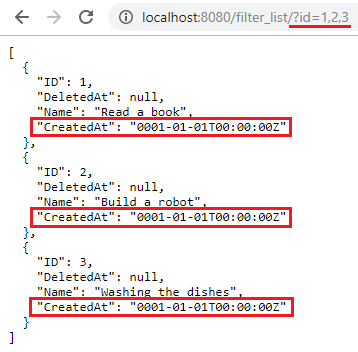

|

Even though there is an assigned date on the CreatedAt field in the form, the API does not return a value because the CreatedAt field is hidden in the list. Now exit your application, go to todo.go in the models folder and remove the list_exclude tag in the CreatedAt field.

.. code-block:: go

    package models

    import (
        "time"

        "github.com/uadmin/uadmin"
    )

    // Todo model ...
    type Todo struct {
        uadmin.Model
        Name      string
        CreatedAt time.Time // Tag removed
    }

Run your application. Search for the first three records on the id parameter in the address bar and see what happens.

.. image:: assets/filterlistcreatedatwithvalue.png
   :align: center

|

As expected, the API is now returning a CreatedAt value because the CreatedAt field in the list is visible.

**uadmin.GenerateBase32**
^^^^^^^^^^^^^^^^^^^^^^^^^
GenerateBase32 generates a base32 string of length.

Function:

.. code-block:: go

    func(length int) string

Parameter:

    **length int:** Is how many digits that you want to store with

Go to the friend.go and initialize the Base32 field inside the struct. Set the tag as "read_only".

.. code-block:: go

    // Friend model ...
    type Friend struct {
        uadmin.Model
        Name     string `uadmin:"required"`
        Email    string `uadmin:"email"`
        Password string `uadmin:"password;list_exclude"`
        Base32   string `uadmin:"read_only"` // <-- place it here
    }

Apply overriding save function. Use this function to the Base32 field and set the integer value as 40.

.. code-block:: go

    // Save !
    func (f *Friend) Save() {
        f.Base32 = uadmin.GenerateBase32(40) // <-- place it here
        uadmin.Save(f)
    }

Now run your application. Go to the Friend model and save any element to see the changes.

.. image:: assets/friendbase32.png

|

Result

.. image:: assets/friendbase32output.png

As you notice, the Base32 value changed automatically.

**uadmin.GenerateBase64**
^^^^^^^^^^^^^^^^^^^^^^^^^
GenerateBase64 generates a base64 string of length.

Function:

.. code-block:: go

    func(length int) string

Parameter:

    **length int:** Is how many digits that you want to store with

Go to the friend.go and initialize the Base64 field inside the struct. Set the tag as "read_only".

.. code-block:: go

    // Friend model ...
    type Friend struct {
        uadmin.Model
        Name     string `uadmin:"required"`
        Email    string `uadmin:"email"`
        Password string `uadmin:"password;list_exclude"`
        Base64   string `uadmin:"read_only"` // <-- place it here
    }

Apply overriding save function. Use this function to the Base64 field and set the integer value as 75.

.. code-block:: go

    // Save !
    func (f *Friend) Save() {
        f.Base64 = uadmin.GenerateBase64(75) // <-- place it here
        uadmin.Save(f)
    }

Now run your application. Go to the Friend model and save any element to see the changes.

.. image:: assets/friendbase64.png

|

Result

.. image:: assets/friendbase64output.png

As you notice, the Base64 value changed automatically.

**uadmin.Get**
^^^^^^^^^^^^^^
Get fetches the first record from the database.

Function:

.. code-block:: go

    func(a interface{}, query interface{}, args ...interface{}) (err error)

Parameters:

    **a interface{}:** Is the variable where the model was initialized

    **query interface{}:** Is an action that you want to perform in your database

    **args ...interface{}:** Is the series of arguments for query input

Before we proceed to the example, read `Tutorial Part 7 - Introduction to API`_ to familiarize how API works in uAdmin.

.. _Tutorial Part 7 - Introduction to API: https://uadmin-docs.readthedocs.io/en/latest/tutorial/part7.html

Suppose you have five records in your Todo model.

.. image:: assets/fiverecordstodomodel.png

Create a file named get_list.go inside the api folder with the following codes below:

.. code-block:: go

    func GetListHandler(w http.ResponseWriter, r *http.Request) {
        // r.URL.Path creates a new path called /get_list
        r.URL.Path = strings.TrimPrefix(r.URL.Path, "/get_list")

        // Set the parameter as todo_id
        todoID := r.FormValue("todo_id")

        // Get a record from DB
        todo := models.Todo{}
        uadmin.Get(&todo, "id=? ", todoID) // <-- place it here

        // Prints the todo in JSON format
        uadmin.ReturnJSON(w, r, todo)
    }

Establish a connection in the main.go to the API by using http.HandleFunc. It should be placed after the uadmin.Register and before the StartServer.

.. code-block:: go

    func main() {
        // Some codes

        // GetListHandler
        http.HandleFunc("/get_list/", api.GetListHandler) // <-- place it here
    }

api is the folder name while GetListHandler is the name of the function inside get_list.go.

Run your application. Search for the third ID on the todo_id parameter in the address bar and see what happens.

.. image:: assets/getlistapi.png
   :align: center

**uadmin.GetDB**
^^^^^^^^^^^^^^^^
GetDB returns a pointer to the DB.

Function:

.. code-block:: go

    func() *gorm.DB

Before we proceed to the example, read `Tutorial Part 7 - Introduction to API`_ to familiarize how API works in uAdmin.

.. _Tutorial Part 7 - Introduction to API: https://uadmin-docs.readthedocs.io/en/latest/tutorial/part7.html

Suppose I have one record in the Todo model.

.. image:: assets/todomodeloutput.png

Create a file named custom_todo.go inside the api folder with the following codes below:

.. code-block:: go

    // CustomTodoHandler !
    func CustomTodoHandler(w http.ResponseWriter, r *http.Request) {
        r.URL.Path = strings.TrimPrefix(r.URL.Path, "/custom_todo")

        res := map[string]interface{}{}

        // Initialize the Todo model
        todolist := []models.Todo{}

        // Create a query in the sql variable to select all records in todos
        sql := `SELECT * FROM todos`

        // Place it here
        db := uadmin.GetDB()

        // Store the query inside the Raw function in order to scan value to
        // the Todo model
        db.Raw(sql).Scan(&todolist)

        // Print the result in JSON format
        res["status"] = "ok"
        res["todo"] = todolist
        uadmin.ReturnJSON(w, r, res)
    }

Establish a connection in the main.go to the API by using http.HandleFunc. It should be placed after the uadmin.Register and before the StartServer.

.. code-block:: go

    func main() {
        // Some codes

        // CustomTodoHandler
        http.HandleFunc("/custom_todo/", api.CustomTodoHandler) // <-- place it here
    }

api is the folder name while CustomTodoHandler is the name of the function inside custom_todo.go.

Run your application and see what happens.

.. image:: assets/getdbjson.png

**uadmin.GetForm**
^^^^^^^^^^^^^^^^^^
GetForm fetches the first record from the database matching query and args where it selects only visible fields in the form based on given schema.

Function:

.. code-block:: go

    func(a interface{}, s *ModelSchema, query interface{}, args ...interface{}) (err error)

Parameters:

    **a interface{}:** Is the variable where the model was initialized

    **s \*ModelSchema:** Is the variable where the model was called in the Schema

    **query interface{}:** Is an action that you want to perform in your database

    **args ...interface{}:** Is the series of arguments for query input

Before we proceed to the example, read `Tutorial Part 7 - Introduction to API`_ to familiarize how API works in uAdmin.

.. _Tutorial Part 7 - Introduction to API: https://uadmin-docs.readthedocs.io/en/latest/tutorial/part7.html

Suppose you have a record in the Todo model that has a field of Name and CreatedAt.

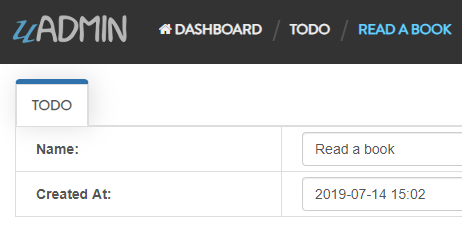

|

Open your Todo List project, go to the todo.go and set the hidden tag in the CreatedAt field.

.. code-block:: go

    package models

    import (
        "time"

        "github.com/uadmin/uadmin"
    )

    // Todo model ...
    type Todo struct {
        uadmin.Model
        Name      string
        CreatedAt time.Time `uadmin:"hidden"` // <-- place it here
    }

Run your application. From uAdmin dashboard, go to Todo model, click any existing record that you have and you should get this result.

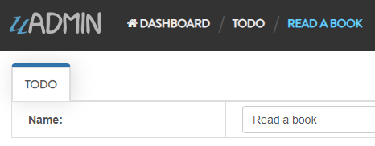

|

Now exit your application. Create a file named get_form.go inside the api folder with the following codes below:

.. code-block:: go

    package api

    import (
        "net/http"
        "strings"

        // Specify the username that you used inside github.com folder
        "github.com/username/todo/models"
        "github.com/uadmin/uadmin"
    )

    // GetFormAPIHandler !
    func GetFormAPIHandler(w http.ResponseWriter, r *http.Request) {
        // r.URL.Path creates a new path called /get_form
        r.URL.Path = strings.TrimPrefix(r.URL.Path, "/get_form")

        // Set the parameter as id
        id := r.FormValue("id")

        // Initialize the Todo model
        todo := models.Todo{}

        // Call the schema of "todo" model
        modelschema := uadmin.Schema["todo"]

        // Get a record from DB based on the assigned ID
        uadmin.GetForm(&todo, &modelschema, "id = ?", id)

        // Print the result in JSON format
        uadmin.ReturnJSON(w, r, todo)
    }

Establish a connection in the main.go to the API by using http.HandleFunc. It should be placed after the uadmin.Register and before the StartServer.

.. code-block:: go

    func main() {
        // Some codes

        // GetFormAPIHandler
        http.HandleFunc("/get_form/", api.GetFormAPIHandler) // <-- place it here
    }

api is the folder name while GetFormAPIHandler is the name of the function inside get_form.go.

Run your application. Search for the first ID on the id parameter in the address bar and see what happens.

.. image:: assets/getformcreatedatnovalue.png
   :align: center

|

Even though there is an assigned date on the CreatedAt field in the form, the API does not return a value because the CreatedAt field is hidden in the form. Now exit your application, go to todo.go in the models folder and remove the hidden tag in the CreatedAt field.

.. code-block:: go

    package models

    import (
        "time"

        "github.com/uadmin/uadmin"
    )

    // Todo model ...
    type Todo struct {
        uadmin.Model
        Name      string
        CreatedAt time.Time // Tag removed
    }

Run your application. Search for the first ID on the id parameter in the address bar and see what happens.

.. image:: assets/getformcreatedatwithvalue.png
   :align: center

|

As expected, the API is now returning a CreatedAt value because the CreatedAt field in the form is visible.

**uadmin.GetID**
^^^^^^^^^^^^^^^^
GetID returns an ID number of a field.

Function:

.. code-block:: go

    func(m.reflectValue) uint

Parameter:

    **m.reflectValue:** Creates a new instance to read, set, or add values

Suppose I have four records in my Category model.

* Education ID = 4
* Family ID = 3
* Work ID = 2
* Travel ID = 1

.. image:: assets/categorylist.png

Go to the main.go and apply the following codes below:

.. code-block:: go

    func main(){

        // Some codes

        // Initialize the Category model
        categorylist := models.Category{}

        // Get the value of the name in the categorylist
        uadmin.Get(&categorylist, "name = 'Family'")

        // Get the ID of the name "Family"
        getid := uadmin.GetID(reflect.ValueOf(categorylist))

        // Print the result
        uadmin.Trail(uadmin.INFO, "GetID is %d.", getid)
    }

Run your application and check the terminal to see the result.

.. code-block:: bash

    [  INFO  ]   GetID is 3.

**uadmin.GetSetting**
^^^^^^^^^^^^^^^^^^^^^
GetSetting returns the value of the setting based on the data type selected.

Function:

.. code-block:: go

    func(code string) interface{}

Suppose I have the record "Water Daily Intake for Men" that has the value of 13 and the Data Type is Integer.

.. image:: assets/waterdailyintakeformenrecord.png
   :align: center

|

Go to the main.go and print the returning value of the GetSetting:

.. code-block:: go

    func main(){
        // Some codes
        // GetSetting reads the Code then returns the value
        uadmin.Trail(uadmin.DEBUG, uadmin.GetSetting("Health.WaterDailyIntakeforMen"))
    }

Now run your application and check the result in your terminal.

.. code-block:: bash

    [  DEBUG ]   13

**uadmin.GetString**
^^^^^^^^^^^^^^^^^^^^
GetString returns string representation on an instance of a model.

Function:

.. code-block:: go

    func(a interface{}) string

Parameter:

    **a interface{}:** Is the variable where the model was initialized

Suppose I have four records in my Category model.

* Education ID = 4
* Family ID = 3
* Work ID = 2
* Travel ID = 1

.. image:: assets/categorylist.png

Go to the main.go and apply the following codes below:

.. code-block:: go

    func main(){

        // Some codes

        // Initialize the Category model
        categorylist := models.Category{}

        // Get the ID in the categorylist
        uadmin.Get(&categorylist, "id = 3")

        // Get the name of the ID 3
        getstring := uadmin.GetString(categorylist)

        // Print the result
        uadmin.Trail(uadmin.INFO, "GetString is %s.", getstring)
    }

Run your application and check the terminal to see the result.

.. code-block:: bash

    [  INFO  ]   GetString is Family.

**uadmin.GetStringer**
^^^^^^^^^^^^^^^^^^^^^^
GetStringer fetches the first record from the database matching query and args and get only fields tagged with `stringer` tag. If no field has `stringer` tag, then it gets all the fields.

Function:

.. code-block:: go

    func(a interface{}, query interface{}, args ...interface{}) (err error)

Parameters:

    **a interface{}:** Is the variable where the model was initialized

    **query interface{}:** Is an action that you want to perform in your database

    **args ...interface{}:** Is the series of arguments for query input

Before we proceed to the example, read `Tutorial Part 7 - Introduction to API`_ to familiarize how API works in uAdmin.

.. _Tutorial Part 7 - Introduction to API: https://uadmin-docs.readthedocs.io/en/latest/tutorial/part7.html

Suppose you have a record in the Friend model that has an ID of 1 where Name field has a `stringer` tag.

.. image:: assets/friendjohndoe.png

Create a file named get_stringer.go inside the api folder with the following codes below:

.. code-block:: go

    // GetStringerHandler !
    func GetStringerHandler(w http.ResponseWriter, r *http.Request) {
        // r.URL.Path creates a new path called /get_stringer
        r.URL.Path = strings.TrimPrefix(r.URL.Path, "/get_stringer")

        // Set the parameter as friend_id
        friendID := r.FormValue("friend_id")

        // Get a record from DB that fetches a field with a stringer tag
        friend := models.Friend{}
        uadmin.GetStringer(&friend, "id = ?", friendID)

        // Print result in JSON format
        uadmin.ReturnJSON(w, r, friend)
    }

Establish a connection in the main.go to the API by using http.HandleFunc. It should be placed after the uadmin.Register and before the StartServer.

.. code-block:: go

    func main() {
        // Some codes

        // GetStringerHandler
        http.HandleFunc("/get_stringer/", api.GetStringerHandler)
    }

api is the folder name while GetStringerHandler is the name of the function inside get_stringer.go.

Run your application. Search for the first ID on the friend_id parameter in the address bar and see what happens.

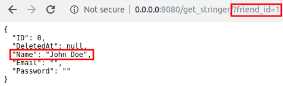

**uadmin.GetUserFromRequest**
^^^^^^^^^^^^^^^^^^^^^^^^^^^^^
GetUserFromRequest returns a user from a request.

Function:

.. code-block:: go

    func(r *http.Request) *uadmin.User

Parameter:

    **r \*http.Request:** Is a data structure that represents the client HTTP request

Before we proceed to the example, read `Tutorial Part 7 - Introduction to API`_ to familiarize how API works in uAdmin.

Suppose that the admin account has logined.

.. image:: tutorial/assets/adminhighlighted.png

|

Create a file named info.go inside the api folder with the following codes below:

.. code-block:: go

    // InfoHandler !
    func InfoHandler(w http.ResponseWriter, r *http.Request) {
        r.URL.Path = strings.TrimPrefix(r.URL.Path, "/info")

        // Place it here
        uadmin.Trail(uadmin.INFO, "GetUserFromRequest: %s", uadmin.GetUserFromRequest(r))
    }

Establish a connection in the main.go to the API by using http.HandleFunc. It should be placed after the uadmin.Register and before the StartServer.

.. code-block:: go

    func main() {
        // Some codes

        // InfoHandler
        http.HandleFunc("/info/", api.InfoHandler) // <-- place it here
    }

api is the folder name while InfoHandler is the name of the function inside info.go.

Run your application and see what happens.

.. image:: assets/infoapi.png

Check your terminal for the result.

.. code-block:: bash

    [  INFO  ]   GetUserFromRequest: System Admin

The result is coming from the user in the dashboard.

.. image:: assets/getuserfromrequest.png

|

There is another way of using this function:

.. code-block:: go

    // InfoHandler !
    func InfoHandler(w http.ResponseWriter, r *http.Request) {
        r.URL.Path = strings.TrimPrefix(r.URL.Path, "/info")

        getuser := uadmin.GetUserFromRequest(r)
        getuser.XXXX
    }

XXXX contains user fields and functions that you can use. See `uadmin.User`_ for the list and examples.

Go to the info.go in API folder containing the following codes below:

.. code-block:: go

    // InfoHandler !
    func InfoHandler(w http.ResponseWriter, r *http.Request) {
        r.URL.Path = strings.TrimPrefix(r.URL.Path, "/info")

        // Get the User that returns the first and last name
        getuser := uadmin.GetUserFromRequest(r)

        // Print the result using Golang fmt
        fmt.Println("GetActiveSession() is", getuser.GetActiveSession())
        fmt.Println("GetDashboardMenu() is", getuser.GetDashboardMenu())

        // Print the result using Trail
        uadmin.Trail(uadmin.INFO, "GetOTP() is %s.", getuser.GetOTP())
        uadmin.Trail(uadmin.INFO, "String() is %s.", getuser.String())
    }

Run your application and see what happens.

.. image:: assets/infoapi.png

Check your terminal for the result.

.. code-block:: bash

    GetActiveSession() is Pfr7edaO7bBjv9zL9j1Yi01I
    GetDashboardMenu() is [Dashboard Menus Users User Groups Sessions User Permissions Group Permissions Languages Logs Todos Categorys Friends Items]
    [  INFO  ]   GetOTP() is 363669.
    [  INFO  ]   String() is System Admin.

**uadmin.GroupPermission**
^^^^^^^^^^^^^^^^^^^^^^^^^^
GroupPermission sets the permission of a user group handled by an administrator.

Structure:

.. code-block:: go

    type GroupPermission struct {
        Model
        DashboardMenu   DashboardMenu `uadmin:"required;filter"`
        DashboardMenuID uint
        UserGroup       UserGroup `uadmin:"required;filter"`
        UserGroupID     uint
        Read            bool `uadmin:"filter"`
        Add             bool `uadmin:"filter"`
        Edit            bool `uadmin:"filter"`
        Delete          bool `uadmin:"filter"`
        Approval        bool `uadmin:"filter"`
    }

There are 2 functions that you can use in GroupPermission:

* **HideInDashboard()** - Return true and auto hide this from dashboard
* **String()** - Returns the GroupPermission ID

There are 2 ways you can do for initialization process using this function: one-by-one and by group.

One-by-one initialization:

.. code-block:: go

    func main(){
        // Some codes
        grouppermission := uadmin.GroupPermission{}
        grouppermission.DashboardMenu = dashboardmenu
        grouppermission.DashboardMenuID = 1
        grouppermission.UserGroup = usergroup
        grouppermission.UserGroupID = 1
    }

By group initialization:

.. code-block:: go

    func main(){
        // Some codes
        grouppermission := uadmin.GroupPermission{
            DashboardMenu: dashboardmenu,
            DashboardMenuID: 1,
            UserGroup: usergroup,
            UserGroupID: 1,
        }
    }

In this example, we will use "by group" initialization process.

Suppose that Even Demata is a part of the Front Desk group.

.. image:: assets/useraccountfrontdesk.png

|

Go to the main.go and apply the following codes below after the RegisterInlines section.

.. code-block:: go

    func main(){

        // Some codes

        grouppermission := uadmin.GroupPermission{
            DashboardMenuID: 9, // Todos
            UserGroupID:     1, // Front Desk
            Read:            true,
            Add:             false,
            Edit:            false,
            Delete:          false,
            Approval:        false,
        }

        // This will create a new group permission based on the information
        // assigned in the grouppermission variable.
        uadmin.Save(&grouppermission)

        // Returns the GroupPermissionID
        uadmin.Trail(uadmin.INFO, "String() returns %s.", grouppermission.String())
    }

Now run your application and see what happens.

**Terminal**

.. code-block:: bash

    [  INFO  ]   String() returns 1.

.. image:: assets/grouppermissioncreated.png

|

Log out your System Admin account. This time login your username and password using the user account that has group permission. Afterwards, you will see that only the Todos model is shown in the dashboard because your user account is not an admin and has no remote access to it. Now click on TODOS model.

.. image:: assets/userpermissiondashboard.png

|

As you will see, your user account is restricted to add, edit, or delete a record in the Todo model. You can only read what is inside this model.

.. image:: assets/useraddeditdeleterestricted.png

|

If you want to hide the Todo model in your dashboard, first of all, create a HideInDashboard() function in your todo.go inside the models folder and set the return value to "true".

.. code-block:: go

    // HideInDashboard !
    func (t Todo) HideInDashboard() bool {
        return true
    }

Now you can do something like this in main.go:

.. code-block:: go

    func main(){

        // Some codes

        // Initializes the DashboardMenu
        dashboardmenu := uadmin.DashboardMenu{}

        // Assign the grouppermission, call the HideInDashboard() function
        // from todo.go, store it to the Hidden field of the dashboardmenu
        dashboardmenu.Hidden = grouppermission.HideInDashboard()

        // Checks the Dashboard Menu ID number from the grouppermission. If it
        // matches, it will update the value of the Hidden field.
        uadmin.Update(&dashboardmenu, "Hidden", dashboardmenu.Hidden, "id = ?", grouppermission.DashboardMenuID)
    }

Now rerun your application using the Even Demata account and see what happens.

.. image:: assets/dashboardmenuempty.png

|

The Todo model is now hidden from the dashboard. If you login your System Admin account, you will see in the Dashboard menu that the hidden field of the Todo model is set to true.

.. image:: assets/todomodelhidden.png

**uadmin.HideInDashboarder**
^^^^^^^^^^^^^^^^^^^^^^^^^^^^
HideInDashboarder is used to check if a model should be hidden in the dashboard.

Structure:

.. code-block:: go

    type HideInDashboarder interface{
        HideInDashboard() bool
    }

Suppose I have five models in my dashboard: Todos, Categorys, Items, Friends, and Expressions. I want Friends and Expressions models to be hidden in the dashboard. In order to do that, go to the friend.go and expression.go inside the models folder and apply the HideInDashboard() function. Set the return value to **true** inside it.

**friend.go**

.. code-block:: go

    func (Friend) HideInDashboard() bool {
        return true
    }

**expression.go**

.. code-block:: go

    func (Expression) HideInDashboard() bool {
        return true
    }

Now go to the main.go and apply the following codes below inside the main function:

.. code-block:: go

    // Initialize the Expression and Friend models inside the modelList with
    // the array type of interface
    modelList := []interface{}{
        models.Expression{},
        models.Friend{},
    }

    // Loop the execution process based on the modelList count
    for i := range modelList {

        // Returns the reflection type that represents the dynamic type of i
        t := reflect.TypeOf(modelList[i])

        // Calls the HideInDashboarder function to access the HideInDashboard
        // function
        hideItem := modelList[i].(uadmin.HideInDashboarder).HideInDashboard()

        // Initializes the dashboardmenu variable to assign the DashboardMenu
        dashboardmenu := uadmin.DashboardMenu{

            // Returns the name of the model based on reflection
            MenuName: t.Name(),

            // Returns the boolean value based on the assigned return in the
            // HideInDashboard()
            Hidden:   hideItem,
        }

        // Prints the information of the dashboardmenu
        uadmin.Trail(uadmin.INFO, "MenuName: %s,  Hidden: %t", dashboardmenu.MenuName, dashboardmenu.Hidden)
    }

Go back to your application. Open the DashboardMenu then delete the Expressions and Friends model.

.. image:: assets/deletetwomodels.png

|

Now rerun your application and see what happens.

.. code-block:: bash

    [  INFO  ]   MenuName: Expression,  Hidden: true
    [  INFO  ]   MenuName: Friend,  Hidden: true

.. image:: assets/twomodelshidden.png

|

As expected, Friends and Expressions models are now hidden in the dashboard. If you go to the Dashboard Menus, you will see that they are checked in the Hidden field.

.. image:: assets/twomodelshiddenchecked.png

**uadmin.INFO**
^^^^^^^^^^^^^^^
INFO is the display tag under Trail. It is a data that is presented within a context that gives it meaning and relevance.

Type:

.. code-block:: go

    untyped int

See `uadmin.Trail`_ for the example.

**uadmin.IsAuthenticated**
^^^^^^^^^^^^^^^^^^^^^^^^^^
IsAuthenticated returns the session of the user.

Function:

.. code-block:: go

    func(r *http.Request) *uadmin.Session

Parameter:

    **r \*http.Request:** Is a data structure that represents the client HTTP request

See `uadmin.Session`_ for the list of fields and functions that you can use in IsAuthenticated.

Before we proceed to the example, read `Tutorial Part 7 - Introduction to API`_ to familiarize how API works in uAdmin.

Suppose that the admin account has logined.

.. image:: tutorial/assets/adminhighlighted.png

|

Create a file named custom_todo.go inside the api folder with the following codes below:

.. code-block:: go

    // CustomTodoHandler !
    func CustomTodoHandler(w http.ResponseWriter, r *http.Request) {
        r.URL.Path = strings.TrimPrefix(r.URL.Path, "/custom_todo")

        // Get the session key
        session := uadmin.IsAuthenticated(r)

        // If there is no value in the session, it will return the
        // LoginHandler.
        if session == nil {
            LoginHandler(w, r)
            return
        }

        // Fetch the values from a User model using session IsAuthenticated
        user := session.User
        userid := session.UserID
        username := session.User.Username
        active := session.User.Active

        // Print the result
        uadmin.Trail(uadmin.INFO, "Session / Key: %s", session)
        uadmin.Trail(uadmin.INFO, "User: %s", user)
        uadmin.Trail(uadmin.INFO, "UserID: %d", userid)
        uadmin.Trail(uadmin.INFO, "Username: %s", username)
        uadmin.Trail(uadmin.INFO, "Active: %v", active)

        // Deactivates a session
        session.Logout()
    }

Establish a connection in the main.go to the API by using http.HandleFunc. It should be placed after the uadmin.Register and before the StartServer.

.. code-block:: go

    func main() {
        // Some codes

        // CustomTodoHandler
        http.HandleFunc("/custom_todo/", api.CustomTodoHandler) // <-- place it here
    }

api is the folder name while CustomTodoHandler is the name of the function inside custom_todo.go.

Run your application and see what happens.

.. image:: assets/customtodoapi.png

Check your terminal for the result.

.. code-block:: bash

    [  INFO  ]   Session / Key: Pfr7edaO7bBjv9zL9j1Yi01I
    [  INFO  ]   Username: System Admin
    [  INFO  ]   UserID: 1
    [  INFO  ]   Username: admin
    [  INFO  ]   Active: true

The result is coming from the session in the dashboard.

.. image:: assets/isauthenticated.png

|

And the values in the User model by calling the User, UserID, Username, and Active fields.

.. image:: assets/usersession.png

|

And if you go back to the home page, your account has been logged out automatically that redirects you to the login page.

.. image:: tutorial/assets/loginform.png

**uadmin.JSONMarshal**
^^^^^^^^^^^^^^^^^^^^^^
JSONMarshal returns the JSON encoding of v.

Function:

.. code-block:: go

    func(v interface{}, safeEncoding bool) ([]byte, error)

Parameters:

    **v interface{}:** Is the variable where the model was initialized

    **safeEncoding bool:** Ensures the security of the data

Before we proceed to the example, read `Tutorial Part 7 - Introduction to API`_ to familiarize how API works in uAdmin.

.. _Tutorial Part 7 - Introduction to API: https://uadmin-docs.readthedocs.io/en/latest/tutorial/part7.html

Create a file named friend_list.go inside the api folder with the following codes below:

.. code-block:: go

    // FriendListHandler !
    func FriendListHandler(w http.ResponseWriter, r *http.Request) {
        // r.URL.Path creates a new path called /friend_list
        r.URL.Path = strings.TrimPrefix(r.URL.Path, "/friend_list")

        // Fetch Data from DB
        friend := []models.Friend{}
        uadmin.All(&friend)

        // Place it here
        output, _ := uadmin.JSONMarshal(&friend, true)

        // Prints the output to the terminal in JSON format
        os.Stdout.Write(output)

        // Unmarshal parses the JSON-encoded data and stores the result in the
        // value pointed to by v.
        json.Unmarshal(output, &friend)

        // Prints the JSON format in the API webpage
        uadmin.ReturnJSON(w, r, friend)
    }

Establish a connection in the main.go to the API by using http.HandleFunc. It should be placed after the uadmin.Register and before the StartServer.

.. code-block:: go

    func main() {
        // Some codes

        // FriendListHandler
        http.HandleFunc("/friend_list/", api.FriendListHandler) // <-- place it here
    }

api is the folder name while FriendListHandler is the name of the function inside friend_list.go.

Run your application and see what happens.

**Terminal**

.. code-block:: bash

    [
        {
            "ID": 1,
            "DeletedAt": null,
            "Name": "John Doe",
            "Email": "john.doe@gmail.com",
            "Password": "123456",
            "Nationality": 3,
            "Invite": "https://uadmin.io/"
        }
    ]

**API**

.. image:: assets/friendlistjsonmarshal.png
   :align: center

**uadmin.Language**
^^^^^^^^^^^^^^^^^^^
Language is a system in uAdmin that is used to add, modify and delete the elements of a language.

Structure:

.. code-block:: go

    type Language struct {
        Model
        EnglishName    string `uadmin:"required;read_only;filter;search"`
        Name           string `uadmin:"required;read_only;filter;search"`
        Flag           string `uadmin:"image;list_exclude"`
        Code           string `uadmin:"filter;read_only;list_exclude"`
        RTL            bool   `uadmin:"list_exclude"`
        Default        bool   `uadmin:"help:Set as the default language;list_exclude"`
        Active         bool   `uadmin:"help:To show this in available languages;filter"`
        AvailableInGui bool   `uadmin:"help:The App is available in this language;read_only"`
    }

There are 2 functions that you can use in Language:

* **Save()** - Saves the object in the database
* **String()** - Returns the Code of the language

There are 2 ways you can do for initialization process using this function: one-by-one and by group.

One-by-one initialization:

.. code-block:: go

    func main(){
        // Some codes
        language := uadmin.Language{}
        language.EnglishName = "English Name"
        language.Name = "Name"
    }

By group initialization:

.. code-block:: go

    func main(){
        // Some codes
        language := uadmin.Language{
            EnglishName: "English Name",
            Name: "Name",
        }
    }

In the following examples, we will use “by group” initialization process.

* `Example #1: Active`_
* `Example #2: Default`_
* `Example #3: RTL`_

.. _Example #1\: Active: https://uadmin-docs.readthedocs.io/en/latest/api/language.html#example-1-active
.. _Example #2\: Default: https://uadmin-docs.readthedocs.io/en/latest/api/language.html#example-2-default
.. _Example #3\: RTL: https://uadmin-docs.readthedocs.io/en/latest/api/language.html#example-3-rtl

Page:

.. toctree::
   :maxdepth: 1

   api/language

**uadmin.Log**
^^^^^^^^^^^^^^
Log is a system in uAdmin that is used to add, modify, and delete the status of the user activities.

Structure:

.. code-block:: go

    type Log struct {
        Model
        Username  string    `uadmin:"filter;read_only"`
        Action    Action    `uadmin:"filter;read_only"`
        TableName string    `uadmin:"filter;read_only"`
        TableID   int       `uadmin:"filter;read_only"`
        Activity  string    `uadmin:"code;read_only" gorm:"type:longtext"`
        RollBack  string    `uadmin:"link;"`
        CreatedAt time.Time `uadmin:"filter;read_only"`
    }

There are 11 types of actions:

* **Added** - Saved a new record
* **Custom** - For any other action that you would like to log
* **Deleted** - Deleted a record
* **LoginDenied** - User invalid login
* **LoginSuccessful** - User login
* **Logout** - User logout
* **Modified** - Save an existing record
* **PasswordResetDenied** - A password reset attempt was rejected
* **PasswordResetRequest** - A password reset was received
* **PasswordResetSuccessful** - A password was reset
* **Read** - Opened a record

There are 5 functions that you can use in Log:

**ParseRecord** - It means to analyze a record specifically. It uses this format as shown below:

.. code-block:: go

    func(a reflect.Value, modelName string, ID uint, user *User, action Action, r *http.Request) (err error)

Parameters:

* **a reflect.Value**: An interface initialized in NewModel function
* **modelName string**: The name of the model in lowercase letters
* **ID uint**: The ID of the model
* **user \*User**: What account is using in the session
* **action Action**: An activity status
* **r \*http.Request**: A data structure that represents the client HTTP request

Go to `Example #2: ParseRecord function`_ to see how ParseRecord works.

**PasswordReset** - It keeps track when the user resets his password. It uses this format as shown below:

.. code-block:: go

    func(user string, action Action, r *http.Request) (err error)

Parameters:

* **user string**: An account username
* **action Action**: An activity status
* **r \*http.Request**: A data structure that represents the client HTTP request

Go to `Example #3: PasswordReset function`_ to see how PasswordReset works.

**Save()** - Saves the object in the database

**SignIn** - It keeps track when the user signs in his account. It uses this format as shown below:

.. code-block:: go

    func(user string, action Action, r *http.Request) (err error)

Parameters:

* **user string**: An account username
* **action Action**: An activity status
* **r \*http.Request**: A data structure that represents the client HTTP request

Go to `Example #4: SignIn function`_ to see how SignIn works.

**String()** - Returns the Log ID

Examples:

* `Example #1: Assigning values in Log fields`_
* `Example #2: ParseRecord function`_
* `Example #3: PasswordReset function`_
* `Example #4: SignIn function`_

.. _Example #1\: Assigning values in Log fields: https://uadmin-docs.readthedocs.io/en/latest/api/log.html#example-1-assigning-values-in-log-fields
.. _Example #2\: ParseRecord function: https://uadmin-docs.readthedocs.io/en/latest/api/log.html#example-2-parserecord-function
.. _Example #3\: PasswordReset function: https://uadmin-docs.readthedocs.io/en/latest/api/log.html#example-3-passwordreset-function
.. _Example #4\: SignIn function: https://uadmin-docs.readthedocs.io/en/latest/api/log.html#example-4-signin-function

Page:

.. toctree::
   :maxdepth: 1

   api/log

**uadmin.LogAdd**
^^^^^^^^^^^^^^^^^
LogAdd adds a log when a record is added.

Type:

.. code-block:: go

    bool

Go to the main.go and apply this function to “true”. Put it above the uadmin.Register.

.. code-block:: go

    func main() {
        uadmin.LogAdd = true
        uadmin.Register(
            // Some codes
        )

Run your application and go to "LOGS" model.

.. image:: assets/logshighlighted.png

|

Suppose that you have this record in your logs as shown below:

.. image:: assets/loginitialrecord.png

|

Go back to uAdmin dashboard then select "LOGS".

.. image:: assets/todoshighlightedlog.png

|

Click "Add New Todo".

.. image:: assets/addnewtodo.png

|

Input the name value in the text box (e.g. Read a book). Click Save button afterwards.

.. image:: assets/readabook.png

|

Result

.. image:: assets/readabookoutput.png

|

Now go back to the "LOGS" to see the result.

.. image:: assets/logaddtrueresult.png

|

Exit your application for a while. Go to the main.go once again. This time, apply this function to "false".

.. code-block:: go

    func main() {
        uadmin.LogAdd = false // <----
        uadmin.Register(
            // Some codes
        )

|

Rebuild and run your application. Go to "TODOS" model and add another data inside it.

.. image:: assets/buildarobot.png

|

Result

.. image:: assets/buildarobotoutput.png

|

Now go back to the "LOGS" to see the result.

.. image:: assets/logaddfalseresult.png

|

As you can see, the log content remains the same. Well done!

See `uadmin.LogRead`_ for the continuation.

**uadmin.LogDelete**
^^^^^^^^^^^^^^^^^^^^
LogAdd adds a log when a record is deleted.

Type:

.. code-block:: go

    bool

Before you proceed to this example, see `uadmin.LogEdit`_.

Go to the main.go and apply the LogDelete function to “true”. Put it above the uadmin.Register.

.. code-block:: go

    func main() {
        uadmin.LogAdd = false
        uadmin.LogRead = false
        uadmin.LogEdit = false
        uadmin.LogDelete = true // <----
        uadmin.Register(
            // Some codes
        )

Run your application and go to "LOGS" model.

.. image:: assets/logshighlighted.png

|

Suppose that you have this record in your logs as shown below:

.. image:: assets/logeditfalseresult.png

|

Go back to uAdmin dashboard then select "LOGS".

.. image:: assets/todoshighlightedlog.png

|

Select any of your existing data that you wish to delete (e.g. Washing the dishes)

.. image:: assets/washingthedishesdelete.png

|

Now go back to the "LOGS" to see the result.

.. image:: assets/logdeletetrueresult.png

|

Exit your application for a while. Go to the main.go once again. This time, apply the LogDelete function to "false".

.. code-block:: go

    func main() {
        uadmin.LogAdd = false
        uadmin.LogRead = false
        uadmin.LogEdit = false
        uadmin.LogDelete = false // <---
        uadmin.Register(
            // Some codes
        )

Rebuild and run your application. Go to "TODOS" model and delete the remaining data (e.g. Read a book).

.. image:: assets/readabookdelete.png

|

Now go back to the "LOGS" to see the result.

.. image:: assets/logdeletefalseresult.png

|

As you can see, the log content remains the same. Well done!

**uadmin.LogEdit**
^^^^^^^^^^^^^^^^^^
LogAdd adds a log when a record is edited.

Type:

.. code-block:: go

    bool

Before you proceed to this example, see `uadmin.LogRead`_.

Go to the main.go and apply the LogEdit function to “true”. Put it above the uadmin.Register.

.. code-block:: go

    func main() {
        uadmin.LogAdd = false
        uadmin.LogRead = false
        uadmin.LogEdit = true // <----
        uadmin.Register(
            // Some codes
        )

Run your application and go to "LOGS" model.

.. image:: assets/logshighlighted.png

|

Suppose that you have this record in your logs as shown below:

.. image:: assets/logreadfalseresult.png

|

Go back to uAdmin dashboard then select "LOGS".

.. image:: assets/todoshighlightedlog.png

|

Select any of your existing data (e.g. Build a robot)

.. image:: assets/todoexistingdata.png

|

Change it to "Assembling the CPU" for instance.

.. image:: assets/assemblingthecpu.png

|

Result

.. image:: assets/assemblingthecpuoutput.png

|

Now go back to the "LOGS" to see the result.

.. image:: assets/logedittrueresult.png

|

Exit your application for a while. Go to the main.go once again. This time, apply the LogEdit function to "false".

.. code-block:: go

    func main() {
        uadmin.LogAdd = false
        uadmin.LogRead = false
        uadmin.LogEdit = false // <----
        uadmin.Register(
            // Some codes
        )

Rebuild and run your application. Go to "TODOS" model and modify any of your existing data (e.g. Assembling the CPU).

.. image:: assets/buildarobot.png

|

Change it to "Washing the dishes" for instance.

.. image:: assets/washingthedishes.png

|

Result

.. image:: assets/washingthedishesresult.png

|

Now go back to the "LOGS" to see the result.

.. image:: assets/logeditfalseresult.png

|

As you can see, the log content remains the same. Well done!

See `uadmin.LogDelete`_ for the continuation.

**uadmin.Login**
^^^^^^^^^^^^^^^^
Login returns the pointer of User and a bool for Is OTP Required.

Function:

.. code-block:: go

    func(r *http.Request, username string, password string) (*uadmin.User, bool)

Parameters:

    **r \*http.Request:** Is a data structure that represents the client HTTP request

    **username string:** Is the account username

    **password string:** Is the password of the user account

Before we proceed to the example, read `Tutorial Part 7 - Introduction to API`_ to familiarize how API works in uAdmin.

Create a file named info.go inside the api folder with the following codes below:

.. code-block:: go

    // InfoHandler !
    func InfoHandler(w http.ResponseWriter, r *http.Request) {
        r.URL.Path = strings.TrimPrefix(r.URL.Path, "/info")
        fmt.Println(uadmin.Login(r, "admin", "admin")) // <-- place it here
    }

Establish a connection in the main.go to the API by using http.HandleFunc. It should be placed after the uadmin.Register and before the StartServer.

.. code-block:: go

    func main() {
        // Some codes

        // InfoHandler
        http.HandleFunc("/info/", api.InfoHandler) // <-- place it here
    }

api is the folder name while InfoHandler is the name of the function inside info.go.

Run your application and see what happens.

.. image:: assets/infoapi.png

Check your terminal for the result.

.. code-block:: bash

    System Admin false

The result is coming from the user in the dashboard.

.. image:: assets/systemadminotphighlighted.png

Visit `Login System Tutorials`_ for more examples.

.. _Login System Tutorials: https://uadmin-docs.readthedocs.io/en/latest/login_system/coverage.html

Page:

.. toctree::
   :maxdepth: 1

   login_system/coverage

**uadmin.Login2FA**
^^^^^^^^^^^^^^^^^^^
Login2FA returns the pointer of User with a two-factor authentication.

Function:

.. code-block:: go

   func(r *http.Request, username string, password string, otpPass string) *uadmin.User

Parameters:

    **r \*http.Request:** Is a data structure that represents the client HTTP request

    **username string:** Is the account username

    **password string:** Is the password of the user account

    **otpPass string:** Is the OTP code assigned by your terminal

Before we proceed to the example, read `Tutorial Part 7 - Introduction to API`_ to familiarize how API works in uAdmin.

First of all, activate the OTP Required in your System Admin account.

.. image:: assets/otprequired.png

|

Afterwards, logout your account then login again to get the OTP verification code in your terminal.

.. image:: assets/loginformwithotp.png

.. code-block:: bash

    [  INFO  ]   User: admin OTP: 445215

Now create a file named info.go inside the api folder with the following codes below:

.. code-block:: go

    package api

    import (
        "fmt"
        "net/http"
        "strings"

        "github.com/uadmin/uadmin"
    )

    // InfoHandler !
    func InfoHandler(w http.ResponseWriter, r *http.Request) {
        r.URL.Path = strings.TrimPrefix(r.URL.Path, "/info")

        // Place it here
        fmt.Println(uadmin.Login2FA(r, "admin", "admin", "445215"))
    }

Establish a connection in the main.go to the API by using http.HandleFunc. It should be placed after the uadmin.Register and before the StartServer.

.. code-block:: go

    func main() {
        // Some codes

        // InfoHandler
        http.HandleFunc("/info/", api.InfoHandler) // <-- place it here
    }

api is the folder name while InfoHandler is the name of the function inside info.go.

Run your application and see what happens.

.. image:: assets/infoapi.png

Check your terminal for the result.

.. code-block:: bash

    System Admin

Visit `Login System Tutorials`_ for more examples.

.. _Login System Tutorials: https://uadmin-docs.readthedocs.io/en/latest/login_system/coverage.html

Page:

.. toctree::
   :maxdepth: 1

   login_system/coverage

**uadmin.Logout**
^^^^^^^^^^^^^^^^^
Logout deactivates the session.

Function:

.. code-block:: go

    func(r *http.Request)

Parameter:

    **r \*http.Request:** Is a data structure that represents the client HTTP request

Suppose that the admin account has logined.

.. image:: tutorial/assets/adminhighlighted.png

|

Create a file named logout.go inside the api folder with the following codes below:

.. code-block:: go

    // LogoutHandler !
    func LogoutHandler(w http.ResponseWriter, r *http.Request) {
        r.URL.Path = strings.TrimPrefix(r.URL.Path, "/logout")
        uadmin.Logout(r) // <-- place it here
    }

Establish a connection in the main.go to the API by using http.HandleFunc. It should be placed after the uadmin.Register and before the StartServer.

.. code-block:: go

    func main() {
        // Some codes

        // LogoutHandler
        http.HandleFunc("/logout/", api.LogoutHandler)) // <-- place it here
    }

api is the folder name while LogoutHandler is the name of the function inside logout.go.

Run your application and see what happens.

.. image:: assets/logoutapi.png

Refresh your browser and see what happens.

.. image:: tutorial/assets/loginform.png

|

Your account has been logged out automatically that redirects you to the login page.

Visit `Login System Tutorials`_ for more examples.

.. _Login System Tutorials: https://uadmin-docs.readthedocs.io/en/latest/login_system/coverage.html

Page:

.. toctree::
   :maxdepth: 1

   login_system/coverage

**uadmin.LogRead**
^^^^^^^^^^^^^^^^^^
LogRead adds a log when a record is read.

Type:

.. code-block:: go

    bool

Before you proceed to this example, see `uadmin.LogAdd`_.

Go to the main.go and apply the LogRead function to “true”. Put it above the uadmin.Register.

.. code-block:: go

    func main() {
        uadmin.LogAdd = false
        uadmin.LogRead = true // <----
        uadmin.Register(
            // Some codes
        )

Run your application and go to "LOGS" model.

.. image:: assets/logshighlighted.png

|

Suppose that you have this record in your logs as shown below:

.. image:: assets/logaddfalseresult.png

|

Go back to uAdmin dashboard then select "LOGS".

.. image:: assets/todoshighlightedlog.png

|

Select any of your existing data.

.. image:: assets/todoexistingdata.png

|

Result

.. image:: assets/readabook.png

|

Now go back to the "LOGS" to see the result.

.. image:: assets/logreadtrueresult.png

|

Exit your application for a while. Go to the main.go once again. This time, apply the LogRead function to "false".

.. code-block:: go

    func main() {
        uadmin.LogAdd = false
        uadmin.LogRead = false // <----
        uadmin.Register(
            // Some codes
        )

Rebuild and run your application. Go to "TODOS" model and add select any of your existing data.

.. image:: assets/todoexistingdata.png

|

Result

.. image:: assets/readabook.png

|

Now go back to the "LOGS" to see the result.

.. image:: assets/logreadfalseresult.png

|

As you can see, the log content remains the same. Well done!

See `uadmin.LogEdit`_ for the continuation.

**uadmin.MaxImageHeight**
^^^^^^^^^^^^^^^^^^^^^^^^^
MaxImageHeight sets the maximum height of an image.

Type:

.. code-block:: go

    int

See `uadmin.MaxImageWidth`_ for the example.

**uadmin.MaxImageWidth**
^^^^^^^^^^^^^^^^^^^^^^^^
MaxImageWidth sets the maximum width of an image.

Type:

.. code-block:: go

    int

Let's set the MaxImageWidth to 360 pixels and the MaxImageHeight to 240 pixels.

.. code-block:: go

    func main() {
        // Some codes
        uadmin.MaxImageWidth = 360      // <--  place it here
        uadmin.MaxImageHeight = 240     // <--  place it here
    }

uAdmin has a feature that allows you to customize your own profile. In order to do that, click the profile icon on the top right corner then select admin as highlighted below.

.. image:: tutorial/assets/adminhighlighted.png

|

By default, there is no profile photo inserted on the top left corner. If you want to add it in your profile, click the Choose File button to browse the image on your computer.

.. image:: tutorial/assets/choosefilephotohighlighted.png

|

Let's pick a photo that surpasses the MaxImageWidth and MaxImageHeight values.

.. image:: tutorial/assets/widthheightbackground.png
   :align: center

|

Once you are done, click Save Changes on the left corner and refresh the webpage to see the output.

.. image:: tutorial/assets/profilepicadded.png

As expected, the profile pic will be uploaded to the user profile that automatically resizes to 360x240 pixels.

**uadmin.MaxUploadFileSize**
^^^^^^^^^^^^^^^^^^^^^^^^^^^^
MaxUploadFileSize is the maximum upload file size in kilobytes.

Type:

.. code-block:: go

    int64

Go to the main.go. Let's set the MaxUploadFileSize value to 1 MB. It is 1 multiplied by 1024 (Kilobytes) multiplied by  1024 (Bytes).

.. code-block:: go

    func main() {
        // Some codes
        uadmin.MaxUploadFileSize = int64(1 * 1024 * 1024)
    }

Run the application, go to your profile and upload an image that exceeds the MaxUploadFileSize limit. If you click Save changes...

.. image:: tutorial/assets/noprofilepic.png

The profile picture has failed to upload in the user profile because the file size is larger than the limit.

**uadmin.Model**
^^^^^^^^^^^^^^^^
Model is the standard struct to be embedded in any other struct to make it a model for uAdmin.

Structure:

.. code-block:: go

    type Model struct {
        ID        uint       `gorm:"primary_key"`
        DeletedAt *time.Time `sql:"index"`
    }

In every struct, uadmin.Model must always come first before creating a field.

.. code-block:: go

    type (struct_name) struct{
        uadmin.Model // <-- place it here
        // Some codes here
    }

**uadmin.ModelSchema**
^^^^^^^^^^^^^^^^^^^^^^
ModelSchema is a representation of a plan or theory in the form of an outline or model.

Structure:

.. code-block:: go

    type ModelSchema struct {
        Name          string // Name of the Model
        DisplayName   string // Display Name of the model
        ModelName     string // URL
        ModelID       uint
        Inlines       []*ModelSchema
        InlinesData   []listData
        Fields        []F
        IncludeFormJS []string
        IncludeListJS []string
        FormModifier  func(*uadmin.ModelSchema, interface{}, *uadmin.User)
        ListModifier  func(*uadmin.ModelSchema, *uadmin.User) (string, []interface{})
        FormTheme     string
        ListTheme     string
    }

Here are the following fields and their definitions:

* **Name** - The name of the Model
* **DisplayName** - A human readable version of the name of the Model
* **ModelName** - The same as the Name but in small letters.
* **ModelID** - **(Data)** A place holder to store the primary key of a single row for form processing
* **Inlines** - A list of associated inlines to this model
* **InlinesData** - **(Data)** A place holder to store the data of the inlines
* **Fields** - A list of uadmin.F type representing the fields of the model
* **IncludeFormJS** - A list of string where you could add URLs to javascript files that uAdmin will run when a form view of this model is rendered
* **IncludeListJS** - A list of string where you could add URLs to javascript files that uAdmin will run when a list view of this model is rendered
* **FormModifier** - A function that you could pass that will allow you to modify the schema when rendering a form. It will pass to you the a pointer to the schema so you could modify it and a copy of the Model that is being rendered and the user access it to be able to customize per user (or per user group). Examples can be found in `FM1`_, `FM2`_.
* **ListModifier** - A function that you could pass that will allow you to modify the schema when rendering a list. It will pass to you the a pointer to the schema so you could modify it and the user access it to be able to customize per user (or per user group). Examples can be found in `LM1`_, `LM2`_.
* **FormTheme** - Name of the theme for the form
* **ListTheme** - Name of the theme for the list

.. _FM1: https://uadmin-docs.readthedocs.io/en/latest/document_system/tutorial/part15.html
.. _FM2: https://uadmin-docs.readthedocs.io/en/latest/api/modelschema.html#example-4-formmodifier-and-listmodifier

.. _LM1: https://uadmin-docs.readthedocs.io/en/latest/document_system/tutorial/part16.html
.. _LM2: https://uadmin-docs.readthedocs.io/en/latest/api/modelschema.html#example-4-formmodifier-and-listmodifier

There are 3 functions that you can use in ModelSchema:

* **FieldByName** - Returns a field from a ModelSchema by name or nil if it doesn't exist. It uses this format as shown below:

.. code-block:: go

    func(a string) *uadmin.F

Structure:

.. code-block:: go

    modelschema.FieldByName("Name").XXXX = Value

XXXX has many things: See `uadmin.F`_ for the list. It is an alternative way of changing the feature of the field rather than using Tags. For more information, see `Tag Reference`_.

.. _Tag Reference: https://uadmin-docs.readthedocs.io/en/latest/tags.html

* **GetFormTheme()** - Returns the form theme for this model or the global theme if there is no assigned theme for the model.
* **GetListTheme()** - Returns the list theme for this model or the global theme if there is no assigned theme for the model.

There are 2 ways you can do for initialization process using this function: one-by-one and by group.

One-by-one initialization:

.. code-block:: go

    func main(){
        // Some codes
        modelschema := uadmin.ModelSchema{}
        modelschema.Name = "Name"
        modelschema.DisplayName = "Display Name"
    }

By group initialization:

.. code-block:: go

    func main(){
        // Some codes
        modelschema := uadmin.ModelSchema{
            Name: "Name",
            DisplayName: "Display Name",
        }
    }

In the following examples, we will use "by group" initialization process.

* `Example #1: IncludeFormJS`_
* `Example #2: IncludeListJS`_
* `Example #3: Fields`_
* `Example #4: FormModifier and ListModifier`_
* `Example #5: FormTheme and ListTheme`_

.. _Example #1\: IncludeFormJS: https://uadmin-docs.readthedocs.io/en/latest/api/modelschema.html#example-1-includeformjs
.. _Example #2\: IncludeListJS: https://uadmin-docs.readthedocs.io/en/latest/api/modelschema.html#example-2-includelistjs
.. _Example #3\: Fields: https://uadmin-docs.readthedocs.io/en/latest/api/modelschema.html#example-3-fields
.. _Example #4\: FormModifier and ListModifier: https://uadmin-docs.readthedocs.io/en/latest/api/modelschema.html#example-4-formmodifier-and-listmodifier
.. _Example #5\: FormTheme and ListTheme: https://uadmin-docs.readthedocs.io/en/latest/api/modelschema.html#example-5-formtheme-and-listtheme

Page:

.. toctree::
   :maxdepth: 1

   api/modelschema

**uadmin.NewModel**
^^^^^^^^^^^^^^^^^^^
NewModel creates a new model from a model name.

Function:

.. code-block:: go

    func(modelName string, pointer bool) (reflect.Value, bool)

Parameters:

    **modelName string:** Is the model you want to call in the function

    **pointer bool** Points to the interface

Before we proceed to the example, read `Tutorial Part 7 - Introduction to API`_ to familiarize how API works in uAdmin.

.. _Tutorial Part 7 - Introduction to API: https://uadmin-docs.readthedocs.io/en/latest/tutorial/part7.html

Suppose I have four records in my Category model.

* Education ID = 4
* Family ID = 3
* Work ID = 2
* Travel ID = 1

.. image:: assets/categorylist.png

Create a file named custom_todo.go inside the api folder with the following codes below:

.. code-block:: go

    // CustomTodoHandler !
    func CustomTodoHandler(w http.ResponseWriter, r *http.Request) {
        r.URL.Path = strings.TrimPrefix(r.URL.Path, "/custom_todo")

        res := map[string]interface{}{}

        // Call the category model and set the pointer to true
        m, _ := uadmin.NewModel("category", true)

        // Get the third record in the category model
        uadmin.Get(m.Interface(), "id = ?", 3)

        // Assign the m.Interface() to the newmodel
        newmodel := m.Interface()

        // Print the result in JSON format
        res["status"] = "ok"
        res["category"] = newmodel
        uadmin.ReturnJSON(w, r, res)
    }

Establish a connection in the main.go to the API by using http.HandleFunc. It should be placed after the uadmin.Register and before the StartServer.

.. code-block:: go

    func main() {
        // Some codes

        // CustomTodoHandler
        http.HandleFunc("/custom_todo/", api.CustomTodoHandler) // <-- place it here
    }

api is the folder name while CustomTodoHandler is the name of the function inside custom_todo.go.

Run your application and see what happens.

.. image:: assets/newmodeljson.png

**uadmin.NewModelArray**
^^^^^^^^^^^^^^^^^^^^^^^^
NewModelArray creates a new model array from a model name.

Function:

.. code-block:: go

    func(modelName string, pointer bool) (reflect.Value, bool)
    
Parameters:

    **modelName string:** Is the model you want to call in the function

    **pointer bool** Points to the interface

Before we proceed to the example, read `Tutorial Part 7 - Introduction to API`_ to familiarize how API works in uAdmin.

.. _Tutorial Part 7 - Introduction to API: https://uadmin-docs.readthedocs.io/en/latest/tutorial/part7.html

Suppose I have four records in my Category model.

.. image:: assets/categorylist.png

Create a file named custom_todo.go inside the api folder with the following codes below:

.. code-block:: go

    // CustomTodoHandler !
    func CustomTodoHandler(w http.ResponseWriter, r *http.Request) {
        r.URL.Path = strings.TrimPrefix(r.URL.Path, "/custom_todo")

        res := map[string]interface{}{}

        // Call the category model and set the pointer to true
        m, _ := uadmin.NewModelArray("category", true)

        // Fetch the records of the category model
        uadmin.Filter(m.Interface(), "id >= ?", 1)

        // Assign the m.Interface() to the newmodelarray
        newmodelarray := m.Interface()

        // Print the result in JSON format
        res["status"] = "ok"
        res["category"] = newmodelarray
        uadmin.ReturnJSON(w, r, res)
    }

Establish a connection in the main.go to the API by using http.HandleFunc. It should be placed after the uadmin.Register and before the StartServer.

.. code-block:: go

    func main() {
        // Some codes

        // CustomTodoHandler
        http.HandleFunc("/custom_todo/", api.CustomTodoHandler) // <-- place it here
    }

api is the folder name while CustomTodoHandler is the name of the function inside custom_todo.go.

Run your application and see what happens.

.. image:: assets/newmodelarrayjson.png

**uadmin.OK**
^^^^^^^^^^^^^
OK is the display tag under Trail. It is a status to show that the application is doing well.

Type:

.. code-block:: go

    untyped int

See `uadmin.Trail`_ for the example.

**uadmin.OptimizeSQLQuery**
^^^^^^^^^^^^^^^^^^^^^^^^^^^
OptimizeSQLQuery selects columns during rendering a form a list to visible fields. This means during the filtering of a form the select statement will not include any field with `hidden` tag. For list it will not select any field with `list_exclude`.

Type:

.. code-block:: go

    bool

Example:

.. code-block:: go

    func main(){
        // Some codes

        // Enable
        uadmin.OptimizeSQLQuery = true

        // Disable
        uadmin.OptimizeSQLQuery = false
    }

**uadmin.OTPAlgorithm**
^^^^^^^^^^^^^^^^^^^^^^^
OTPAlgorithm is the hashing algorithm of OTP.

Type:

.. code-block:: go

    string

There are 3 different algorithms:

* sha1 (default)
* sha256
* sha512

You can apply any of these in main.go.

.. code-block:: go

    func main(){
        uadmin.OTPAlgorithm = "sha256"
        // OR
        uadmin.OTPAlgorithm = "sha512"
    }

**uadmin.OTPDigits**
^^^^^^^^^^^^^^^^^^^^
OTPDigits is the number of digits for the OTP.

Type:

.. code-block:: go

    int

Go to the main.go and set the OTPDigits to 8.

.. code-block:: go

    func main() {
        // Some codes
        uadmin.OTPDigits = 8 // <--  place it here
    }

Run your application, login your account, and check your terminal afterwards to see the OTP verification code assigned by your system.

.. code-block:: bash

    [  INFO  ]   User: admin OTP: 90401068

As shown above, it has 8 OTP digits.

**uadmin.OTPPeriod**
^^^^^^^^^^^^^^^^^^^^
OTPPeriod is the number of seconds for the OTP to change.

Type:

.. code-block:: go

    uint

Go to the main.go and set the OTPPeriod to 10 seconds.

.. code-block:: go

    func main() {
        // Some codes
        uadmin.OTPPeriod = uint(10) // <--  place it here
    }

Run your application, login your account, and check your terminal afterwards to see how the OTP code changes every 10 seconds by refreshing your browser.

.. code-block:: bash

    // Before refreshing your browser
    [  INFO  ]   User: admin OTP: 433452

    // After refreshing your browser in more than 10 seconds
    [  INFO  ]   User: admin OTP: 185157

**uadmin.OTPSkew**
^^^^^^^^^^^^^^^^^^
OTPSkew is the number of minutes to search around the OTP.

Type:

.. code-block:: go

    uint

Go to the main.go and set the OTPSkew to 2 minutes.

.. code-block:: go

    func main() {
        // Some codes
        uadmin.OTPSkew = uint(2) // <--  place it here
    }

Run your application, login your account, and check your terminal afterwards to see the OTP verification code assigned by your system. Wait for more than two minutes and check if the OTP code is still valid.

After waiting for more than two minutes,

.. image:: assets/loginformwithotp.png

It redirects to the same webpage which means your OTP code is no longer valid.

**uadmin.PageLength**
^^^^^^^^^^^^^^^^^^^^^
PageLength is the list view max number of records.

Type:

.. code-block:: go

    int

Go to the main.go and apply the PageLength function.

.. code-block:: go

    func main() {
        // Some codes
        uadmin.PageLength = 4  // <--  place it here
    }

Run your application, go to the Item model, inside it you have 6 total elements. The elements in the item model will display 4 elements per page.

.. image:: tutorial/assets/pagelength.png

**uadmin.Port**
^^^^^^^^^^^^^^^
Port is the port used for http or https server.

Type:

.. code-block:: go

    int

Go to the main.go in your Todo list project and apply **8000** as a port number.

.. code-block:: go

    func main() {
        // Some codes
        uadmin.Port = 8000
    }

If you run your code,

.. code-block:: bash

    [   OK   ]   Initializing DB: [12/12]
    [   OK   ]   Server Started: http://0.0.0.0:8000
             ___       __          _
      __  __/   | ____/ /___ ___  (_)___
     / / / / /| |/ __  / __  __ \/ / __ \
    / /_/ / ___ / /_/ / / / / / / / / / /
    \__,_/_/  |_\__,_/_/ /_/ /_/_/_/ /_/

In the Server Started, it will redirect you to port number **8000**.

**uadmin.Preload**
^^^^^^^^^^^^^^^^^^
Preload accesses the information of the fields in another model.

Function:

.. code-block:: go

    func(a interface{}, preload ...string) (err error)

Parameters:

    **a interface{}:** Is the variable where the model was initialized

    **preload ...string** Is the field that you want to access with

Used in the tutorial:

* `uAdmin Tutorial Part 7 - Introduction to API`_
* `uAdmin Tutorial Part 8 - Customizing your API Handler`_
* `uAdmin Tutorial Part 12 - Storing the data to HTML`_

.. _uAdmin Tutorial Part 7 - Introduction to API: https://uadmin-docs.readthedocs.io/en/latest/tutorial/part7.html
.. _uAdmin Tutorial Part 8 - Customizing your API Handler: https://uadmin-docs.readthedocs.io/en/latest/tutorial/part8.html
.. _uAdmin Tutorial Part 12 - Storing the data to HTML: https://uadmin-docs.readthedocs.io/en/latest/tutorial/part12.html

Go to the friend.go and add the Points field inside the struct.

.. code-block:: go

    // Friend model ...
    type Friend struct {
        uadmin.Model
        Name     string `uadmin:"required"`
        Email    string `uadmin:"email"`
        Password string `uadmin:"password;list_exclude"`
        TotalPoints int // <-- place it here
    }

Now go to the todo.go and apply some business logic that will get the total points of each friend in the todo list. Let's apply overriding save function and put it below the Todo struct.

.. code-block:: go

    // Save ...
    func (t *Todo) Save() {
        // Save the model to DB
        uadmin.Save(t)

        // Get a list of other todo items that share the same
        // FriendID. Notice that in the filter we use friend_id which
        // is the way this is created in the DB
        todoList := []Todo{}
        uadmin.Filter(&todoList, "friend_id = ?", t.FriendID)
        progressSum := 0

        // Sum up the progress of all todos
        for _, todo := range todoList {
            progressSum += todo.Progress
        }

        // Preload the todo model to get the related points
        uadmin.Preload(t) // <-- place it here

        // Calculate the total progress
        t.Friend.TotalPoints = progressSum

        // Finally save the Friend
        uadmin.Save(&t.Friend)
    }

Suppose you have ten records in your Todo model.

|

Now go to the Friend model and see what happens.

.. image:: assets/friendpoints.png

|

In my list, Willie Revillame wins 85 points and Even Demata wins 130 points.

**uadmin.PublicMedia**
^^^^^^^^^^^^^^^^^^^^^^
PublicMedia allows public access to media handler without authentication.

Type:

.. code-block:: go

    bool

For instance, my account was not signed in.

.. image:: tutorial/assets/loginform.png

|

And you want to access **travel.png** inside your media folder.

.. image:: assets/mediapath.png

|

Go to the main.go and apply this function as "true". Put it above the uadmin.Register.

.. code-block:: go

    func main() {
        uadmin.PublicMedia = true // <-- place it here
        uadmin.Register(
            // Some codes
        )
    }

Result

.. image:: assets/publicmediaimage.png

**uadmin.RateLimit**
^^^^^^^^^^^^^^^^^^^^
RateLimit is the maximum number of requests/second for any unique IP.

Type:

.. code-block:: go

    int64

Go to the main.go and apply the following codes below:

.. code-block:: go

    func main() {
        // Some codes

        // Assign the rate limit to 1
        uadmin.RateLimit = 1
    }

Run your application. From uAdmin dashboard, hold the Ctrl Key on your keyboard then click any dashboard menu in the form really fast to add in a new tab and see what happens.

.. image:: assets/ratelimithighlighttab.png

|

The title bar name looks different in the last two tabs. Click any of them to see the result.

.. image:: assets/ratelimitresult.png

|

The website is crashed as expected. In fact that our rate limit is 1, it might take a long time to bring the website back to normal. To increase the recovery rate, adjust the rate limit to a higher value (e.g. 100).

.. code-block:: go

    uadmin.RateLimit = 100

Run your application again and do the same process as shown above. Afterwards, click any button in the form and you will see that the website is back to normal much faster.

.. image:: assets/websitebacktonormal.png

**uadmin.RateLimitBurst**
^^^^^^^^^^^^^^^^^^^^^^^^^
RateLimitBurst is the maximum number of requests for an idle user.

Type:

.. code-block:: go

    int64

Go to the main.go and apply the following codes below:

.. code-block:: go

    func main() {
        // Some codes

        // Assign the rate limit burst to 3
        uadmin.RateLimitBurst = 3
    }

Run your application. From uAdmin dashboard, hold the Ctrl Key on your keyboard then click any dashboard menu in the form really fast to add in a new tab and see what happens.

.. image:: assets/ratelimithighlighttab.png

|

The title bar name looks different in the last two tabs. Click any of them to see the result.

.. image:: assets/ratelimitresult.png

|

The website is crashed because our request exceeds the limit that we have assigned.

**uadmin.Register**
^^^^^^^^^^^^^^^^^^^
Register is used to register models to uAdmin.

Function:

.. code-block:: go

    func(m ...interface{})

Parameter:

    **m ...interface{}:** Is the model that you want to add in the dashboard

Used in the tutorial:

* `uAdmin Tutorial Part 2 - Internal vs. External Models`_
* `uAdmin Tutorial Part 3 - Linking Models`_
* `uAdmin Tutorial Part 5 - Applying uAdmin Tags and m2m`_

.. _uAdmin Tutorial Part 5 - Applying uAdmin Tags and m2m: https://uadmin-docs.readthedocs.io/en/latest/tutorial/part5.html

Create an internal Todo model inside the main.go. Afterwards, call the Todo{} inside the uadmin.Register so that the application will identify the Todo model to be added in the dashboard.

.. code-block:: go

    // Todo model ...
    type Todo struct {
        uadmin.Model
        Name        string
        Description string `uadmin:"html"`
        TargetDate  time.Time
        Progress    int `uadmin:"progress_bar"`
    }

    func main() {
        uadmin.Register(Todo{}) // <-- place it here
    }

Output

.. image:: tutorial/assets/uadmindashboard.png

If you click the Todos model, it will display this result as shown below.

.. image:: assets/todomodel.png

**uadmin.RegisterInlines**
^^^^^^^^^^^^^^^^^^^^^^^^^^
RegisterInlines is a function to register a model as an inline for another model

Function:

.. code-block:: go

    func RegisterInlines(model interface{}, fk map[string]string)

Parameters:

    **model (struct instance):** Is the model that you want to add inlines to.

    **fk (map[interface{}]string):** This is a map of the inlines to be added to the model. The map's key is the name of the model of the inline and the value of the map is the foreign key field's name.

Used in the tutorial:

* `uAdmin Tutorial Part 4 - Register Inlines and Drop Down List`_
* `uAdmin Tutorial Part 5 - Applying uAdmin Tags and m2m`_

.. _uAdmin Tutorial Part 4 - Register Inlines and Drop Down List: https://uadmin-docs.readthedocs.io/en/latest/tutorial/part4.html
.. _uAdmin Tutorial Part 5 - Applying uAdmin Tags and m2m: https://uadmin-docs.readthedocs.io/en/latest/tutorial/part5.html

Example:

.. code-block:: go

    type Person struct {
        uadmin.Model
        Name string
    }

    type Card struct {
        uadmin.Model
        PersonID uint
        Person   Person
    }

    func main() {
        // ...
        uadmin.RegisterInlines(Person{}, map[string]string{
            "Card": "PersonID",
        })
        // ...
    }

**uadmin.RenderHTML**
^^^^^^^^^^^^^^^^^^^^^
RenderHTML creates a new template and applies a parsed template to the specified data object.

Function:

.. code-block:: go

    func(w http.ResponseWriter, data interface{}, path string, funcs ...interface{})

Used in the tutorial:

* `uAdmin Tutorial Part 11 - Accessing an HTML file`_

.. _uAdmin Tutorial Part 11 - Accessing an HTML file: https://uadmin-docs.readthedocs.io/en/latest/tutorial/part11.html

Create an HTML file in views folder named **friends.html** with the following codes below:

.. code-block:: html

    <!DOCTYPE html>
    <html lang="en">
    <head>
        <meta charset="UTF-8">
        <meta name="viewport" content="width=device-width, initial-scale=1.0">
        <meta http-equiv="X-UA-Compatible" content="ie=edge">
        <link rel="stylesheet" href="https://maxcdn.bootstrapcdn.com/bootstrap/4.3.1/css/bootstrap.min.css">
        <title>Friends List</title>
    </head>
    <body>
        

            <table class="table table-striped">
                <thead>
                    <tr>
                        <th>Name</th>
                        <th>Email</th>
                    </tr>
                </thead>
                <tbody>

                </tbody>
            </table>
        

    </body>
    </html>

In views folder, create a new file named **friends_list.go** with the following codes below:

.. code-block:: go

    package views

    import (
        "net/http"
        "strings"

        // Specify the username that you used inside github.com folder
        "github.com/username/todo/models"

        "github.com/uadmin/uadmin"
    )

    // FriendsList !
    func FriendsList(w http.ResponseWriter, r *http.Request) {
        // r.URL.Path creates a new path called /friends
        r.URL.Path = strings.TrimPrefix(r.URL.Path, "/friends")

        // Friends field inside the Context that will be used in Golang
        // HTML template
        type Context struct {
            Friends []map[string]interface{}
        }

        // Assigns Context struct to the c variable
        c := Context{}

        // Fetch Data from DB
        friend := []models.Friend{}
        uadmin.All(&friend)

        for f := range friend {
            // Assigns the Friend records
            c.Friends = append(c.Friends, map[string]interface{}{
                "ID":    friend[f].ID,
                "Name":  friend[f].Name,
                "Email": friend[f].Email,
            })
        }

        // Pass Friends data object to the specified HTML path
        uadmin.RenderHTML(w, c, "views/friends.html")
    }

Go back to friends.html in views folder. Inside the <tbody> tag, add the following codes shown below.

.. code-block:: html

    {{range .Friends}}
    <tr>
        <td>{{.Name}}</td>
        <td>{{.Email}}</td>
    </tr>
    {{end}}

In Go programming language, **range** is equivalent to **for** loop.

The double brackets **{{ }}** are Golang delimiter.

**.Friends** is the assigned field inside the Context struct.

**.Name** and **.Email** are the fields assigned in c.Friends.

Establish a connection in the main.go to the views by using http.HandleFunc. It should be placed after the uadmin.Register and before the StartServer.

.. code-block:: go

    import (
        "net/http"

        // Specify the username that you used inside github.com folder
        "github.com/username/todo/models"

        // Import this library
        "github.com/username/todo/views"

        "github.com/uadmin/uadmin"
    )

    func main() {
        // Some codes

        // Friend Handler
        http.HandleFunc("/friends/", views.FriendsList) <-- place it here
    }

The path is /friends/ in HandleFunc because that is the name that we used in r.URL.Path on FriendsList function located in views/friends_list.go.

Now run your application, go to /friends/ path and see what happens.

.. image:: assets/friendhtmlresult.png

**uadmin.ReportingLevel**
^^^^^^^^^^^^^^^^^^^^^^^^^
ReportingLevel is the standard reporting level.

Type:

.. code-block:: go

    int

There are 6 different levels:

* DEBUG
* WORKING
* INFO
* OK
* WARNING
* ERROR

Let's set the ReportingLevel to 1 to show that the debugging process is working.

.. code-block:: go

    func main() {
        // Some codes
        uadmin.ReportingLevel = 1 // <--  place it here
    }

Result

.. code-block:: bash

    [   OK   ]   Initializing DB: [12/12]
    [   OK   ]   Server Started: http://0.0.0.0:8080
             ___       __          _
      __  __/   | ____/ /___ ___  (_)___
     / / / / /| |/ __  / __  __ \/ / __ \
    / /_/ / ___ / /_/ / / / / / / / / / /
    \__,_/_/  |_\__,_/_/ /_/ /_/_/_/ /_/

What if I set the value to 5?

.. code-block:: go

    func main() {
        // Some codes
        uadmin.ReportingLevel = 5 // <--  place it here
    }

Result

.. code-block:: bash

    [   OK   ]   Initializing DB: [12/12]
             ___       __          _
      __  __/   | ____/ /___ ___  (_)___
     / / / / /| |/ __  / __  __ \/ / __ \
    / /_/ / ___ / /_/ / / / / / / / / / /
    \__,_/_/  |_\__,_/_/ /_/ /_/_/_/ /_/

The database was initialized. The server has started. However the error message did not show up because the reporting level is assigned to 5 which is ERROR.

**uadmin.ReportTimeStamp**
^^^^^^^^^^^^^^^^^^^^^^^^^^
ReportTimeStamp set this to true to have a time stamp in your logs.

Type:

.. code-block:: go

    bool

Go to the main.go and set the ReportTimeStamp value as true.

.. code-block:: go

    func main() {
        // Some codes
        uadmin.ReportTimeStamp = true // <--  place it here
    }

If you run your code,

.. code-block:: bash

    [   OK   ]   Initializing DB: [12/12]
    2018/11/07 08:52:14 [   OK   ]   Server Started: http://0.0.0.0:8080
             ___       __          _
      __  __/   | ____/ /___ ___  (_)___
     / / / / /| |/ __  / __  __ \/ / __ \
    / /_/ / ___ / /_/ / / / / / / / / / /
    \__,_/_/  |_\__,_/_/ /_/ /_/_/_/ /_/

**uadmin.RestrictSessionIP**
^^^^^^^^^^^^^^^^^^^^^^^^^^^^
RestrictSessionIP is to block access of a user if their IP changes from their original IP during login.

Type:

.. code-block:: go

    bool

Example:

.. code-block:: go

    package main

    import (
        "github.com/uadmin/uadmin"
    )

    func main() {
        // Block access of a user
        uadmin.RestrictSessionIP = true

        // Allow access of a user
        uadmin.RestrictSessionIP = false
    }

**uadmin.RetainMediaVersions**
^^^^^^^^^^^^^^^^^^^^^^^^^^^^^^
RetainMediaVersions is to allow the system to keep files uploaded even after they are changed. This allows the system to "Roll Back" to an older version of the file.

Type:

.. code-block:: go

    bool

Go to the main.go and set the status of the RetainMediaVersions to false.

.. code-block:: go

    func main() {
        // Some codes
        uadmin.RetainMediaVersions = false
    }

Run your application, go to the Category model and click Add New Category button on the top right corner of the screen. Let's add a new record that includes the uploaded file from your computer (e.g. Windows Installation.pdf).

.. image:: api/assets/categoryinstallationrecord.png
   :align: center

|

Result:

.. image:: api/assets/categoryinstallationrecordresult.png

|

From your project folder, go to /media/files/(generated_folder_name)/. As expected, the "Windows Installation.pdf" file was saved on that path.

.. image:: assets/categoryinstallationsaved.png
   :align: center

|

Go back to your application and click the existing record that you have (e.g. Installation).

.. image:: api/assets/categoryinstallationrecordresult.png

|

Now update the file on that record (e.g. PDF file to ODT file).

.. image:: assets/categoryinstallationupdateodt.png
   :align: center

|

Result:

.. image:: assets/categoryinstallationresultodt.png

|

From your project folder, go to /media/files/(generated_folder_name)/. As expected, the "Windows Installation.pdf" file was updated from "Windows Installation.pdf" to "Windows Installation.odt" on the same folder.

.. image:: assets/categoryinstallationsavedodt.png
   :align: center

|

Exit your application and go to the main.go. This time, set the status of the RetainMediaVersions to true.

.. code-block:: go

    func main() {
        // Some codes
        uadmin.RetainMediaVersions = true
    }

Run your application and go to the Category model. Update the file of the Installation record back to PDF.

.. image:: api/assets/categoryinstallationrecord.png
   :align: center

|

Result:

.. image:: api/assets/categoryinstallationrecordresult.png

|

From your project folder, go to /media/files/ path. Inside it, there are two generated folders that means the old version of the file is kept and the new version was saved in the different folder.

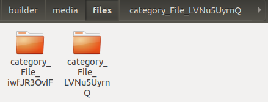

**uadmin.ReturnJSON**
^^^^^^^^^^^^^^^^^^^^^
ReturnJSON returns JSON to the client.

Function:

.. code-block:: go

    func(w http.ResponseWriter, r *http.Request, v interface{})

Parameters:

    **w http.ResponseWriter:** Assembles the HTTP server's response; by writing to it, we send data to the HTTP client

    **r \*http.Request** Is a data structure that represents the client HTTP request

    **v interface{}** Is the arbitrary JSON objects and arrays that you want to return with

Used in the tutorial:

* `uAdmin Tutorial Part 7 - Introduction to API`_
* `uAdmin Tutorial Part 8 - Customizing your API Handler`_
* `uAdmin Tutorial Part 9 - Inserting and Saving the Record`_

.. _uAdmin Tutorial Part 7 - Introduction to API: https://uadmin-docs.readthedocs.io/en/latest/tutorial/part7.html
.. _uAdmin Tutorial Part 8 - Customizing your API Handler: https://uadmin-docs.readthedocs.io/en/latest/tutorial/part8.html
.. _uAdmin Tutorial Part 9 - Inserting and Saving the Record: https://uadmin-docs.readthedocs.io/en/latest/tutorial/part9.html

**uadmin.RootURL**
^^^^^^^^^^^^^^^^^^
RootURL is where the listener is mapped to.

Type:

.. code-block:: go

    string

Used in the tutorial:

* `uAdmin Tutorial Part 7 - Introduction to API`_

.. _uAdmin Tutorial Part 7 - Introduction to API: https://uadmin-docs.readthedocs.io/en/latest/tutorial/part7.html

Go to the main.go and assign the RootURL value as **/admin/**.

.. code-block:: go

    func main() {
        // Some codes

        uadmin.RootURL = "/admin/"
    }

Result

.. image:: assets/rooturladmin.png

**uadmin.Salt**
^^^^^^^^^^^^^^^
Salt is extra salt added to password hashing.

Type:

.. code-block:: go

    string

Go to the friend.go and apply the following codes below:

.. code-block:: go

    // This function hashes a password with a salt.
    func hashPass(pass string) string {
        // Generates a random string
        uadmin.Salt = uadmin.GenerateBase64(20)

        // Combine salt and password
        password := []byte(pass + uadmin.Salt)

        // Returns the bcrypt hash of the password at the given cost
        hash, err := bcrypt.GenerateFromPassword(password, 12)
        if err != nil {
            log.Fatal(err)
        }

        // Returns the string of hash value
        return string(hash)
    }

    // Save !
    func (f *Friend) Save() {

        // Calls the function of hashPass to store the value in the password
        // field.
        f.Password = hashPass(f.Password)
        
        // Override save
        uadmin.Save(f)
    }

Now go to the Friend model and put the password as 123456. Save it and check the result.

.. image:: assets/passwordwithsalt.png

**uadmin.Save**
^^^^^^^^^^^^^^^
Save saves the object in the database.

Function:

.. code-block:: go

    func(a interface{}) (err error)

Parameter:

    **a interface{}:** Is the model that you want to save with

Used in the tutorial:

* `uAdmin Tutorial Part 4 - Register Inlines and Drop Down List`_
* `uAdmin Tutorial Part 6 - Back-end Validation`_
* `uAdmin Tutorial Part 9 - Inserting and Saving the Record`_

.. _uAdmin Tutorial Part 4 - Register Inlines and Drop Down List: https://uadmin-docs.readthedocs.io/en/latest/tutorial/part4.html
.. _uAdmin Tutorial Part 6 - Back-end Validation: https://uadmin-docs.readthedocs.io/en/latest/tutorial/part6.html
.. _uAdmin Tutorial Part 9 - Inserting and Saving the Record: https://uadmin-docs.readthedocs.io/en/latest/tutorial/part9.html

Let's add an Invite field in the friend.go that will direct you to his website. In order to do that, set the field name as "Invite" with the tag "link".

.. code-block:: go

    // Friend model ...
    type Friend struct {
        uadmin.Model
        Name        string 
        Email       string 
        Password    string 
        Nationality string
        Invite      string `uadmin:"link"`
    }

To make it functional, add the overriding save function after the Friend struct.

.. code-block:: go

    // Save !
    func (f *Friend) Save() {
        f.Invite = "https://www.google.com/"
        uadmin.Save(f) // <-- place it here
    }

Run your application, go to the Friends model and update the elements inside. Afterwards, click the Invite button on the output structure and see what happens.

.. image:: tutorial/assets/invitebuttonhighlighted.png

|

Result

.. image:: tutorial/assets/googlewebsitescreen.png
   :align: center

**uadmin.Schema**
^^^^^^^^^^^^^^^^^
Schema is the global schema of the system.

Structure:

.. code-block:: go

    map[string]uadmin.ModelSchema

Examples:

* `Approval`_
* `CategoricalFilter`_
* `Choices`_
* `DefaultValue`_
* `DisplayName`_
* `Encrypt`_
* `ErrMsg`_
* `Filter`_
* `FormDisplay`_
* `Help`_
* `Hidden`_
* `ListDisplay`_
* `Max`_
* `Min`_
* `Pattern`_
* `PatternMsg`_
* `ProgressBar`_
* `ReadOnly`_
* `Required`_
* `Stringer`_
* `Type`_
* `UploadTo`_
* `WebCam`_

.. _Approval: https://uadmin-docs.readthedocs.io/en/latest/api/schema.html#approval
.. _CategoricalFilter: https://uadmin-docs.readthedocs.io/en/latest/api/schema.html#categoricalfilter
.. _Choices: https://uadmin-docs.readthedocs.io/en/latest/api/schema.html#choices
.. _DefaultValue: https://uadmin-docs.readthedocs.io/en/latest/api/schema.html#defaultvalue
.. _DisplayName: https://uadmin-docs.readthedocs.io/en/latest/api/schema.html#displayname
.. _Encrypt: https://uadmin-docs.readthedocs.io/en/latest/api/schema.html#encrypt
.. _ErrMsg: https://uadmin-docs.readthedocs.io/en/latest/api/schema.html#errmsg
.. _Filter: https://uadmin-docs.readthedocs.io/en/latest/api/schema.html#filter
.. _FormDisplay: https://uadmin-docs.readthedocs.io/en/latest/api/schema.html#formdisplay
.. _Help: https://uadmin-docs.readthedocs.io/en/latest/api/schema.html#help
.. _Hidden: https://uadmin-docs.readthedocs.io/en/latest/api/schema.html#hidden
.. _ListDisplay: https://uadmin-docs.readthedocs.io/en/latest/api/schema.html#listdisplay
.. _Max: https://uadmin-docs.readthedocs.io/en/latest/api/schema.html#max
.. _Min: https://uadmin-docs.readthedocs.io/en/latest/api/schema.html#min
.. _Pattern: https://uadmin-docs.readthedocs.io/en/latest/api/schema.html#pattern
.. _PatternMsg: https://uadmin-docs.readthedocs.io/en/latest/api/schema.html#patternmsg
.. _ProgressBar: https://uadmin-docs.readthedocs.io/en/latest/api/schema.html#progressbar
.. _ReadOnly: https://uadmin-docs.readthedocs.io/en/latest/api/schema.html#readonly
.. _Required: https://uadmin-docs.readthedocs.io/en/latest/api/schema.html#required
.. _Stringer: https://uadmin-docs.readthedocs.io/en/latest/api/schema.html#stringer
.. _Type: https://uadmin-docs.readthedocs.io/en/latest/api/schema.html#type
.. _UploadTo: https://uadmin-docs.readthedocs.io/en/latest/api/schema.html#uploadto
.. _WebCam: https://uadmin-docs.readthedocs.io/en/latest/api/schema.html#webcam

Page:

.. toctree::
   :maxdepth: 1

   api/schema

**uadmin.SendEmail**
^^^^^^^^^^^^^^^^^^^^
SendEmail sends email using system configured variables.

Function:

.. code-block:: go

    func(to, cc, bcc []string, subject, body string) (err error)

Parameters:

    **to []string:** This is who you are primarily writing the email to, it’s clear to both the writer and the recipient who is writing the email and to whom it intended.

    **cc []string:** This means carbon copy and it includes people who might be interested in knowing that there was an email between the sender and the primary TO, typically CC’s are not meant to respond, only the primary sender. Everyone can see who was included in the To and CC.

    **bcc []string:** This means blind carbon copy. The sender has added people that the receiving TO and CC are not able to see as a part of the email, someone on BCC is not to respond and they will not be included in the response from the TO or CC. BCC is often used to include a stakeholder like a boss to make sure they are aware of a situation but they can’t respond. [#f2]_

    **subject string:** This means what your email content is all about.

    **body string:** This means the content of your email. It would be either a job application, the letter of your friend, notifications from your subscribed website, etc.

Go to the main.go and apply the following codes below:

.. code-block:: go

    func main(){

        // Some codes

        // Email configurations
        uadmin.EmailFrom = "myemail@integritynet.biz"
        uadmin.EmailUsername = "myemail@integritynet.biz"
        uadmin.EmailPassword = "abc123"
        uadmin.EmailSMTPServer = "smtp.integritynet.biz"
        uadmin.EmailSMTPServerPort = 587

        // Place it here
        uadmin.SendEmail([]string{"myemail@integritynet.biz"}, []string{}, []string{}, "Todo List", "Here are the tasks that I should have done today.")
    }

Once you are done, open your email account. You will receive an email from a sender.

.. image:: assets/sendemailnotification.png

**uadmin.Session**
^^^^^^^^^^^^^^^^^^
Session is an activity that a user with a unique IP address spends on a Web site during a specified period of time. [#f1]_

Structure:

.. code-block:: go

    type Session struct {
        Model
        Key        string
        User       User `gorm:"ForeignKey:UserID" uadmin:"filter"`
        UserID     uint `fk:"true" displayName:"User"`
        LoginTime  time.Time
        LastLogin  time.Time
        Active     bool   `uadmin:"filter"`
        IP         string `uadmin:"filter"`
        PendingOTP bool   `uadmin:"filter"`
        ExpiresOn  *time.Time
    }

There are 5 functions that you can use in Session:

* **GenerateKey()** - Automatically generates a random string of characters for you
* **HideInDashboard()** - Return true and auto hide this from dashboard
* **Logout()** - Deactivates a session
* **Save()** - Saves the object in the database
* **String()** - Returns the value of the Key

There are 2 ways you can do for initialization process using this function: one-by-one and by group.

One-by-one initialization:

.. code-block:: go

    func main(){
        // Some codes
        session := uadmin.Session{}
        session.Key = "Key"
        session.UserID = 1
    }

By group initialization:

.. code-block:: go

    func main(){
        // Some codes
        session := uadmin.Session{
            Key:    "Key",
            UserID: 1,
        }
    }

In this example, we will use "by group" initialization process.

Go to the main.go and apply the following codes below after the RegisterInlines section.

.. code-block:: go

    func main(){

        // Some codes

        now := time.Now()
        then := now.AddDate(0, 0, 1)
        session := uadmin.Session{

            // Generates a random string dynamically
            Key: uadmin.GenerateBase64(20),

            // UserID of System Admin account
            UserID: 1,

            LoginTime:  now,
            LastLogin:  now,
            Active:     true,
            IP:         "",
            PendingOTP: false,
            ExpiresOn:  &then,
        }

        // This will create a new session based on the information assigned in
        // the session variable.
        session.Save()

        // Returns the value of the key
        uadmin.Trail(uadmin.INFO, "String() returns %s", session.String())
    }

Now run your application and see what happens.

**Terminal**

.. code-block:: bash

    [  INFO  ]   String() returns 0G81O_LecZLru3CTm_Qz

.. image:: assets/sessioncreated.png

The other way around is you can use **GenerateKey()** function instead of initializing the Key field inside the uadmin.Session. Omit the session.Save() as well because session.Logout() has the ability to save it.

.. code-block:: go

    func main(){
        now := time.Now()
        then := now.AddDate(0, 0, 1)
        session := uadmin.Session{

            // ------------ KEY FIELD REMOVED ------------ 

            // UserID of System Admin account
            UserID: 1,

            LoginTime:  now,
            LastLogin:  now,
            Active:     true,
            IP:         "",
            PendingOTP: false,
            ExpiresOn:  &then,
        }

        // Automatically generates a random string of characters for you
        session.GenerateKey()

        // Deactivates a session
        session.Logout()

        // ------------ SESSION.SAVE() REMOVED ------------ 

        // Returns the value of the key
        uadmin.Trail(uadmin.INFO, "String() returns %s", session.String())
    }

Now run your application and see what happens.

**Terminal**

.. code-block:: bash

    [  INFO  ]   String() returns 8dDjMOvX8onCVuRUJstZ1Jrl

.. image:: assets/sessioncreated2.png

|

Suppose that "SESSIONS" model is visible in the dashboard.

.. image:: assets/sessionshighlighteddashboard.png

|

In order to hide it, you can use **HideInDashboard()** built-in function from uadmin.Session. Go to the main.go and apply the following codes below:

.. code-block:: go

    func main(){
        // Initialize the session and dashboardmenu
        session := uadmin.Session{}
        dashboardmenu := uadmin.DashboardMenu{}

        // Checks the url from the dashboardmenu. If it matches, it will
        // update the value of the Hidden field.
        uadmin.Update(&dashboardmenu, "Hidden", session.HideInDashboard(), "url = ?", "session")
    }

Now run your application, go to "DASHBOARD MENUS" and you will notice that Sessions is now hidden.

.. image:: assets/sessionshidden.png

**uadmin.Setting**
^^^^^^^^^^^^^^^^^^
Setting is a system in uAdmin that is used to display information for an application as a whole.

Structure:

.. code-block:: go

    type Setting struct {
        Model
        Name         string
        DefaultValue string
        DataType     DataType
        Value        string
        Help         string
        Category     SettingCategory `uadmin:"required"`
        CategoryID   uint
        Code         string `uadmin:"read_only"`
    }

Data Type has 7 choices:

* **Boolean** - A data type that has one of two possible values (usually denoted true and false), intended to represent the two truth values of logic and Boolean algebra
* **DateTime** - Provides functionality for measuring and displaying time
* **File** - A data type used in order to upload a file in the database
* **Float** - Used in various programming languages to define a variable with a fractional value
* **Image** - Used to upload and crop an image in the database
* **Integer** - Used to represent a whole number that ranges from -2147483647 to 2147483647 for 9 or 10 digits of precision
* **String** - Used to represent text rather than numbers

There are 5 functions that you can use in Setting:

* **ApplyValue()** - Applies the assigned value based on filter
* **GetValue()** - Fetch the first value from the record
* **HideInDashboarder()** - Return true and auto hide this from setting
* **ParseFormValue** - Parses a boolean and date time string values to its standard format

.. code-block:: go

    func(v []string)

Go to `Example #4: ParseFormValue function`_ to see how ParseFormValue works.

* **Save()** - Saves the object in the database

There are 2 ways you can do for initialization process using this function: one-by-one and by group.

One-by-one initialization:

.. code-block:: go

    func main(){
        // Some codes
        settingCategory := uadmin.SettingCategory{}
        setting := uadmin.Setting{}
        setting.Category = settingCategory
        setting.CategoryID = 1
        setting.Code = "Code"
        setting.DataType = uadmin.DataType(0).String(),
        setting.DefaultValue = "Default Setting Value"
        setting.Help = "Help"
        setting.Name = "Setting Name"
        setting.Value = "Setting Value"
    }

By group initialization:

.. code-block:: go

    func main(){
        // Some codes
        settingCategory := uadmin.SettingCategory{}
        setting := uadmin.Setting{
            Category:     settingCategory,
            CategoryID:   1,
            Code:         "Code",
            DataType:     uadmin.DataType(0).String(),
            DefaultValue: "Default Setting Value",
            Help:         "Help",
            Name:         "Setting Name",
            Value:        "Setting Value",
        }
    }

In the following examples, we will use “by group” initialization process.

* `Example #1: Assigning values in Setting fields`_
* `Example #2: ApplyValue function`_
* `Example #3: GetValue function`_
* `Example #4: ParseFormValue function`_

.. _Example #1\: Assigning values in Setting fields: https://uadmin-docs.readthedocs.io/en/latest/api/setting.html#example-1-assigning-values-in-setting-fields
.. _Example #2\: ApplyValue function: https://uadmin-docs.readthedocs.io/en/latest/api/setting.html#example-2-applyvalue-function
.. _Example #3\: GetValue function: https://uadmin-docs.readthedocs.io/en/latest/api/setting.html#example-3-getvalue-function
.. _Example #4\: ParseFormValue function: https://uadmin-docs.readthedocs.io/en/latest/api/setting.html#example-4-parseformvalue-function

Page:

.. toctree::
   :maxdepth: 1

   api/setting

**uadmin.SettingCategory**
^^^^^^^^^^^^^^^^^^^^^^^^^^
Setting Category is a system in uAdmin that is used for classifying settings and its records.

Structure:

.. code-block:: go

    type SettingCategory struct {
        Model
        Name string
        Icon string `uadmin:"image"`
    }

There are 2 ways you can do for initialization process using this function: one-by-one and by group.

One-by-one initialization:

.. code-block:: go

    func main(){
        // Some codes
        settingCategory := uadmin.SettingCategory{}
        settingCategory.Name = "Setting Category Name"
        settingCategory.Icon = "/media/images/icon.png"
    }

By group initialization:

.. code-block:: go

    func main(){
        // Some codes
        settingCategory := uadmin.SettingCategory{
            Name: "Setting Category Name",
            Icon: "/media/images/icon.png",
        }
    }

In this example, we will use “by group” initialization process.

Go to main.go and apply the following codes below to create a Health setting category:

.. code-block:: go

    func main() {
        // Some codes

        // Setting Category configuration that assigns the name and path
        // where the icon is located
        settingCategory := uadmin.SettingCategory{
            Name: "Health",
            Icon: "/media/images/heart.png",
        }

        // Save the settingCategory in the database
        uadmin.Save(&settingCategory)
    }

Now run your application. From uAdmin dashboard, click on "SETTING CATEGORIES".

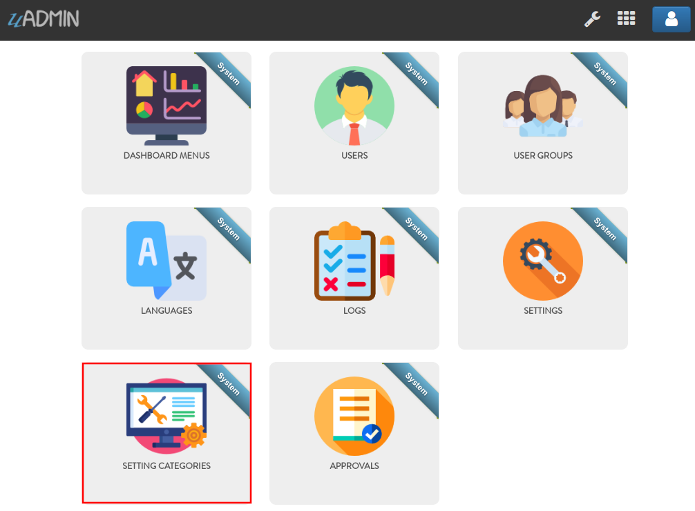

|

As a result, the Health record was saved in the database.

.. image:: api/assets/settingcategoryhealthresult.png

|

Now go to Settings page by clicking on the wrench icon on the top right part to see the result.

.. image:: assets/wrenchiconfromsettingcategory.png

|

Result

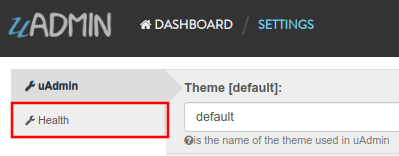

**uadmin.SiteName**
^^^^^^^^^^^^^^^^^^^
SiteName is the name of the website that shows on title and dashboard.

Type:

.. code-block:: go

    string

Used in the tutorial:

* `uAdmin Tutorial Part 15 - Wrapping Up Your Application`_

.. _uAdmin Tutorial Part 15 - Wrapping Up Your Application: https://uadmin-docs.readthedocs.io/en/latest/tutorial/part15.html

Go to the main.go and assign the SiteName value as **Todo List**.

.. code-block:: go

    func main() {
        // Some codes

        uadmin.SiteName = "Todo List"
    }

Run your application and see the changes above the web browser.

.. image:: tutorial/assets/todolisttitle.png

**uadmin.StartSecureServer**
^^^^^^^^^^^^^^^^^^^^^^^^^^^^
StartSecureServer is the process of activating a uAdmin server using a localhost IP or an apache with SSL security.

Function:

.. code-block:: go

    func(certFile, keyFile string)

Parameters:

    **certFile string:** Is your public key

    **keyFile string:** Is your private key

Used in the tutorial:

* `uAdmin Tutorial Part 13 - Advanced Security (Part 1)`_

.. _uAdmin Tutorial Part 13 - Advanced Security (Part 1): https://uadmin-docs.readthedocs.io/en/latest/tutorial/part13.html

To enable SSL for your project, you need an SSL certificate. This is a two parts system with a public key and a private key. The public key is used for encryption and the private key is used for decryption. To get an SSL certificate, you can generate one using openssl which is a tool for generating self-signed SSL certificate.

.. code-block:: bash

    openssl req -x509 -nodes -days 365 -newkey rsa:2048 -keyout priv.pem -out pub.pem

It will ask you for several certificate parameters but you can just press “Enter” and skip filling them for development.

You can change the key size by changing 2048 to a higher value like 4096. For production, you would want to get a certificate that is not self-signed to avoid the SSL error message on the browser. For that, you can buy one from any SSL vendor or you can get a free one from `letsencrypt.org`_ or follow the instructions `here`_.

.. _letsencrypt.org: https://letsencrypt.org/
.. _here: https://medium.com/@saurabh6790/generate-wildcard-ssl-certificate-using-lets-encrypt-certbot-273e432794d7

Once installed, move the **pub.pem** and **priv.pem** to your project folder.

.. image:: tutorial/assets/sslcertificate.png

|

Afterwards, go to the main.go and apply this function on the last section.

.. code-block:: go

    func main(){
        // Some codes
        uadmin.StartSecureServer("pub.pem", "priv.pem")
    }

Once you start your app, you will notice that your terminal logs are showing a message that says https instead of http:

.. code-block:: bash

    $ ~/go/src/github.com/username/todo$ go build; ./todo
    [   OK   ]   Initializing DB: [12/12]
    [   OK   ]   Server Started: https://0.0.0.0:8000
             ___       __          _
      __  __/   | ____/ /___ ___  (_)___
     / / / / /| |/ __  / __  __ \/ / __ \
    / /_/ / ___ / /_/ / / / / / / / / / /
    \__,_/_/  |_\__,_/_/ /_/ /_/_/_/ /_/

Let's use this website as an example of a secure server. Click the padlock icon at the top left section then click Certificate (Valid).

.. image:: assets/uadminiosecure.png

|

You will see the following information in the certificate viewer.

.. image:: assets/certificateinfo.png
   :align: center

**uadmin.StartServer**
^^^^^^^^^^^^^^^^^^^^^^
StartServer is the process of activating a uAdmin server using a localhost IP or an apache.

Function:

.. code-block:: go

    func()

Used in the tutorial:

* `uAdmin Tutorial Part 2 - Internal vs. External Models`_
* `uAdmin Tutorial Part 3 - Linking Models`_
* `uAdmin Tutorial Part 5 - Applying uAdmin Tags and m2m`_

.. _uAdmin Tutorial Part 2 - Internal vs. External Models: https://uadmin-docs.readthedocs.io/en/latest/tutorial/part2.
.. _uAdmin Tutorial Part 3 - Linking Models: https://uadmin-docs.readthedocs.io/en/latest/tutorial/part3.html
.. _uAdmin Tutorial Part 5 - Applying uAdmin Tags and m2m: https://uadmin-docs.readthedocs.io/en/latest/tutorial/part5.html

Go to the main.go and put **uadmin.StartServer()** inside the main function.

.. code-block:: go

    func main() {
        // Some codes
        uadmin.StartServer() // <-- place it here
    }

Now to run your code:

.. code-block:: bash

    $ go build; ./todo
    [   OK   ]   Initializing DB: [9/9]
    [   OK   ]   Initializing Languages: [185/185]
    [  INFO  ]   Auto generated admin user. Username: admin, Password: admin.
    [   OK   ]   Server Started: http://0.0.0.0:8080
             ___       __          _
      __  __/   | ____/ /___ ___  (_)___
     / / / / /| |/ __  / __  __ \/ / __ \
    / /_/ / ___ / /_/ / / / / / / / / / /
    \__,_/_/  |_\__,_/_/ /_/ /_/_/_/ /_/

**uadmin.Tf**
^^^^^^^^^^^^^
Tf is a function for translating strings into any given language.

Function:

.. code-block:: go

    func(path string, lang string, term string, args ...interface{}) string

Parameters:

    **path (string):** This is where to get the translation from. It is in the
    format of "GROUPNAME/FILENAME" for example: "models/Todo"

    **lang (string):** Is the language code. If empty string is passed we will use
    the default language.

    **term (string):** The term to translate

    **args (...interface{}):** Is a list of arguments to fill the term with place holders

|

First of all, create a back-end validation function inside the todo.go.

.. code-block:: go

    // Validate !
    func (t Todo) Validate() (errMsg map[string]string) {
        // Initialize the error messages
        errMsg = map[string]string{}

        // Get any records from the database that matches the name of
        // this record and make sure the record is not the record we are
        // editing right now
        todo := Todo{}
        system := "system"
        if uadmin.Count(&todo, "name = ? AND id <> ?", t.Name, t.ID) != 0 {
            errMsg["Name"] = uadmin.Tf("models/Todo/Name/errMsg", "", fmt.Sprintf("This todo name is already in the %s", system))
        }
        return
    }

Run your application and login using “admin” as username and password.

.. image:: api/assets/loginformadmin.png
   :align: center

|

Open "LANGUAGES" model.

.. image:: assets/languageshighlighted.png

|

Search whatever languages you want to be available in your application. For this example, let's choose Tagalog and set it to Active.

.. image:: api/assets/tagalogactive.png
   :align: center

|

Open "TODOS" model and create at least one record inside it.

.. image:: assets/todomodeloutput.png

|

Logout your account and login again. Set your language to **Wikang Tagalog (Tagalog)**.

.. image:: assets/loginformtagalog.png

|

Open "TODOS" model, create a duplicate record, save it and let's see what happens.

.. image:: assets/duplicaterecord.png
   :align: center

|

The error message appears. Now rebuild your application and see what happens.

.. code-block:: go

    [   OK   ]   Initializing DB: [9/9]
    [ WARNING]   Translation of tl at 0% [0/134]

It says tl is 0% which means we have not translated yet. 

From your project folder, go to static/i18n/models/todo.tl.json. Inside it, you will see a bunch of data in JSON format that says Translate Me. This is where you put your translated text. For this example, let's translate the err_msg value in Tagalog language then save it.

.. image:: assets/errmsgtagalog.png

|

Once you are done, go back to your application, refresh your browser and see what happens.

.. image:: assets/todotagalogtranslatedtf.png
   :align: center

|

And if you rebuild your application, you will notice that uAdmin has found 1 word we have translated and is telling us we are at 1% translation for the Tagalog language.

.. code-block:: bash

    [   OK   ]   Initializing DB: [13/13]
    [ WARNING]   Translation of tl at 1% [1/134]

Congrats, now you know how to translate your sentence using uadmin.Tf.

**uadmin.Theme**
^^^^^^^^^^^^^^^^
Theme is the name of the theme used in uAdmin.

Type:

.. code-block:: go

    string

From your project folder, click on "templates".

.. image:: assets/templatesfolderhighlighted.png

|

Inside templates, click on "uadmin".

.. image:: assets/uadminfolder.png

|

Create a new folder named "custom".

.. image:: assets/customfolderhighlighted.png

|

Inside custom folder, create a new file named "home.html".

.. image:: assets/homehtml.png

|

Inside home.html file, apply the following codes below to display a header that shows "Welcome to Home Page".

.. code-block:: html

    <!DOCTYPE html>
    <html lang="en">
    <head>
        <meta charset="UTF-8">
        <meta name="viewport" content="width=device-width, initial-scale=1.0">
        <meta http-equiv="X-UA-Compatible" content="ie=edge">
        <title>Home Page</title>
    </head>
    <body>
        <h1>Welcome to Home Page</h1>
    </body>
    </html>

Now go to main.go and apply the Theme function that assigns the custom folder.

.. code-block:: go

    func main() {
        // Some codes

        // "custom" is the name of the folder inside the templates/uadmin path
        // that uAdmin will run when the user starts the server
        uadmin.Theme = "custom"
    }

Run your application to see the result.

.. image:: assets/welcometohomepage.png
   :align: center

**uadmin.Trail**
^^^^^^^^^^^^^^^^
Trail prints to the log.

Function:

.. code-block:: go

    func(level int, msg interface{}, i ...interface{})

Parameters:

    **level int:** This is where we apply Trail tags.

    **msg interface{}:** Is the string of characters used for output.

    **i ...interface{}:** A variable or container that can be used to store a value in the msg interface{}.

Trail has 6 different tags:

* DEBUG
* WORKING
* INFO
* OK
* WARNING
* ERROR

Let's apply them in the overriding save function under the friend.go.

.. code-block:: go

    // Save !
    func (f *Friend) Save() {
        f.Invite = "https://uadmin.io/"
        temp := "saved"                                                  // declare temp variable
        uadmin.Trail(uadmin.DEBUG, "Your friend has been %s.", temp)     // used DEBUG tag
        uadmin.Trail(uadmin.WORKING, "Your friend has been %s.", temp)   // used WORKING tag
        uadmin.Trail(uadmin.INFO, "Your friend has been %s.", temp)      // used INFO tag
        uadmin.Trail(uadmin.OK, "Your friend has been %s.", temp)        // used OK tag
        uadmin.Trail(uadmin.WARNING, "Someone %s your friend.", temp)    // used WARNING tag
        uadmin.Trail(uadmin.ERROR, "Your friend has not been %s.", temp) // used ERROR tag
        uadmin.Save(f)
    }

Run your application, go to the Friend model and save any of the elements inside it. Check your terminal afterwards to see the result.

.. image:: tutorial/assets/trailtagsoutput.png
   :align: center

The output shows the different colors per tag.

**uadmin.Translate**
^^^^^^^^^^^^^^^^^^^^
Translate is used to get a translation from a multilingual fields.

Function:

.. code-block:: go

    func(raw string, lang string, args ...bool) string

Parameters:

    **raw string:** Is the field of the model that you want to access to

    **lang string:** Is the code of the language

    **args ...bool:** Series of arguments that returns a boolean value

Before we proceed to the example, read `Tutorial Part 7 - Introduction to API`_ to familiarize how API works in uAdmin.

.. _Tutorial Part 7 - Introduction to API: https://uadmin-docs.readthedocs.io/en/latest/tutorial/part7.html

Suppose I have two multilingual fields in my Item record.

.. image:: assets/itementl.png

Create a file named custom_todo.go inside the api folder with the following codes below:

.. code-block:: go

    // CustomTodoHandler !
    func CustomTodoHandler(w http.ResponseWriter, r *http.Request) {
        r.URL.Path = strings.TrimPrefix(r.URL.Path, "/custom_todo")

        res := map[string]interface{}{}

        item := models.Item{}

        results := []map[string]interface{}{}

        uadmin.Get(&item, "id = 1")

        results = append(results, map[string]interface{}{
            "Description (en)": uadmin.Translate(item.Description, "en"),
            "Description (tl)": uadmin.Translate(item.Description, "tl"),
        })

        res["status"] = "ok"
        res["item"] = results
        uadmin.ReturnJSON(w, r, res)
    }

Establish a connection in the main.go to the API by using http.HandleFunc. It should be placed after the uadmin.Register and before the StartServer.

.. code-block:: go

    func main() {
        // Some codes

        // CustomTodoHandler
        http.HandleFunc("/custom_todo/", api.CustomTodoHandler) // <-- place it here
    }

api is the folder name while CustomTodoHandler is the name of the function inside custom_todo.go.

Run your application and see what happens.

.. image:: assets/translatejson.png

**uadmin.Update**
^^^^^^^^^^^^^^^^^
Update updates the field name and value of an interface.

Function:

.. code-block:: go

    func(a interface{}, fieldName string, value interface{}, query string, args ...interface{}) (err error)

Parameters:

    **a interface{}:** Is the variable where the model was initialized

    **fieldName string:** Is the field name that you want to access to

    **value interface{}:** Is the value that you want to update in the field

    **query string:** Is the command you want to execute in the database

    **args ...interface{}:** Is the series of arguments that you want to update in the query

Suppose you have one record in your Todo model.

.. image:: assets/todoreadabook.png

|

Go to the main.go and apply the following codes below:

.. code-block:: go

    func main(){
        // Some codes

        // Initialize todo and id
        todo := models.Todo{}
        id := 1

        // Updates the Todo name
        uadmin.Update(&todo, "Name", "Read a magazine", "id = ?", id)
    }

Now run your application, go to the Todo model and see what happens.

.. image:: assets/todoreadamagazine.png

|

The Todo name has updated from "Read a book" to "Read a magazine".

**uadmin.User**
^^^^^^^^^^^^^^^
User is a system in uAdmin that is used to add, modify and delete the elements of the user.

Structure:

.. code-block:: go

    type User struct {
        Model
        Username     string    `uadmin:"required;filter"`
        FirstName    string    `uadmin:"filter"`
        LastName     string    `uadmin:"filter"`
        Password     string    `uadmin:"required;password;help:To reset password, clear the field and type a new password.;list_exclude"`
        Email        string    `uadmin:"email"`
        Active       bool      `uadmin:"filter"`
        Admin        bool      `uadmin:"filter"`
        RemoteAccess bool      `uadmin:"filter"`
        UserGroup    UserGroup `uadmin:"filter"`
        UserGroupID  uint
        Photo        string `uadmin:"image"`
        LastLogin   *time.Time `uadmin:"read_only"`
        ExpiresOn   *time.Time
        OTPRequired bool
        OTPSeed     string `uadmin:"list_exclude;hidden;read_only"`
    }

Here are the following fields and their definitions:

* **Username** - The username that you can use in login process and CreatedBy which is a reserved word in uAdmin
* **FirstName** - The given name of the user
* **LastName** - The surname of the user
* **Password** - A secret word or phrase that must be used to gain admission to something. This field is automatically hashed for security protection.
* **Email** - A method of exchanging messages between people using electronic devices.
* **Active** - Checks whether the user is logged in
* **Admin** - Checks whether the user is authorized to access all features in the system
* **RemoteAccess** - Checks whether the user has access to remote devices
* **UserGroup** - Returns the GroupName
* **UserGroupID** - An ID to access the UserGroup
* **Photo** - Profile picture of the user
* **LastLogin** - The date when the user last logged in his account
* **ExpiresOn** - The date when the user account expires
* **OTPRequired** - Checks whether the OTP is Active
* **OTPSeed** - Private field for OTP

There are 10 functions that you can use in User:

* **GetAccess** - Returns the user's permission to a dashboard menu based on their admin status, group and user permissions
* **GetActiveSession()** - Returns an active session key
* **GetDashboardMenu()** - Returns the list of models in the dashboard menu
* **GetOTP()** - Returns a string of OTP code
* **HasAccess** - Searches for the url in the modelName. Uses this format as shown below:

.. code-block:: go

    func(modelName string) UserPermission

**Login** - Returns the pointer of User and a bool for Is OTP Required. It uses this format as shown below:

.. code-block:: go

    func(pass string, otp string) *uadmin.Session

* **Save()** - Saves the object in the database
* **String()** - Returns the first name and the last name
* **Validate()** - Validate user when saving from uadmin. It returns (ret map[string]string).
* **VerifyOTP** - Verifies the OTP of the user. It uses this format as shown below:

.. code-block:: go

    func(pass string) bool

There are 2 ways you can do for initialization process using this function: one-by-one and by group.

One-by-one initialization:

.. code-block:: go

    func main(){
        // Some codes
        user := uadmin.User{}
        user.Username = "Username"
        user.FirstName = "First Name"
        user.LastName = "Last Name"
    }

By group initialization:

.. code-block:: go

    func main(){
        // Some codes
        user := uadmin.User{
            Username: "Username",
            FirstName: "First Name",
            LastName: "Last Name",
        }
    }

In this example, we will use "by group" initialization process.

Go to the main.go and apply the following codes below after the RegisterInlines section.

.. code-block:: go

    func main(){

        // Some codes

        now := time.Now()
        user := uadmin.User{
            Username:     "even",
            FirstName:    "Even",
            LastName:     "Demata",
            Password:     "123456",
            Email:        "evendemata@gmail.com",
            Active:       true,
            Admin:        false,
            RemoteAccess: false,
            UserGroupID:  1, // Front Desk
            Photo:        "/media/images/users.png",
            LastLogin:    &now,
            OTPRequired:  false,
        }

        // This will create a new user based on the information assigned in
        // the user variable.
        user.Save()

        // Returns the first name and the last name
        uadmin.Trail(uadmin.INFO, "String() returns %s.", user.String())
    }

Now run your application and see what happens.

**Terminal**

.. code-block:: bash

    [  INFO  ]   String() returns Even Demata.

.. image:: assets/usercreated.png

|

Select "Even Demata" account in the list.

.. image:: assets/evendematahighlighted.png

|

Go to the User Permission tab. Afterwards, click Add New User Permission button at the right side.

.. image:: assets/addnewuserpermission.png

|

Set the Dashboard Menu to "Todos" model, User linked to "Even Demata", and activate the "Read" only. It means Even Demata user account has restricted access to adding, editing and deleting a record in the Todos model.

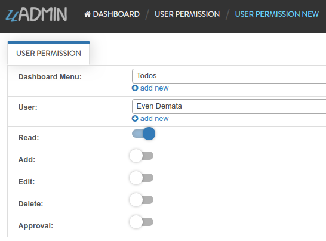

|

Result

.. image:: assets/userpermissionevendemataoutput.png

|

Log out your System Admin account. This time login your username and password using the user account that has user permission. Afterwards, you will see that only the Todos model is shown in the dashboard because your user account is not an admin and has no remote access to it.

.. image:: assets/userpermissiondashboard.png

|

Now go back to the main.go and apply the following codes below:

.. code-block:: go

    func main(){
        // Initialize the User function
        user := uadmin.User{}

        // Fetch the username record as "even" from the user
        uadmin.Get(&user, "username = ?", "even")

        // Print the results
        fmt.Println("GetAccess is", user.GetAccess("todo"))
        fmt.Println("GetActiveSession() is", user.GetActiveSession())
        fmt.Println("GetDashboardMenu() is", user.GetDashboardMenu())
        fmt.Println("GetOTP() is", user.GetOTP())
        fmt.Println("HasAccess is", user.HasAccess("todo"))
    }

Run your application and check your terminal to see the results.

.. code-block:: bash

    GetAccess is 1
    GetActiveSession() is GOzo21lIBCIaj3YkXJsCZXnj
    GetDashboardMenu() is [Todos]
    GetOTP() is 251553
    HasAccess is 1

Take note the value of the GetOTP(). Go to the main.go again and apply the following codes below:

.. code-block:: go

    func main(){
        user := uadmin.User{}
        uadmin.Get(&user, "username = ?", "even")

        // First parameter is password and second parameter is the value from
        // GetOTP()
        fmt.Println("Login is", user.Login("123456", "251553"))

        // The parameter is the value from GetOTP()
        fmt.Println("VerifyOTP is", user.VerifyOTP("251553"))
    }

Run your application and check your terminal to see the results.

.. code-block:: bash

    Login is GOzo21lIBCIaj3YkXJsCZXnj
    VerifyOTP is true

If your Login does not return anything and VerifyOTP is false, it means your OTP is no longer valid. You need to use GetOTP() again to get a new one. OTP usually takes 5 minutes of validity by default.

**Validate()** function allows you to search if the user already exists. For instance, the username is "even" and all of the contents about him are there which was already included in the User model. Go to the main.go and apply the following codes below:

.. code-block:: go

    func main(){
        // Some codes
        now := time.Now()
        user := uadmin.User{
            Username:     "even",
            FirstName:    "Even",
            LastName:     "Demata",
            Password:     "123456",
            Email:        "evendemata@gmail.com",
            Active:       true,
            Admin:        false,
            RemoteAccess: false,
            UserGroupID:  1, // Front Desk
            Photo:        "/media/images/users.png",
            LastLogin:    &now,
            OTPRequired:  false,
        }

        fmt.Println("Validate is", user.Validate())
    }

Run your application and check your terminal to see the results.

.. code-block:: bash

    Validate is map[Username:Username is already Taken.]

Congrats, now you know how to configure the User fields, fetching the username record and applying the functions of the User.

Visit `Login System Tutorials`_ for more examples.

.. _Login System Tutorials: https://uadmin-docs.readthedocs.io/en/latest/login_system/coverage.html

Page:

.. toctree::
   :maxdepth: 1

   login_system/coverage
   
**uadmin.UserGroup**
^^^^^^^^^^^^^^^^^^^^
UserGroup is a system in uAdmin used to add, modify, and delete the group name. 

Structure:

.. code-block:: go

    type UserGroup struct {
        Model
        GroupName string `uadmin:"filter"`
    }

There are 2 functions that you can use in UserGroup:

**HasAccess()** - Returns the Group Permission ID. It uses this format as shown below:

.. code-block:: go

    func(modelName string) uadmin.GroupPermission

**String()** - Returns the GroupName

There are 2 ways you can do for initialization process using this function: one-by-one and by group.

One-by-one initialization:

.. code-block:: go

    func main(){
        // Some codes
        usergroup := uadmin.UserGroup{}
        user.GroupName = "Group Name"
    }

By group initialization:

.. code-block:: go

    func main(){
        // Some codes
        usergroup := uadmin.UserGroup{
            GroupName: "Group Name",
        }
    }

In this example, we will use "by group" initialization process.

Go to the main.go and apply the following codes below after the RegisterInlines section.

.. code-block:: go

    func main(){

        // Some codes

        usergroup := uadmin.UserGroup{
            GroupName: "Front Desk",
        }

        // This will create a new user group based on the information assigned
        // in the usergroup variable.
        uadmin.Save(&usergroup)

        // Returns the GroupName
        uadmin.Trail(uadmin.INFO, "String() returns %s.", usergroup.String())
    }

Now run your application and see what happens.

**Terminal**

.. code-block:: bash

    [  INFO  ]   String() returns Front Desk.

.. image:: assets/usergroupcreated.png

|

Link your created user group to any of your existing accounts (example below is Even Demata).

.. image:: assets/useraccountfrontdesklinked.png

|

Afterwards, click the Front Desk highlighted below.

.. image:: assets/frontdeskhighlighted.png

|

Go to the Group Permission tab. Afterwards, click Add New Group Permission button at the right side.

.. image:: assets/addnewgrouppermission.png

|

Set the Dashboard Menu to "Todos" model, User linked to "Even Demata", and activate the "Read" only. It means Front Desk User Group has restricted access to adding, editing and deleting a record in the Todos model.

.. image:: assets/grouppermissionadd.png
   :align: center

|

Result

.. image:: assets/grouppermissionaddoutput.png

|

Log out your System Admin account. This time login your username and password using the user account that has group permission.

.. image:: assets/userpermissiondashboard.png

|

Now go back to the main.go and apply the following codes below:

.. code-block:: go

    func main(){
        // Initializes the UserGroup function
        usergroup := uadmin.UserGroup{}

        // Fetches the Group Permission ID from the user
        uadmin.Get(&usergroup, "id = ?", 1)

        // Prints the HasAccess result
        fmt.Println("HasAccess is", usergroup.HasAccess("todo"))
    }

Run your application and check your terminal to see the result.

.. code-block:: bash

    HasAccess is 1

Congrats, now you know how to add the UserGroup from code, fetching the record from ID and applying the functions of the UserGroup.

**uadmin.UserPermission**
^^^^^^^^^^^^^^^^^^^^^^^^^
UserPermission sets the permission of a user handled by an administrator.

Structure:

.. code-block:: go

    type UserPermission struct {
        Model
        DashboardMenu   DashboardMenu `gorm:"ForeignKey:DashboardMenuID" required:"true" filter:"true" uadmin:"filter"`
        DashboardMenuID uint          `fk:"true" displayName:"DashboardMenu"`
        User            User          `gorm:"ForeignKey:UserID" required:"true" filter:"true" uadmin:"filter"`
        UserID          uint          `fk:"true" displayName:"User"`
        Read            bool          `uadmin:"filter"`
        Add             bool          `uadmin:"filter"`
        Edit            bool          `uadmin:"filter"`
        Delete          bool          `uadmin:"filter"`
        Approval        bool          `uadmin:"filter"`
    }

There are 2 functions that you can use in GroupPermission:

* **HideInDashboard()** - Return true and auto hide this from dashboard
* **String()** - Returns the User Permission ID

There are 2 ways you can do for initialization process using this function: one-by-one and by group.

One-by-one initialization:

.. code-block:: go

    func main(){
        // Some codes
        userpermission := uadmin.UserPermission{}
        userpermission.DashboardMenu = dashboardmenu
        userpermission.DashboardMenuID = 1
        userpermission.User = user
        userpermission.UserID = 1
    }

By group initialization:

.. code-block:: go

    func main(){
        // Some codes
        userpermission := uadmin.UserPermission{
            DashboardMenu: dashboardmenu,
            DashboardMenuID: 1,
            User: user,
            UserID: 1,
        }
    }

In this example, we will use "by group" initialization process.

Go to the main.go and apply the following codes below after the RegisterInlines section.

.. code-block:: go

    func main(){

        // Some codes

        userpermission := uadmin.UserPermission{
            DashboardMenuID: 9,     // Todos
            UserID:          2,     // Even Demata
            Read:            true,
            Add:             false,
            Edit:            false,
            Delete:          false,
            Approval:        false,
        }

        // This will create a new user permission based on the information
        // assigned in the userpermission variable.
        uadmin.Save(&userpermission)
    }

Now run your application and see what happens.

.. image:: assets/userpermissioncreated.png

|

Log out your System Admin account. This time login your username and password using the user account that has user permission. Afterwards, you will see that only the Todos model is shown in the dashboard because your user account is not an admin and has no remote access to it. Now click on TODOS model.

.. image:: assets/userpermissiondashboard.png

|

As you will see, your user account is restricted to add, edit, or delete a record in the Todo model. You can only read what is inside this model.

.. image:: assets/useraddeditdeleterestricted.png

|

If you want to hide the Todo model in your dashboard, first of all, create a HideInDashboard() function in your todo.go inside the models folder and set the return value to “true”.

.. code-block:: go

    // HideInDashboard !
    func (t Todo) HideInDashboard() bool {
        return true
    }

Now you can do something like this in main.go:

.. code-block:: go

    func main(){

        // Some codes

        // Initializes the DashboardMenu
        dashboardmenu := uadmin.DashboardMenu{}

        // Assign the userpermission, call the HideInDashboard() function
        // from todo.go, store it to the Hidden field of the dashboardmenu
        dashboardmenu.Hidden = userpermission.HideInDashboard()

        // Checks the Dashboard Menu ID number from the userpermission. If it
        // matches, it will update the value of the Hidden field.
        uadmin.Update(&dashboardmenu, "Hidden", dashboardmenu.Hidden, "id = ?", userpermission.DashboardMenuID)
    }

Now rerun your application using the Even Demata account and see what happens.

.. image:: assets/dashboardmenuempty.png

|

The Todo model is now hidden from the dashboard. If you login your System Admin account, you will see in the Dashboard menu that the hidden field of the Todo model is set to true.

.. image:: assets/todomodelhidden.png

**uadmin.ValidateIP**
^^^^^^^^^^^^^^^^^^^^^
ValidateIP is a function to check if the IP in the request is allowed in the allowed based on allowed and block strings.

Function:

.. code-block:: go

    func(r *http.Request, allow string, block string) bool

Before we proceed to the example, read `Tutorial Part 7 - Introduction to API`_ to familiarize how API works in uAdmin.

.. _Tutorial Part 7 - Introduction to API: https://uadmin-docs.readthedocs.io/en/latest/tutorial/part7.html

Create a file named validation_ip.go inside the api folder with the following codes below:

.. code-block:: go

    package api

    import (
        "net/http"
        "strings"

        "github.com/uadmin/uadmin"
    )

    // ValidateAPIHandler !
    func ValidateAPIHandler(w http.ResponseWriter, r *http.Request) {
        // r.URL.Path creates a new path called /validate_ip
        r.URL.Path = strings.TrimPrefix(r.URL.Path, "/validate_ip")

        // Allowed IP - 192.168.1.1 (Your IP address)
        // Blocked IP - 192.168.1.2 (IP that was binded from other PC)
        validateIP := uadmin.ValidateIP(r, "192.168.1.1", "192.168.1.2")

        // Print the result
        uadmin.Trail(uadmin.DEBUG, "Validate IP: %t", validateIP)
    }

Establish a connection in the main.go to the API by using http.HandleFunc. It should be placed after the uadmin.Register and before the StartServer.

.. code-block:: go

    func main() {
        // Some codes

        // ValidateAPIHandler
        http.HandleFunc("/validate_ip/", api.ValidateAPIHandler)
    }

api is the folder name while ValidateAPIHandler is the name of the function inside validation_ip.go.

Run your application and go to the validate_ip URL path in the address bar using your IP address (e.g. 192.168.1.1:8080/validate_ip).

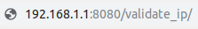

This will not display anything in the webpage but a white screen. Go to your terminal to see the result.

.. code-block:: bash

    [  DEBUG ]   Validate IP: true

Now go to the validate_ip URL path in the address bar using the binded IP (e.g. 192.168.1.2:8080/validate_ip). Make sure that the IP from other PC is binded to your computer. Otherwise, it will not work.

.. image:: assets/validateipblock.png
   :align: center

This will not display anything in the webpage but a white screen. Go to your terminal to see the result.

.. code-block:: bash

    [  DEBUG ]   Validate IP: false

**uadmin.Version**
^^^^^^^^^^^^^^^^^^
Version number as per Semantic Versioning 2.0.0 (semver.org)

Type:

.. code-block:: go

    untyped string

Let's check what version of uAdmin are we using.

.. code-block:: go

    func main() {
        // Some codes
        uadmin.Trail(uadmin.INFO, uadmin.Version)
    }

Result

.. code-block:: bash

    [   OK   ]   Initializing DB: [9/9]
    [  INFO  ]   0.3.1
    [   OK   ]   Server Started: http://0.0.0.0:8080
             ___       __          _
      __  __/   | ____/ /___ ___  (_)___
     / / / / /| |/ __  / __  __ \/ / __ \
    / /_/ / ___ / /_/ / / / / / / / / / /
    \__,_/_/  |_\__,_/_/ /_/ /_/_/_/ /_/

You can also directly check it by typing **uadmin version** in your terminal.

.. code-block:: bash

    $ uadmin version
    [  INFO  ]   0.3.1

**uadmin.WARNING**
^^^^^^^^^^^^^^^^^^
WARNING is the display tag under Trail. It is the statement or event that indicates a possible problems occurring in an application.

Type:

.. code-block:: go

    untyped int

See `uadmin.Trail`_ for the example.

**uadmin.WORKING**
^^^^^^^^^^^^^^^^^^
OK is the display tag under Trail. It is a status to show that the application is working.

Type:

.. code-block:: go

    untyped int

See `uadmin.Trail`_ for the example.

Reference
---------
.. [#f1] QuinStreet Inc. (2018). User Session. Retrieved from https://www.webopedia.com/TERM/U/user_session.html
.. [#f2] Corbin, Anke (2017, Feb 27). What is the meaning of TO, CC and BCC in e-mail? Retrieved from https://www.quora.com/What-is-the-meaning-of-TO-CC-and-BCC-in-e-mail
.. [#f3] eTrigue Support. (n.d.). What is the difference between a dynamic and static list? Retrieved from https://support.etrigue.com/hc/en-us/articles/231552027-What-is-the-difference-between-a-dynamic-and-static-list-
