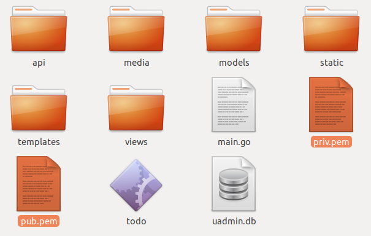

Security Functions
==================
`Back To uAdmin Functions List`_

.. _Back To uAdmin Functions List: https://uadmin-docs.readthedocs.io/en/latest/api.html#api-reference

In this section, we will cover the following functions in-depth listed below:

* `uadmin.CheckCSRF`_
* `uadmin.DefaultMediaPermission`_
* `uadmin.EncryptKey`_
* `uadmin.GenerateBase32`_
* `uadmin.GenerateBase64`_
* `uadmin.GroupPermission`_
    * `func (GroupPermission) HideInDashboard`_
    * `func (GroupPermission) String`_
* `uadmin.OTPAlgorithm`_
* `uadmin.OTPDigits`_
* `uadmin.OTPPeriod`_
* `uadmin.OTPSkew`_
* `uadmin.PasswordAttempts`_
* `uadmin.PasswordTimeout`_
* `uadmin.PublicMedia`_
* `uadmin.Salt`_
* `uadmin.SQLInjection`_
* `uadmin.StartSecureServer`_
* `uadmin.UserPermission`_
    * `func (UserPermission) HideInDashboard`_
    * `func (UserPermission) String`_

uadmin.CheckCSRF
----------------
`Back To Top`_

.. code-block:: go

    func CheckCSRF(r *http.Request) bool

CheckCSRF checks if the request is a possible CSRF. CSRF or Cross-Site Request Forgery is a type of attack here a logged in user clicks on a link that is sent to a website where the user is already authenticated and has instructions for the website to change some state. A possible attack could delete user or system data, change it or add new data to the system. Anti-CSRF measures are implemented in all state changing APIs and UI handler.

The way uAdmin implements CSRF is by checking for a request parameter GET or POST called `x-csrf-token`. The value of this parameter could be equal to the session key. You can get the session key from the session cookie or if you are using `uadmin.RenderHTML` or `uadmin.RenderMultiHTML`, then you will find it in the context as `{{CSRF}}`. If you submitting a form you can add this value to a hidden input.

To implement anti CSRF protection in your own API:

.. code-block:: go

    func MyAPI(w http.ResponseWriter, r *http.Request) {
        if CheckCSRF(r) {
            uadmin.ReturnJSON(w, r, map[string]interface{}{
                "status": "error",
                "err_msg": "The request does not have x-csrf-token",
            })
        }

        // API code ...
    }

    http.HandleFunc("/myapi/", MyAPI)

If you you call this API:

.. code-block:: bash

    http://0.0.0.0:8080/myapi/

It will return an error message and the system will create a CRITICAL level log with details about the possible attack. To make the request work, `x-csrf-token` parameter should be added.

.. code-block:: bash

    http://0.0.0.0:8080/myapi/?x-csrf-token=MY_SESSION_KEY

Where you replace `MY_SESSION_KEY` with the session key.

uadmin.DefaultMediaPermission
-----------------------------
`Back To Top`_

.. code-block:: go

    // Type: FileMode
    var DefaultMediaPermission = os.FileMode(0644)

DefaultMediaPermission is the default permission applied to files uploaded to the system.

A **FileMode** represents a file's mode and permission bits. The bits have the same definition on all systems, so that information about files can be moved from one system to another portably. Not all bits apply to all systems. The only required bit is ModeDir for directories.

In uAdmin, the default media permission is **0644** that means the owner has read and write access to the uploaded files while the group and others have read-only access to them.

For more information on how permissions work, read `File System Permissions`_ or `How to Use UNIX and Linux File Permissions`_.

.. _File System Permissions: https://en.wikipedia.org/wiki/File_system_permissions
.. _How to Use UNIX and Linux File Permissions: https://help.unc.edu/help/how-to-use-unix-and-linux-file-permissions/

Example:

.. code-block:: go

    package main

    import (
        "os"
        "github.com/uadmin/uadmin"
    )

    func main() {
        // No permissions
        uadmin.DefaultMediaPermission = os.FileMode(0000)

        // Read, write, & execute only for owner
        uadmin.DefaultMediaPermission = os.FileMode(0700)

        // Read, write, & execute for owner and group
        uadmin.DefaultMediaPermission = os.FileMode(0700)

        // Read, write, & execute for owner, group and others
        uadmin.DefaultMediaPermission = os.FileMode(0777)

        // Execute
        uadmin.DefaultMediaPermission = os.FileMode(0111)

        // Write
        uadmin.DefaultMediaPermission = os.FileMode(0222)

        // Write & execute
        uadmin.DefaultMediaPermission = os.FileMode(0333)

        // Read
        uadmin.DefaultMediaPermission = os.FileMode(0444)

        // Read & execute
        uadmin.DefaultMediaPermission = os.FileMode(0555)

        // Read & write
        uadmin.DefaultMediaPermission = os.FileMode(0666)

        // Owner can read, write, & execute; group can only read; others have no permissions
        uadmin.DefaultMediaPermission = os.FileMode(0740)
    }

Quiz:

* `Default Media Permission`_

.. _Default Media Permission: https://uadmin-docs.readthedocs.io/en/latest/_static/quiz/default-media-permission.html

uadmin.EncryptKey
-----------------
`Back To Top`_

.. code-block:: go

    var EncryptKey = []byte{}

EncryptKey is a key for encryption and decryption of data in the DB.

Go to the main.go and set the byte values from 0 to 255. Put it above the uadmin.Register.

.. code-block:: go

    func main() {
        uadmin.EncryptKey = []byte{34, 35, 35, 57, 68, 4, 35, 36, 7, 8, 35, 23, 35, 86, 35, 23}
        uadmin.Register(
            // Some codes
        )
    }

Run your application to create your key file then exit it.

In your terminal, type **cat .key** to see the result.

.. code-block:: bash

    $ cat .key
    �!��Q�nt��Z�-���| �9쁌=Y�

Quiz:

* `Miscellaneous Functions (2)`_

.. _Miscellaneous Functions (2): https://uadmin-docs.readthedocs.io/en/latest/_static/quiz/miscellaneous-functions-2.html

uadmin.GenerateBase32
---------------------
`Back To Top`_

.. code-block:: go

    func GenerateBase32(length int) string

GenerateBase32 generates a base32 string of length.

Parameter:

    **length int:** Is how many digits that you want to store with

Go to the friend.go and initialize the Base32 field inside the struct. Set the tag as "read_only".

.. code-block:: go

    // Friend model ...
    type Friend struct {
        uadmin.Model
        Name     string `uadmin:"required"`
        Email    string `uadmin:"email"`
        Password string `uadmin:"password;list_exclude"`
        Base32   string `uadmin:"read_only"` // <-- place it here
    }

Apply overriding save function. Use this function to the Base32 field and set the integer value as 40.

.. code-block:: go

    // Save !
    func (f *Friend) Save() {
        f.Base32 = uadmin.GenerateBase32(40) // <-- place it here
        uadmin.Save(f)
    }

Now run your application. Go to the Friend model and save any element to see the changes.

.. image:: ../assets/friendbase32.png

|

Result

.. image:: ../assets/friendbase32output.png

|

The Base32 value changed automatically.

Quiz:

* `Miscellaneous Functions`_

uadmin.GenerateBase64
---------------------
`Back To Top`_

.. code-block:: go

    func GenerateBase64(length int) string

GenerateBase64 generates a base64 string of length.

Parameter:

    **length int:** Is how many digits that you want to store with

Go to the friend.go and initialize the Base64 field inside the struct. Set the tag as "read_only".

.. code-block:: go

    // Friend model ...
    type Friend struct {
        uadmin.Model
        Name     string `uadmin:"required"`
        Email    string `uadmin:"email"`
        Password string `uadmin:"password;list_exclude"`
        Base64   string `uadmin:"read_only"` // <-- place it here
    }

Apply overriding save function. Use this function to the Base64 field and set the integer value as 75.

.. code-block:: go

    // Save !
    func (f *Friend) Save() {
        f.Base64 = uadmin.GenerateBase64(75) // <-- place it here
        uadmin.Save(f)
    }

Now run your application. Go to the Friend model and save any element to see the changes.

.. image:: ../assets/friendbase64.png

|

Result

.. image:: ../assets/friendbase64output.png

|

The Base64 value changed automatically.

Quiz:

* `Miscellaneous Functions`_

uadmin.GroupPermission
----------------------
`Back To Top`_

.. code-block:: go

    type GroupPermission struct {
        Model
        DashboardMenu   DashboardMenu `uadmin:"required;filter"`
        DashboardMenuID uint
        UserGroup       UserGroup `uadmin:"required;filter"`
        UserGroupID     uint
        Read            bool `uadmin:"filter"`
        Add             bool `uadmin:"filter"`
        Edit            bool `uadmin:"filter"`
        Delete          bool `uadmin:"filter"`
        Approval        bool `uadmin:"filter"`
    }

GroupPermission sets the permission of a user group handled by an administrator.

**func (GroupPermission) HideInDashboard**
^^^^^^^^^^^^^^^^^^^^^^^^^^^^^^^^^^^^^^^^^^
`Back to Top`_

.. code-block:: go

    func (GroupPermission) HideInDashboard() bool

HideInDashboard to return false and auto hide this from dashboard

**func (GroupPermission) String**
^^^^^^^^^^^^^^^^^^^^^^^^^^^^^^^^^
`Back to Top`_

.. code-block:: go

    func (GroupPermission) HideInDashboard() bool

String returns the GroupPermission ID.

There are 2 ways you can do for initialization process using this function: one-by-one and by group.

One-by-one initialization:

.. code-block:: go

    func main(){
        // Some codes
        grouppermission := uadmin.GroupPermission{}
        grouppermission.DashboardMenu = dashboardmenu
        grouppermission.DashboardMenuID = 1
        grouppermission.UserGroup = usergroup
        grouppermission.UserGroupID = 1
    }

By group initialization:

.. code-block:: go

    func main(){
        // Some codes
        grouppermission := uadmin.GroupPermission{
            DashboardMenu: dashboardmenu,
            DashboardMenuID: 1,
            UserGroup: usergroup,
            UserGroupID: 1,
        }
    }

In this example, we will use "by group" initialization process.

Suppose that Even Demata is a part of the Front Desk group.

.. image:: ../assets/useraccountfrontdesk.png

|

Go to the main.go and apply the following codes below after the RegisterInlines section.

.. code-block:: go

    func main(){

        // Some codes

        grouppermission := uadmin.GroupPermission{
            DashboardMenuID: 9, // Todos
            UserGroupID:     1, // Front Desk
            Read:            true,
            Add:             false,
            Edit:            false,
            Delete:          false,
            Approval:        false,
        }

        // This will create a new group permission based on the information
        // assigned in the grouppermission variable.
        uadmin.Save(&grouppermission)

        // Returns the GroupPermissionID
        uadmin.Trail(uadmin.INFO, "String() returns %s.", grouppermission.String())
    }

Now run your application and see what happens.

**Terminal**

.. code-block:: bash

    [  INFO  ]   String() returns 1.

.. image:: ../assets/grouppermissioncreated.png

|

Log out your System Admin account. This time login your username and password using the user account that has group permission. Afterwards, you will see that only the Todos model is shown in the dashboard because your user account is not an admin and has no remote access to it. Now click on TODOS model.

.. image:: ../assets/userpermissiondashboard.png

|

As you will see, your user account is restricted to add, edit, or delete a record in the Todo model. You can only read what is inside this model.

.. image:: ../assets/useraddeditdeleterestricted.png

|

If you want to hide the Todo model in your dashboard, first of all, create a HideInDashboard() function in your todo.go inside the models folder and set the return value to "true".

.. code-block:: go

    // HideInDashboard !
    func (t Todo) HideInDashboard() bool {
        return true
    }

Now you can do something like this in main.go:

.. code-block:: go

    func main(){

        // Some codes

        // Initializes the DashboardMenu
        dashboardmenu := uadmin.DashboardMenu{}

        // Assign the grouppermission, call the HideInDashboard() function
        // from todo.go, store it to the Hidden field of the dashboardmenu
        dashboardmenu.Hidden = grouppermission.HideInDashboard()

        // Checks the Dashboard Menu ID number from the grouppermission. If it
        // matches, it will update the value of the Hidden field.
        uadmin.Update(&dashboardmenu, "Hidden", dashboardmenu.Hidden, "id = ?", grouppermission.DashboardMenuID)
    }

Now rerun your application using the Even Demata account and see what happens.

.. image:: ../assets/dashboardmenuempty.png

|

The Todo model is now hidden from the dashboard. If you login your System Admin account, you will see in the Dashboard menu that the hidden field of the Todo model is set to true.

.. image:: ../assets/todomodelhidden.png

|

Quiz:

* `Group Permission and User Group`_

.. _Group Permission and User Group: https://uadmin-docs.readthedocs.io/en/latest/_static/quiz/group-permission-and-user-group.html

uadmin.OTPAlgorithm
-------------------
`Back To Top`_

.. code-block:: go

    // Type: string
    var OTPAlgorithm = "sha1"

OTPAlgorithm is the hashing algorithm of OTP.

There are 3 different algorithms:

* sha1 (default)
* sha256
* sha512

To assign a value within an application, visit `OTP Algorithm`_ page for an example.

.. _OTP Algorithm: https://uadmin-docs.readthedocs.io/en/latest/system-reference/setting.html#otp-algorithm

To assign a value in the code, follow this approach:

You can apply any of these in main.go.

.. code-block:: go

    func main(){
        // NOTE: This code works only on first build.
        uadmin.OTPAlgorithm = "sha256"

        // ----- IF YOU RUN YOUR APPLICATION AGAIN, DO THIS BELOW -----

        // Assign the OTP Algorithm value to 256
        setting := uadmin.Setting{}
        uadmin.Get(&setting, "code = ?", "uAdmin.OTPAlgorithm")
        setting.ParseFormValue([]string{"sha256"})
        setting.Save()

        // OR

        // NOTE: This code works only on first build.
        uadmin.OTPAlgorithm = "sha512"

        // ----- IF YOU RUN YOUR APPLICATION AGAIN, DO THIS BELOW -----

        // Assign the OTP Algorithm value to 512
        setting := uadmin.Setting{}
        uadmin.Get(&setting, "code = ?", "uAdmin.OTPAlgorithm")
        setting.ParseFormValue([]string{"sha512"})
        setting.Save()
    }

Quiz:

* `OTP Functions`_

uadmin.OTPDigits
----------------
`Back To Top`_

.. code-block:: go

    // Type: int
    var OTPDigits = 6

OTPDigits is the number of digits for the OTP.

To assign a value within an application, visit `OTP Digits`_ page for an example.

.. _OTP Digits: https://uadmin-docs.readthedocs.io/en/latest/system-reference/setting.html#otp-digits

To assign a value in the code, follow this approach:

Go to the main.go and set the OTPDigits to 8.

.. code-block:: go

    func main() {
        // NOTE: This code works only on first build.
        uadmin.OTPDigits = 8

        // ----- IF YOU RUN YOUR APPLICATION AGAIN, DO THIS BELOW -----

        // Assign the OTP Digits value to 8
        setting := uadmin.Setting{}
        uadmin.Get(&setting, "code = ?", "uAdmin.OTPDigits")
        setting.ParseFormValue([]string{"8"})
        setting.Save()
    }

Run your application, login your account, and check your terminal afterwards to see the OTP verification code assigned by your system.

.. code-block:: bash

    [  INFO  ]   User: admin OTP: 90401068

As shown above, it has 8 OTP digits.

Quiz:

* `OTP Functions`_

uadmin.OTPPeriod
----------------
`Back To Top`_

.. code-block:: go

    // Type: uint
    var OTPPeriod = uint(30)

OTPPeriod is the number of seconds for the OTP to change.

To assign a value within an application, visit `OTP Period`_ page for an example.

.. _OTP Period: https://uadmin-docs.readthedocs.io/en/latest/system-reference/setting.html#otp-period

To assign a value in the code, follow this approach:

Go to the main.go and set the OTPPeriod to 10 seconds.

.. code-block:: go

    func main() {
        // NOTE: This code works only on first build.
        uadmin.OTPPeriod = uint(10)

        // ----- IF YOU RUN YOUR APPLICATION AGAIN, DO THIS BELOW -----

        // Assign the OTP Period value to 10
        setting := uadmin.Setting{}
        uadmin.Get(&setting, "code = ?", "uAdmin.OTPPeriod")
        setting.ParseFormValue([]string{"10"})
        setting.Save()
    }

Run your application, login your account, and check your terminal afterwards to see how the OTP code changes every 10 seconds by refreshing your browser.

.. code-block:: bash

    // Before refreshing your browser
    [  INFO  ]   User: admin OTP: 433452

    // After refreshing your browser in more than 10 seconds
    [  INFO  ]   User: admin OTP: 185157

Quiz:

* `OTP Functions`_

uadmin.OTPSkew
--------------
`Back To Top`_

.. code-block:: go

    // Type: uint
    var OTPSkew = uint(5)

OTPSkew is the number of minutes to search around the OTP.

To assign a value within an application, visit `OTP Skew`_ page for an example.

.. _OTP Skew: https://uadmin-docs.readthedocs.io/en/latest/system-reference/setting.html#otp-skew

To assign a value in the code, follow this approach:

Go to the main.go and set the OTPSkew to 2 minutes.

.. code-block:: go

    func main() {
        // NOTE: This code works only on first build.
        uadmin.OTPSkew = uint(2)

        // ----- IF YOU RUN YOUR APPLICATION AGAIN, DO THIS BELOW -----

        // Assign the OTP Skew value to 2
        setting := uadmin.Setting{}
        uadmin.Get(&setting, "code = ?", "uAdmin.OTPSkew")
        setting.ParseFormValue([]string{"2"})
        setting.Save()
    }

Run your application, login your account, and check your terminal afterwards to see the OTP verification code assigned by your system. Wait for more than two minutes and check if the OTP code is still valid.

After waiting for more than two minutes,

.. image:: ../assets/loginformwithotp.png

It redirects to the same webpage which means your OTP code is no longer valid.

Quiz:

* `OTP Functions`_

.. _OTP Functions: https://uadmin-docs.readthedocs.io/en/latest/_static/quiz/otp.html

uadmin.PasswordAttempts
-----------------------
`Back To Top`_

.. code-block:: go

    // Type: int
    var PasswordAttempts = 5

PasswordAttempts is the maximum number of invalid password attempts before the IP address is blocked for some time from using the system.

uadmin.PasswordTimeout
----------------------
`Back To Top`_

.. code-block:: go

    // Type: int
    var PasswordTimeout = 15

PasswordTimeout is the amount of time in minutes the IP will be blocked for after reaching the the maximum invalid password attempts

uadmin.PublicMedia
------------------
`Back To Top`_

.. code-block:: go

    // Type: bool
    var PublicMedia = false

PublicMedia allows public access to media handler without authentication.

To assign a value within an application, visit `Public Media`_ page for an example.

.. _Public Media: https://uadmin-docs.readthedocs.io/en/latest/system-reference/setting.html#public-media

To assign a value in the code, follow this approach:

For instance, my account was not signed in.

.. image:: ../tutorial/assets/loginform.png
   :align: center

|

And you want to access **travel.png** inside your media folder.

.. image:: ../assets/mediapath.png

|

Go to the main.go and apply this function as "true".

.. code-block:: go

    func main() {
        // NOTE: This code works only on first build.
        uadmin.PublicMedia = true

        // ----- IF YOU RUN YOUR APPLICATION AGAIN, DO THIS BELOW -----

        // Assign the Public Media value as "on" to set the value as true
        // in the settings
        setting := uadmin.Setting{}
        uadmin.Get(&setting, "code = ?", "uAdmin.PublicMedia")
        setting.ParseFormValue([]string{"on"})
        setting.Save()
    }

Result

.. image:: ../assets/publicmediaimage.png

|

Quiz:

* `Miscellaneous Functions`_

.. _Miscellaneous Functions: https://uadmin-docs.readthedocs.io/en/latest/_static/quiz/miscellaneous-functions.html

uadmin.Salt
-----------
`Back To Top`_

.. code-block:: go

    // Type: string
    var Salt = ""

Salt is extra salt added to password hashing.

Go to the friend.go and apply the following codes below:

.. code-block:: go

    // This function hashes a password with a salt.
    func hashPass(pass string) string {
        // Generates a random string
        uadmin.Salt = uadmin.GenerateBase64(20)

        // Combine salt and password
        password := []byte(pass + uadmin.Salt)

        // Returns the bcrypt hash of the password at the given cost
        hash, err := bcrypt.GenerateFromPassword(password, 12)
        if err != nil {
            log.Fatal(err)
        }

        // Returns the string of hash value
        return string(hash)
    }

    // Save !
    func (f *Friend) Save() {

        // Calls the function of hashPass to store the value in the password
        // field.
        f.Password = hashPass(f.Password)
        
        // Override save
        uadmin.Save(f)
    }

Now go to the Friend model and put the password as 123456. Save it and check the result.

.. image:: ../assets/passwordwithsalt.png

|

Quiz:

* `Salt`_

.. _Salt: https://uadmin-docs.readthedocs.io/en/latest/_static/quiz/salt.html

uadmin.SQLInjection
-------------------
`Back To Top`_

.. code-block:: go

    func SQLInjection(r *http.Request, key, value string) bool

SQLInjection is the function to check for SQL injection attacks. Parameters:

.. code-block:: bash

    -key: column_name, table name
    -value: WHERE key(OP)value, SET key=value, VALUES (key,key...)

Return true for SQL injection attempt and false for safe requests

uadmin.StartSecureServer
------------------------
`Back To Top`_

.. code-block:: go

    func StartSecureServer(certFile, keyFile string)

StartSecureServer is the process of activating a uAdmin server using a localhost IP or an apache with SSL security.

Parameters:

    **certFile string:** Is your public key

    **keyFile string:** Is your private key

Used in the tutorial:

* `uAdmin Tutorial Part 15 - Advanced Security (Part 1)`_

.. _uAdmin Tutorial Part 15 - Advanced Security (Part 1): https://uadmin-docs.readthedocs.io/en/latest/tutorial/part15.html

To enable SSL for your project, you need an SSL certificate. This is a two parts system with a public key and a private key. The public key is used for encryption and the private key is used for decryption. To get an SSL certificate, you can generate one using openssl which is a tool for generating self-signed SSL certificate.

.. code-block:: bash

    openssl req -x509 -nodes -days 365 -newkey rsa:2048 -keyout priv.pem -out pub.pem

It will ask you for several certificate parameters but you can just press "Enter” and skip filling them for development.

You can change the key size by changing 2048 to a higher value like 4096. For production, you would want to get a certificate that is not self-signed to avoid the SSL error message on the browser. For that, you can buy one from any SSL vendor or you can get a free one from `letsencrypt.org`_ or follow the instructions in `Medium`_.

.. _letsencrypt.org: https://letsencrypt.org/
.. _Medium: https://medium.com/@saurabh6790/generate-wildcard-ssl-certificate-using-lets-encrypt-certbot-273e432794d7

Once installed, move the **pub.pem** and **priv.pem** to your project folder.

|

Afterwards, go to the main.go and apply this function on the last section.

.. code-block:: go

    func main(){
        // Some codes
        uadmin.StartSecureServer("pub.pem", "priv.pem")
    }

Once you start your app, you will notice that your terminal logs are showing a message that says https instead of http:

.. code-block:: bash

    $ ~/go/src/github.com/username/todo$ go build; ./todo
    [   OK   ]   Initializing DB: [13/13]
    [   OK   ]   Synching System Settings: [46/46]
    [   OK   ]   Server Started: https://0.0.0.0:8000
             ___       __          _
      __  __/   | ____/ /___ ___  (_)___
     / / / / /| |/ __  / __  __ \/ / __ \
    / /_/ / ___ / /_/ / / / / / / / / / /
    \__,_/_/  |_\__,_/_/ /_/ /_/_/_/ /_/

Let's use this website as an example of a secure server. Click the padlock icon at the top left section then click Certificate (Valid).

.. image:: ../assets/uadminiosecure.png

|

You will see the following information in the certificate viewer.

.. image:: ../assets/certificateinfo.png
   :align: center

|

Quiz:

* `IP Configuration`_

.. _IP Configuration: https://uadmin-docs.readthedocs.io/en/latest/_static/quiz/ip-configuration.html

uadmin.UserPermission
---------------------
`Back To Top`_

.. _Back To Top: https://uadmin-docs.readthedocs.io/en/latest/api/security_functions.html#security-functions

.. code-block:: go

    type UserPermission struct {
        Model
        DashboardMenu   DashboardMenu `uadmin:"filter"`
        DashboardMenuID uint          ``
        User            User          `uadmin:"filter"`
        UserID          uint          ``
        Read            bool          `uadmin:"filter"`
        Add             bool          `uadmin:"filter"`
        Edit            bool          `uadmin:"filter"`
        Delete          bool          `uadmin:"filter"`
        Approval        bool          `uadmin:"filter"`
    }

UserPermission sets the permission of a user handled by an administrator.

**func (UserPermission) HideInDashboard**
^^^^^^^^^^^^^^^^^^^^^^^^^^^^^^^^^^^^^^^^^
`Back to Top`_

.. code-block:: go

    func (UserPermission) HideInDashboard() bool

HideInDashboard to return false and auto hide this from dashboard

**func (UserPermission) String**
^^^^^^^^^^^^^^^^^^^^^^^^^^^^^^^^
`Back to Top`_

.. code-block:: go

    func (u UserPermission) String() string

String returns the User Permission ID.

There are 2 ways you can do for initialization process using this function: one-by-one and by group.

One-by-one initialization:

.. code-block:: go

    func main(){
        // Some codes
        userpermission := uadmin.UserPermission{}
        userpermission.DashboardMenu = dashboardmenu
        userpermission.DashboardMenuID = 1
        userpermission.User = user
        userpermission.UserID = 1
    }

By group initialization:

.. code-block:: go

    func main(){
        // Some codes
        userpermission := uadmin.UserPermission{
            DashboardMenu: dashboardmenu,
            DashboardMenuID: 1,
            User: user,
            UserID: 1,
        }
    }

In this example, we will use "by group" initialization process.

Go to the main.go and apply the following codes below after the RegisterInlines section.

.. code-block:: go

    func main(){

        // Some codes

        userpermission := uadmin.UserPermission{
            DashboardMenuID: 9,     // Todos
            UserID:          2,     // Even Demata
            Read:            true,
            Add:             false,
            Edit:            false,
            Delete:          false,
            Approval:        false,
        }

        // This will create a new user permission based on the information
        // assigned in the userpermission variable.
        uadmin.Save(&userpermission)
    }

Now run your application and see what happens.

.. image:: ../assets/userpermissioncreated.png

|

Log out your System Admin account. This time login your username and password using the user account that has user permission. Afterwards, you will see that only the Todos model is shown in the dashboard because your user account is not an admin and has no remote access to it. Now click on TODOS model.

.. image:: ../assets/userpermissiondashboard.png

|

As you will see, your user account is restricted to add, edit, or delete a record in the Todo model. You can only read what is inside this model.

.. image:: ../assets/useraddeditdeleterestricted.png

|

If you want to hide the Todo model in your dashboard, first of all, create a HideInDashboard() function in your todo.go inside the models folder and set the return value to "true”.

.. code-block:: go

    // HideInDashboard !
    func (t Todo) HideInDashboard() bool {
        return true
    }

Now you can do something like this in main.go:

.. code-block:: go

    func main(){

        // Some codes

        // Initializes the DashboardMenu
        dashboardmenu := uadmin.DashboardMenu{}

        // Assign the userpermission, call the HideInDashboard() function
        // from todo.go, store it to the Hidden field of the dashboardmenu
        dashboardmenu.Hidden = userpermission.HideInDashboard()

        // Checks the Dashboard Menu ID number from the userpermission. If it
        // matches, it will update the value of the Hidden field.
        uadmin.Update(&dashboardmenu, "Hidden", dashboardmenu.Hidden, "id = ?", userpermission.DashboardMenuID)
    }

Now rerun your application using the Even Demata account and see what happens.

.. image:: ../assets/dashboardmenuempty.png

|

The Todo model is now hidden from the dashboard. If you login your System Admin account, you will see in the Dashboard menu that the hidden field of the Todo model is set to true.

.. image:: ../assets/todomodelhidden.png

Quiz:

* `User and User Permission`_

.. _User and User Permission: https://uadmin-docs.readthedocs.io/en/latest/_static/quiz/user-and-user-permission.html
