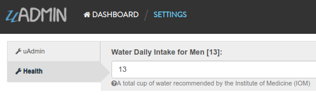

uadmin.Setting
==============
`Back to Setting Functions Page`_

.. _Back to Setting Functions Page: https://uadmin-docs.readthedocs.io/en/latest/api/setting_functions.html

Setting is a system in uAdmin that is used to display information for an application as a whole.

Structure:

.. code-block:: go

    type Setting struct {
        Model
        Name         string
        DefaultValue string
        DataType     DataType
        Value        string
        Help         string
        Category     SettingCategory `uadmin:"required"`
        CategoryID   uint
        Code         string `uadmin:"read_only"`
    }

Data Type has 7 Data Type:

* **Boolean** - A data type that has one of two possible values (usually denoted true and false), intended to represent the two truth values of logic and Boolean algebra
* **DateTime** - Provides functionality for measuring and displaying time
* **File** - A data type used in order to upload a file in the database
* **Float** - Used in various programming languages to define a variable with a fractional value
* **Image** - Used to upload and crop an image in the database
* **Integer** - Used to represent a whole number that ranges from -2147483647 to 2147483647 for 9 or 10 digits of precision
* **String** - Used to represent text rather than numbers

There are 5 functions that you can use in Setting:

* **ApplyValue()** - Applies the assigned value based on filter
* **GetValue()** - Fetch the first value from the record
* **HideInDashboarder()** - Return true and auto hide this from setting
* **ParseFormValue** - Parses a boolean and date time string values to its standard format

.. code-block:: go

    func(v []string)

Go to `Example #4: ParseFormValue function`_ to see how ParseFormValue works.

* **Save()** - Saves the object in the database

There are 2 ways you can do for initialization process using this function: one-by-one and by group.

One-by-one initialization:

.. code-block:: go

    func main(){
        // Some codes
        settingCategory := uadmin.SettingCategory{}
        setting := uadmin.Setting{}
        setting.Category = settingCategory
        setting.CategoryID = 1
        setting.Code = "Code"
        setting.DataType = uadmin.DataType(0).String(),
        setting.DefaultValue = "Default Setting Value"
        setting.Help = "Help"
        setting.Name = "Setting Name"
        setting.Value = "Setting Value"
    }

By group initialization:

.. code-block:: go

    func main(){
        // Some codes
        settingCategory := uadmin.SettingCategory{}
        setting := uadmin.Setting{
            Category:     settingCategory,
            CategoryID:   1,
            Code:         "Code",
            DataType:     uadmin.DataType(0).String(),
            DefaultValue: "Default Setting Value",
            Help:         "Help",
            Name:         "Setting Name",
            Value:        "Setting Value",
        }
    }

In the following examples, we will use "by group” initialization process.

uadmin.Setting Examples
^^^^^^^^^^^^^^^^^^^^^^^
* `Example #1: Assigning values in Setting fields`_
* `Example #2: ApplyValue function`_
* `Example #3: GetValue function`_
* `Example #4: ParseFormValue function`_

**Example #1:** Assigning values in Setting fields
^^^^^^^^^^^^^^^^^^^^^^^^^^^^^^^^^^^^^^^^^^^^^^^^^^
`Back to Top`_

Suppose you have a Health record in Setting Category system model that has an ID of 2.

.. image:: ../assets/settingcategoryhealthresult.png

|

Go to main.go and apply the following codes below to create a Setting that has a record of "Water Daily Intake for Men":

.. code-block:: go

    func main(){
        // Some codes
        // Setting configuration that assigns setting field values
        setting := uadmin.Setting{
            CategoryID:   2, // Health
            Code:         "Health.WaterDailyIntakeforMen",
            DataType:     uadmin.DataType(0).Integer(),
            DefaultValue: "13",
            Help:         "A total cup of water recommended by the Institute of Medicine (IOM)",
            Name:         "Water Daily Intake for Men",
            Value:        "13",
        }

        // Save setting in the database
        setting.Save()
    }

Now run your application. From uAdmin dashboard, click on "SETTINGS".

.. image:: ../assets/settingshighlighted.png

|

As a result, the record "Water Daily Intake for Men" was saved in the database. Now go to Settings page by clicking on the wrench icon on the top right part to see the result.

.. image:: ../assets/waterdailyintakeformensaved.png

|

Result

**Example #2:** ApplyValue function
^^^^^^^^^^^^^^^^^^^^^^^^^^^^^^^^^^^
`Back to Top`_

Example:

.. code-block:: go

    func main() {
        // Some codes

        // Initialize the Setting model
        settings := uadmin.Setting{}

        // Some business logic here

        // Apply the value assigned in the specified record
        settings.ApplyValue()
    }

**Example #3:** GetValue function
^^^^^^^^^^^^^^^^^^^^^^^^^^^^^^^^^
`Back to Top`_

Suppose you have built-in records containing uAdmin functions in the Setting model.

.. image:: ../assets/defaultsettingrecords.png

|

Go to the main.go and let's get all the values of the built-in setting records.

.. code-block:: go

    func main() {
        // Some codes

        // Initialize the Setting model
        settings := []uadmin.Setting{}

        // Fetch all records
        uadmin.All(&settings)

        // Print the value of each built-in setting records
        for s := range settings {
            uadmin.Trail(uadmin.DEBUG, settings[s].Name+": %v", settings[s].GetValue())
        }
    }

|

Run your application and check the result in your terminal.

.. code-block:: bash

    [  DEBUG ]   Theme: default
    [  DEBUG ]   Site Name: Todo List
    [  DEBUG ]   Reporting Level: 0
    [  DEBUG ]   Report Time Stamp: false
    [  DEBUG ]   Debug DB: false
    [  DEBUG ]   Page Length: 100
    [  DEBUG ]   Max Image Height: 600
    [  DEBUG ]   Max Image Width: 800
    [  DEBUG ]   Max Upload File Size: 26214400
    [  DEBUG ]   Port: 8000
    [  DEBUG ]   Email From: 
    [  DEBUG ]   Email Username: 
    [  DEBUG ]   Email Password: 
    [  DEBUG ]   Email SMTP Server: 
    [  DEBUG ]   Email SMTP Server Port: 0
    [  DEBUG ]   Root URL: /admin/
    [  DEBUG ]   OTP Algorithm: sha1
    [  DEBUG ]   OTP Digits: 6
    [  DEBUG ]   OTP Period: 30
    [  DEBUG ]   OTP Skew: 5
    [  DEBUG ]   Public Media: false
    [  DEBUG ]   Log Delete: true
    [  DEBUG ]   Log Add: true
    [  DEBUG ]   Log Edit: true
    [  DEBUG ]   Log Read: false
    [  DEBUG ]   Cache Translation: false
    [  DEBUG ]   Allowed IPs: *
    [  DEBUG ]   Blocked IPs: 
    [  DEBUG ]   Restrict Session IP: false
    [  DEBUG ]   Retain Media Versions: true

**Example #4:** ParseFormValue function
^^^^^^^^^^^^^^^^^^^^^^^^^^^^^^^^^^^^^^^
`Back to Top`_

.. _Back to Top: https://uadmin-docs.readthedocs.io/en/latest/api/setting-functions/setting.html#uadmin-setting-examples

**Date Time**

Suppose you have this record as shown below that has an ID of 1:

.. image:: ../assets/earthhourdata.png

|

Go to main.go and apply the following codes below after the Register and before StartServer sections.

.. code-block:: go

    func main(){
        // Some codes
        
        // Initialize the Setting model from uAdmin
        setting := uadmin.Setting{}

        // Get the first record in Setting model
        uadmin.Get(&setting, "id = 1")

        // Parse assigned Date Time value to its standard format
        setting.ParseFormValue([]string{"2020-03-28 20:30"})

        // Save the setting record
        setting.Save()
    }

Now run your application. From uAdmin dashboard, click on "SETTINGS".

.. image:: ../assets/settingshighlighted.png

|

As expected, the Date Time value has parsed to its standard format where :00 was appended in the value.

.. image:: ../assets/earthhourdataresult.png

|

**Boolean**

Suppose you have this record as shown below that has an ID of 1:

.. image:: ../assets/isearthhourdata.png

|

Go to main.go and apply the following codes below after the Register and before StartServer sections.

.. code-block:: go

    func main(){
        // Some codes
        
        // Initialize the Setting model from uAdmin
        setting := uadmin.Setting{}

        // Get the first record in Setting model
        uadmin.Get(&setting, "id = 1")

        // Parse assigned Boolean value to its standard format
        setting.ParseFormValue([]string{"on"})

        // Save the setting record
        setting.Save()
    }

Now run your application. From uAdmin dashboard, click on "SETTINGS".

.. image:: ../assets/settingshighlighted.png

|

As expected, the Boolean value has parsed to its standard format that prints 1. 1 means true in boolean.

.. image:: ../assets/isearthhourdataresult.png

|

If you click on the wrench icon, the Earth Hour status is Active in the Settings page.

.. image:: ../assets/isearthouractivesettings.png
