dAPI Reference
==============
In this section, we will discuss on URL mapping, security, data query and authentication along with any other related topics to this API.

* `API Help`_
* `Add Multiple`_
* `Add One`_
* `Delete Multiple`_
* `Delete One`_
* `Edit Multiple`_
* `Edit One`_
* `Read Multiple`_
    * `__gt`_
    * `__gte`_
    * `__lt`_
    * `__lte`_
    * `__in`_
    * `__is`_
    * `__contains`_
    * `__between`_
    * `__startswith`_
    * `__endswith`_
    * `__re`_
    * `__icontains`_
    * `__istartswith`_
    * `__iendswith`_
* `Read One`_
* `Return Format`_
* `Schema`_
* `API Permissions`_
* `Logging`_
* `Methods`_
    * `Model Methods`_
    * `Custom Methods`_
* `Special Parameters`_
    * `$or`_
    * `$limit`_
    * `$order (Ascending)`_
    * `$order (Descending)`_
    * `$order (List of Fields)`_
    * `Limit, offset, order`_
    * `$f`_
    * `$groupby`_
    * `$join`_
    * `$deleted`_
    * `$m2m`_
    * `$q`_
    * `$next`_
    * `$preload`_
    * `$stat`_
    * `$allmodels`_
* `Writing Data Symbol`_
* `uAdmin Functions`_

API Help
--------
`Back to Top`_

To display information about data access HTTP API, call this URL in the address bar as shown below:

.. code-block:: bash

    # d stands for data
    http://api.example.com/{ROOT_URL}/api/d/

Result:

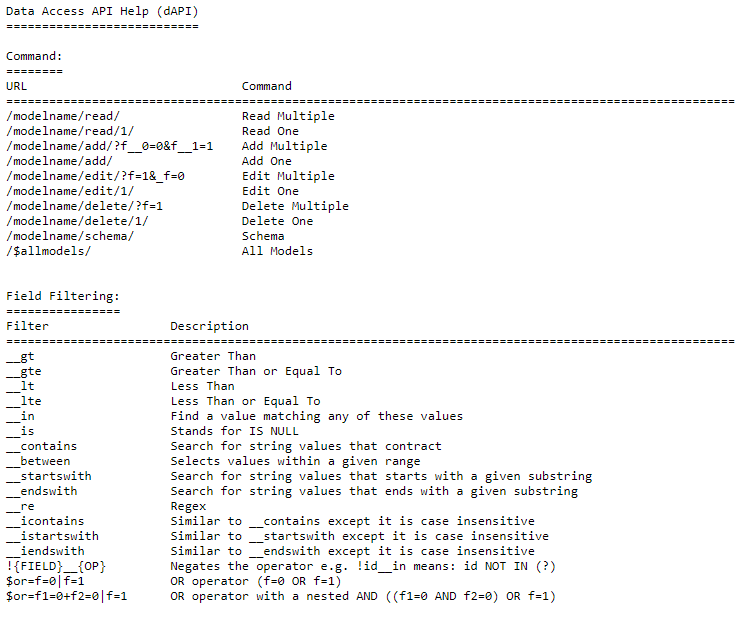

.. image:: dapi/assets/dataaccessapihelp2.png
   :align: center

Add Multiple
------------
`Back to Top`_

Structure:

.. code-block:: bash

    # d stands for data
    # For writing data, put _ symbol first before the field name
    http://api.example.com/{ROOT_URL}/api/d/{MODEL_NAME}/add/?_{FIELD_NAME__n=VALUE}

**Method**: GET, POST

**Authentication**: Cookie, URL parameter "?code=abcd" or POST parameter "code=abcd"

The model's fields could be added as parameters depending of the HTTP method. If a field is required and there is no value passed, the API will return a status:" 'error' with an err_msg detailing which required field was missing.

.. code-block:: JSON

    {
        "status": "error",
        "err_msg": "This field is required and no value is assigned or missing.",
        "err_f": "Name",
    }

To identify each field in the request, there is a suffix of __n where n is the index of the record being added. This is a 0-based index.

Suppose you don't have any records in the Document model.

.. image:: dapi/assets/emptyrecorddocument.png

|

Run your application and call this URL to add multiple records in the Document model with the following information below:

**First Record**

* Name: Golang
* Author: John

**Second Record**

* Name: uAdmin
* Author: Adam

.. code-block:: bash

    # document is a model name
    # name and author are field names
    # __0 is the first index
    # __1 is the second index
    http://api.example.com/{ROOT_URL}/api/d/document/add/?_name__0=Golang&_author__0=John&_name__1=uAdmin&_author__1=Adam

Result:

.. code-block:: JSON

    {
        "id": [
            1,
            2
        ],
        "rows_count": 2,
        "status": "ok"
    }

It returns an array with a list of IDs for the newly created records.

To check the details of the newly created records, there are two methods: by visiting the Document model from uAdmin dashboard or by applying __in operator in the id field then assign the IDs of the newly created records to read multiple data in the API.

**Method 1:** Visiting the Document model from uAdmin dashboard

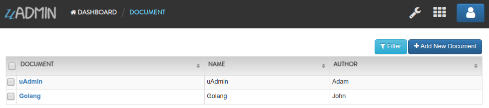

**Method 2:** Using __in operator to read multiple records in the API

.. code-block:: bash

    # document is a model name
    # id is a field name
    # __in is an operator used to read record(s) to find a value matching
    # any of these values
    http://api.example.com/{ROOT_URL}/api/d/document/read/?id__in=1,2

Result:

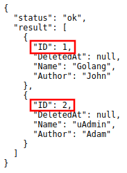

|

It returns a JSON array representing newly created items where ID=1,2.

Add One
-------
`Back to Top`_

Structure:

.. code-block:: bash

    # d stands for data
    # For writing data, put _ symbol first before the field name
    http://api.example.com/{ROOT_URL}/api/d/{MODEL_NAME}/add/?_{FIELD_NAME=VALUE}

**Method**: GET, POST

**Authentication**: Cookie, URL parameter "?code=abcd" or POST parameter "code=abcd"

The model's fields could be added as parameters depending of the HTTP method. If a field is required and there is no value passed, the API will return a status:" 'error' with an err_msg detailing which required field was missing.

.. code-block:: JSON

    {
        "status": "error",
        "err_msg": "This field is required and no value is assigned or missing.",
        "err_f": "Name"
    }

Suppose you have two records in the Document model.

|

Run your application and call this URL to add a new record in the Document model with the following information below:

* Name: Programming
* Author: Admin

.. code-block:: bash

    # document is a model name
    # name and author are field names
    http://api.example.com/{ROOT_URL}/api/d/document/add/?_name=Programming&_author=Admin

Result:

.. code-block:: JSON

    {
        "id": 3,
        "rows_count": 1,
        "status": "ok"
    }

It returns the ID of the newly created record.

To check the details of a newly created record, there are two methods: by visiting the Document model in the dashboard or by using HTTP API to read one by assigning the ID of the newly created record.

**Method 1:** Visiting the Document model from uAdmin dashboard

.. image:: dapi/assets/addoneresult.png

**Method 2:** Using HTTP API to read one record

.. code-block:: bash

    # document is a model name
    # 3 is an ID number
    http://api.example.com/{ROOT_URL}/api/d/document/read/3/

Result:

.. image:: dapi/assets/addoneresultjson.png
   :align: center

|

It returns a JSON object representing an item where ID=3.

Delete Multiple
---------------
`Back to Top`_

Structure:

.. code-block:: bash

    # d stands for data
    http://api.example.com/{ROOT_URL}/api/d/{MODEL_NAME}/delete/?{FIELD_NAME=VALUE}

    # This API call will delete all records in the database.
    http://api.example.com/{ROOT_URL}/api/d/{MODEL_NAME}/delete/

**Method**: GET, POST

**Authentication**: Cookie, URL parameter "?code=abcd" or POST parameter "code=abcd"

Suppose you have five records in the Item model.

.. image:: dapi/assets/itemfiverecords.png

|

Run your application and call this URL to delete records where the name of an item contains "iPad".

.. code-block:: bash

    # item is a model name
    # name is a field name
    # __contains is an operator that will search for string values that contract
    http://api.example.com/{ROOT_URL}/api/d/item/delete/?name__contains=iPad

Result:

.. code-block:: JSON

    {
        "rows_count": 2,
        "status": "ok"
    }

It returns the status and the rows affected by your query.

To check if the record(s) with the substring "iPad" were removed from the database, there are two methods: by visiting the Item model from uAdmin dashboard or by using HTTP API to read all data.

**Method 1:** Visiting the Item model from uAdmin dashboard

.. image:: dapi/assets/deletemultipleresult.png

**Method 2:** Using HTTP API to read all data

.. code-block:: bash

    # item is a model name
    http://api.example.com/{ROOT_URL}/api/d/item/read/

Result:

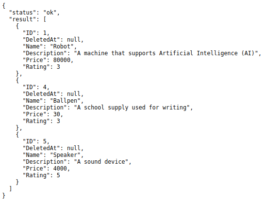

|

It returns a JSON array with all remaining items in the database.

What if you don't specify which record do you want to delete in the database? Let's call this URL without assigning any query.

.. code-block:: bash

    # item is a model name
    # This API call will delete all records in the Item model.
    http://api.example.com/{ROOT_URL}/api/d/item/delete/

Result:

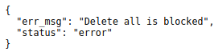

|

By default, delete all is blocked to the user.

Delete One
----------
`Back to Top`_

Structure:

.. code-block:: bash

    # d stands for data
    http://api.example.com/{ROOT_URL}/api/d/{MODEL_NAME}/delete/{ID}/

**Method**: GET, POST

**Authentication**: Cookie, URL parameter "?code=abcd" or POST parameter "code=abcd"

Suppose you have five records in the Item model.

.. image:: dapi/assets/itemfiverecords.png

|

Run your application and call this URL to delete the third record in the database.

.. code-block:: bash

    # item is a model name
    # 3 is an ID number
    http://api.example.com/{ROOT_URL}/api/d/item/delete/3/

Result:

.. code-block:: JSON

    {
        "rows_count": 1,
        "status": "ok"
    }

It returns the status and the rows affected by your query.

To check if the third record was removed from the database, there are two methods: by visiting the Item model from uAdmin dashboard or by using HTTP API to read all data.

**Method 1:** Visiting the Item model from uAdmin dashboard

.. image:: dapi/assets/deleteoneresult.png

**Method 2:** Using HTTP API to read all data

.. code-block:: bash

    # item is a model name
    http://api.example.com/{ROOT_URL}/api/d/item/read/

Result:

.. image:: dapi/assets/deleteoneresultjson.png
   :align: center

|

It returns a JSON array with all remaining items in the database.

Edit Multiple
-------------
`Back to Top`_

Structure:

.. code-block:: bash

    # d stands for data
    # ! stands for query
    # For writing data, put _ symbol first before the field name
    # Pass a query that matches a record to be updated then assign a
    # new value in the specified field
    http://api.example.com/{ROOT_URL}/api/d/{MODEL_NAME}/edit/?{FIELD_NAME=VALUE}&_{FIELD_NAME=VALUE}

    # If there is no assigned field selector, it will update all records in
    # the database.
    http://api.example.com/{ROOT_URL}/api/d/{MODEL_NAME}/edit/?_{FIELD_NAME=VALUE}

**Method**: GET, POST

**Authentication**: Cookie, URL parameter "?code=abcd" or POST parameter "code=abcd"

Suppose you have five records in the Item model where all iPad items have a rating of 4.

.. image:: dapi/assets/itemipadoldrating.png

|

Run your application and call this URL to edit the rating of all iPad items to a value of 5.

.. code-block:: bash

    # item is a model name
    # name is a field name
    # __contains is an operator that will search for string values that contract
    # rating=4&_rating=5 means that where rating is equal to 4, change the
    # rating value to 5
    http://api.example.com/{ROOT_URL}/api/d/item/edit/?rating=4&_rating=5

Result:

.. code-block:: JSON

    {
        "rows_count": 2,
        "status": "ok"
    }

It returns the status and the rows affected by your query.

To check if the rating of iPad items has edited, there are two methods: by visiting the Item model from uAdmin dashboard or by using HTTP API to read multiple data where name contains "iPad".

**Method 1:** Visiting the Item model from uAdmin dashboard

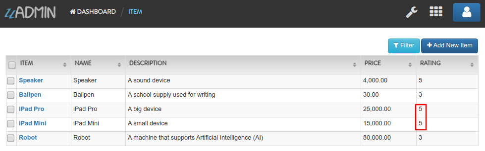

**Method 2:** Using HTTP API to read multiple data

.. code-block:: bash

    # item is a model name
    # name is a field name
    # __contains is an operator that will search for string values that contract
    http://api.example.com/{ROOT_URL}/api/d/item/read/?name__contains=iPad

Result:

.. image:: dapi/assets/editmultipleresultjson.png
   :align: center

|

It returns a JSON array representing newly modified iPad items where rating has a value of 5.

What if you don't specify which record do you want to update in the database? Let's call this URL to edit the rating to a value of 2.

.. code-block:: bash

    http://api.example.com/{ROOT_URL}/api/d/item/edit/?_rating=2

Now let's see what happens.

.. code-block:: JSON

    {
        "rows_count": 5,
        "status": "ok"
    }

Based on the result, it seems that all rows are affected by your query.

To check if the rating of all items has edited, there are two methods: by visiting the Item model from uAdmin dashboard or by using HTTP API to read all records in the database.

**Method 1:** Visiting the Item model from uAdmin dashboard

.. image:: dapi/assets/editallresult.png

**Method 2:** Using HTTP API to read all records

.. code-block:: bash

    # item is a model name
    http://api.example.com/{ROOT_URL}/api/d/item/read/

Result:

.. image:: dapi/assets/editallresultjson.png
   :align: center

Edit One
--------
`Back to Top`_

Structure:

.. code-block:: bash

    # d stands for data
    # For writing data, put _ symbol first before the field name
    http://api.example.com/{ROOT_URL}/api/d/{MODEL_NAME}/edit/{ID}/?_{FIELD_NAME=VALUE}

**Method**: GET, POST

**Authentication**: Cookie, URL parameter "?code=abcd" or POST parameter "code=abcd"

Suppose the first record in the Item model is named as "Robot".

.. image:: dapi/assets/itemfirstrecordrobot.png

|

Run your application and call this URL to edit the name of the first record in the database from "Robot" to "Supercomputer".

.. code-block:: bash

    # item is a model name
    # 1 is an ID number
    # name is a field name
    http://api.example.com/{ROOT_URL}/api/d/item/edit/1/?_name=Supercomputer

Result:

.. code-block:: JSON

    {
        "rows_count": 1,
        "status": "ok"
    }

It returns the status and the rows affected by your query.

To check if the name of the first record has modified, there are two methods: by visiting the Item model from uAdmin dashboard or by using HTTP API to read the first record.

**Method 1:** Visiting the Item model from uAdmin dashboard

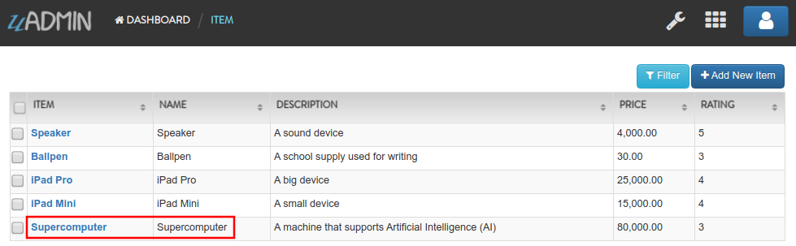

**Method 2:** Using HTTP API to read the first record

.. code-block:: bash

    # item is a model name
    # 1 is an ID number
    http://api.example.com/{ROOT_URL}/api/d/item/read/1/

Result:

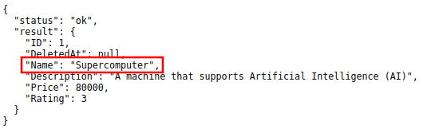

|

It returns a JSON object representing a modified item where name=Supercomputer.

Read Multiple
-------------
`Back to Top`_

Structure:

.. code-block:: bash

    # d stands for data
    http://api.example.com/{ROOT_URL}/api/d/{MODEL_NAME}/read/?{FIELD_NAME=VALUE}

    # ! is a negate symbol equivalent to SQL NOT
    # WHERE field_name != value
    http://api.example.com/{ROOT_URL}/api/d/{MODEL_NAME}/read/?!{FIELD_NAME=VALUE}

    # This API call will read all records in the database.
    http://api.example.com/{ROOT_URL}/api/d/{MODEL_NAME}/read/

**Method**: GET, POST

**Authentication**: Cookie, URL parameter "?code=abcd" or POST parameter "code=abcd"

Any field of the model could be passed as a parameter to filter the results. Multiple filters could be used together where the system will apply AND operator between them. Evaluation operator could be added using __ e.g. ?name__contains=contract.

Suppose you have five records in the Item model.

.. image:: dapi/assets/itemfiverecords.png

|

Run your application and call this URL to read record(s) where rating is equal to 3.

.. code-block:: bash

    # item is a model name
    # rating is a field name
    http://api.example.com/{ROOT_URL}/api/d/item/read/?rating=3

Result:

.. image:: dapi/assets/readmultipleresult.png
   :align: center

|

It returns a list of records where rating is equal to 3.

Now let's call this URL to read record(s) where rating is not equal to 3.

.. code-block:: bash

    # item is a model name
    # rating is a field name
    # ! is a negate symbol equivalent to SQL NOT
    # WHERE rating != 3
    http://api.example.com/{ROOT_URL}/api/d/item/read/?!rating=3

Result:

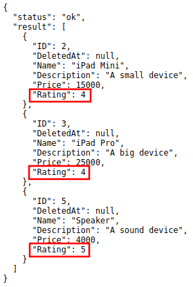

|

It returns a list of records where rating is not equal to 3.

What if you don't specify which record do you want to read in the database? Let's call this URL without assigning any query.

.. code-block:: bash

    # item is a model name
    # This API call will read all records in the Item model.
    http://api.example.com/{ROOT_URL}/api/d/item/read/

Result:

.. image:: dapi/assets/readallresult.png
   :align: center

|

It returns a JSON array with all items in the database.

List of Operators
^^^^^^^^^^^^^^^^^
`Back to Top (Read Multiple)`_

.. _Back to Top (Read Multiple): https://uadmin-docs.readthedocs.io/en/latest/dapi.html#read-multiple

* `__gt`_
* `__gte`_
* `__lt`_
* `__lte`_
* `__in`_
* `__is`_
* `__contains`_
* `__between`_
* `__startswith`_
* `__endswith`_
* `__re`_
* `__icontains`_
* `__istartswith`_
* `__iendswith`_

**__gt**
^^^^^^^^
`Back to Top (List of Operators)`_

Greater than. Applies to: numbers, dates

Structure:

.. code-block:: bash

    # d stands for data
    http://api.example.com/{ROOT_URL}/api/d/{MODEL_NAME}/read/?{FIELD_NAME__gt=VALUE}

    # ! is a negate symbol equivalent to SQL NOT
    # WHERE field_name <= value
    http://api.example.com/{ROOT_URL}/api/d/{MODEL_NAME}/read/?!{FIELD_NAME__gt=VALUE}

Suppose you have five records in the Item model.

.. image:: dapi/assets/itemfiverecords.png

|

Run your application and call this URL to read record(s) where price is greater than 15000.

.. code-block:: bash

    # item is a model name
    # price is a field name
    # __gt is an operator used to read record(s) where price is greater
    # than 15000
    http://api.example.com/{ROOT_URL}/api/d/item/read/?price__gt=15000

Result:

.. image:: dapi/assets/gtresult.png
   :align: center

|

It returns a list of records where price is greater than 15000.

**__gte**
^^^^^^^^^
`Back to Top (List of Operators)`_

Greater than or equal to. Applies to: numbers, dates

Structure:

.. code-block:: bash

    # d stands for data
    http://api.example.com/{ROOT_URL}/api/d/{MODEL_NAME}/read/?{FIELD_NAME__gte=VALUE}

    # ! is a negate symbol equivalent to SQL NOT
    # WHERE field_name < value
    http://api.example.com/{ROOT_URL}/api/d/{MODEL_NAME}/read/?!{FIELD_NAME__gte=VALUE}

Suppose you have five records in the Item model.

.. image:: dapi/assets/itemfiverecords.png

|

Run your application and call this URL to read record(s) where price is greater than or equal to 15000.

.. code-block:: bash

    # item is a model name
    # price is a field name
    # __gte is an operator used to read record(s) where price is greater
    # than or equal to 15000
    http://api.example.com/{ROOT_URL}/api/d/item/read/?price__gte=15000

Result:

.. image:: dapi/assets/gteresult.png
   :align: center

|

It returns a list of records where price is greater than or equal 15000.

**__lt**
^^^^^^^^
`Back to Top (List of Operators)`_

Less than. Applies to: numbers, dates

Structure:

.. code-block:: bash

    # d stands for data
    http://api.example.com/{ROOT_URL}/api/d/{MODEL_NAME}/read/?{FIELD_NAME__lt=VALUE}

    # ! is a negate symbol equivalent to SQL NOT
    # WHERE field_name >= value
    http://api.example.com/{ROOT_URL}/api/d/{MODEL_NAME}/read/?!{FIELD_NAME__lt=VALUE}

Suppose you have five records in the Item model.

.. image:: dapi/assets/itemfiverecords.png

|

Run your application and call this URL to read record(s) where price is less than 15000.

.. code-block:: bash

    # item is a model name
    # price is a field name
    # __lt is an operator used to read record(s) where price is less
    # than 15000
    http://api.example.com/{ROOT_URL}/api/d/item/read/?price__lt=15000

Result:

.. image:: dapi/assets/ltresult.png
   :align: center

|

It returns a list of records where price is less than 15000.

**__lte**
^^^^^^^^^
`Back to Top (List of Operators)`_

Less than or equal to. Applies to: numbers, dates

Structure:

.. code-block:: bash

    # d stands for data
    http://api.example.com/{ROOT_URL}/api/d/{MODEL_NAME}/read/?{FIELD_NAME__lte=VALUE}

    # ! is a negate symbol equivalent to SQL NOT
    # WHERE field_name > value
    http://api.example.com/{ROOT_URL}/api/d/{MODEL_NAME}/read/?!{FIELD_NAME__lte=VALUE}

Suppose you have five records in the Item model.

.. image:: dapi/assets/itemfiverecords.png

|

Run your application and call this URL to read record(s) where price is less than or equal to 15000.

.. code-block:: bash

    # item is a model name
    # price is a field name
    # __lte is an operator used to read record(s) where price is less
    # than or equal to 15000
    http://api.example.com/{ROOT_URL}/api/d/item/read/?price__lte=15000

Result:

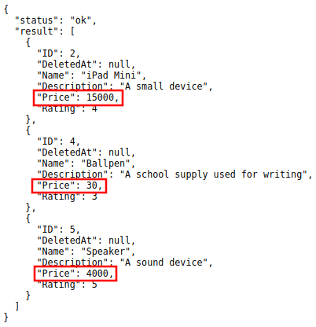

|

It returns a list of records where price is less than or equal to 15000.

**__in**
^^^^^^^^
`Back to Top (List of Operators)`_

Uses SQL IN (a,c,b...) operator to find a value matching any of these values. In the URL the values will be comma separated in this way id__in=1,2,3. Applies to: numbers

Structure:

.. code-block:: bash

    # d stands for data
    http://api.example.com/{ROOT_URL}/api/d/{MODEL_NAME}/read/?{FIELD_NAME__in=VALUE}

    # ! is a negate symbol equivalent to SQL NOT
    # WHERE field_name NOT IN value
    http://api.example.com/{ROOT_URL}/api/d/{MODEL_NAME}/read/?!{FIELD_NAME__in=VALUE}

Suppose you have five records in the Item model.

.. image:: dapi/assets/itemfiverecords.png

|

Run your application and call this URL to read record(s) where the rating of an item is 3 and 5.

.. code-block:: bash

    # item is a model name
    # rating is a field name
    # __in is an operator used to read record(s) to find a value matching
    # any of these values
    http://api.example.com/{ROOT_URL}/api/d/item/read/?rating__in=3,5

Result:

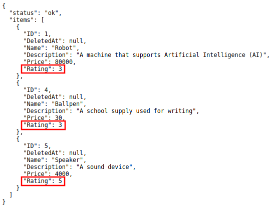

|

It returns a list of records where the rating of an item is 3 or 5.

Now let's call this URL to read record(s) where the rating of an item is outside of 3 and 5.

.. code-block:: bash

    # item is a model name
    # rating is a field name
    # ! is a negate symbol equivalent to SQL NOT
    # WHERE rating NOT IN (3,5)
    http://api.example.com/{ROOT_URL}/api/d/item/read/?!rating__in=3,5

Result:

.. image:: dapi/assets/notinresult.png
   :align: center

|

It returns a list of records where the rating of an item is outside of 3 or 5.

**__is**
^^^^^^^^
`Back to Top (List of Operators)`_

Stands for IS NULL. It should be used like date__is=null

Structure:

.. code-block:: bash

    # d stands for data
    http://api.example.com/{ROOT_URL}/api/d/{MODEL_NAME}/read/?{FIELD_NAME__is=null)

    # ! is a negate symbol equivalent to SQL NOT
    # WHERE field_name IS NOT NULL
    http://api.example.com/{ROOT_URL}/api/d/{MODEL_NAME}/read/?!{FIELD_NAME__is=null)

Suppose you have five records in the Item model.

.. image:: dapi/assets/itemfiverecords.png

|

Run your application. Inside the Item model, delete the iPad Pro and iPad Mini items.

.. image:: dapi/assets/ipaddeleteselected.png

|

.. image:: dapi/assets/ipadconfirmdelete.png

|

Result:

.. image:: dapi/assets/deletemultipleresult.png

|

In the address bar, call this URL to read record(s) where the Deleted At date value is null.

.. code-block:: bash

    # item is a model name
    # deletedat is a field name
    # __is is an operator that stands for IS NULL
    http://api.example.com/{ROOT_URL}/api/d/item/read/?deletedat__is=null

Result:

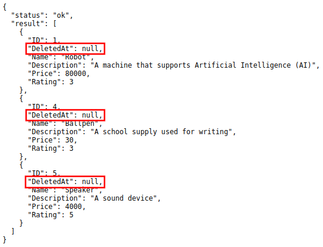

|

It returns a list of records where the Deleted At date value is null.

Now let's call this URL to read record(s) where the Deleted At date value is not null.

.. code-block:: bash

    # item is a model name
    # deletedat is a field name
    # ! is a negate symbol equivalent to SQL NOT
    # WHERE deletedat IS NOT NULL
    http://api.example.com/{ROOT_URL}/api/d/item/read/?!deletedat__is=null

Result:

.. image:: dapi/assets/isnotnullresult.png
   :align: center

|

It returns a list of records where the Deleted At date value is not null.

**__contains**
^^^^^^^^^^^^^^
`Back to Top (List of Operators)`_

Will search for string values that contract. Applies to: string

Structure:

.. code-block:: bash

    # d stands for data
    http://api.example.com/{ROOT_URL}/api/d/{MODEL_NAME}/read/?{FIELD_NAME__contains=VALUE}

    # ! is a negate symbol equivalent to SQL NOT
    # WHERE field_name NOT LIKE BINARY %value%
    http://api.example.com/{ROOT_URL}/api/d/{MODEL_NAME}/read/?!{FIELD_NAME__contains=VALUE}

Suppose you have five records in the Item model.

.. image:: dapi/assets/itemfiverecords.png

|

Run your application and call this URL to read record(s) where the name of an item contains the substring "iPad".

.. code-block:: bash

    # item is a model name
    # name is a field name
    # __contains is an operator that will search for string values that contract
    http://api.example.com/{ROOT_URL}/api/d/item/read/?name__contains=iPad

Result:

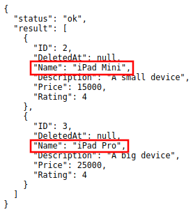

|

It returns a list of records where the name of an item contains the substring "iPad".

Now let's search the substring "ipad" where p is the lowercase letter and see what happens.

.. code-block:: bash

    http://api.example.com/{ROOT_URL}/api/d/item/read/?name__contains=ipad

Result:

.. code-block:: JSON

    {
        "result": [],
        "status": "ok"
    }

It returns an empty array because __contains operator searches for an exact match string value. It is case sensitive. If you want to search a string value that is not case sensitive, go to `__icontains`_ for an example.

**__between**
^^^^^^^^^^^^^
`Back to Top (List of Operators)`_

The __between operator selects values within a given range. The values can be numbers, text, or dates.

The __between operator is inclusive: begin and end values are included. [#f5]_

Structure:

.. code-block:: bash

    # d stands for data
    http://api.example.com/{ROOT_URL}/api/d/{MODEL_NAME}/read/?{FIELD_NAME__between=value1,value2)

    # ! is a negate symbol equivalent to SQL NOT
    # WHERE field_name NOT BETWEEN value1 AND value2
    http://api.example.com/{ROOT_URL}/api/d/{MODEL_NAME}/read/?!{FIELD_NAME__between=value1,value2)

Suppose you have five records in the Item model.

.. image:: dapi/assets/itemfiverecords.png

|

Run your application and call this URL to read record(s) where price is between the range of 15000 and 30000.

.. code-block:: bash

    # item is a model name
    # price is a field name
    # __between is an operator that selects values within a given range
    http://api.example.com/{ROOT_URL}/api/d/item/read/?price__between=15000,30000

Result:

.. image:: dapi/assets/betweenresult.png
   :align: center

|

It returns a list of records where where price is between the range of 15000 and 30000.

**__startswith**
^^^^^^^^^^^^^^^^
`Back to Top (List of Operators)`_

Will search for string values that starts with a given substring. Applies to: string

Structure:

.. code-block:: bash

    # d stands for data
    http://api.example.com/{ROOT_URL}/api/d/{MODEL_NAME}/read/?{FIELD_NAME__startswith=VALUE}

    # ! is a negate symbol equivalent to SQL NOT
    # WHERE field_name NOT LIKE BINARY value%
    http://api.example.com/{ROOT_URL}/api/d/{MODEL_NAME}/read/?!{FIELD_NAME__startswith=VALUE}

Suppose you have five records in the Item model.

.. image:: dapi/assets/itemfiverecords.png

|

Run your application and call this URL to read record(s) where the name of an item starts with "iPad".

.. code-block:: bash

    # item is a model name
    # name is a field name
    # __startswith is an operator that will search for string values that
    # starts with a given substring
    http://api.example.com/{ROOT_URL}/api/d/item/read/?name__startswith=iPad

Result:

.. image:: dapi/assets/startswithresult.png
   :align: center

|

It returns a list of records where the name of an item starts with "iPad".

Now let's search the substring "ipad" where p is the lowercase letter and see what happens.

.. code-block:: bash

    http://api.example.com/{ROOT_URL}/api/d/item/read/?name__startswith=ipad

Result:

.. code-block:: JSON

    {
        "result": [],
        "status": "ok"
    }

It returns an empty array because __startswith operator searches for an exact match string value. It is case sensitive. If you want to search a string value that is not case sensitive, go to `__istartswith`_ for an example.

**__endswith**
^^^^^^^^^^^^^^
`Back to Top (List of Operators)`_

Will search for string values that ends with a given substring. Applies to: string

Structure:

.. code-block:: bash

    # d stands for data
    http://api.example.com/{ROOT_URL}/api/d/{MODEL_NAME}/read/?{FIELD_NAME__endswith=VALUE}

    # ! is a negate symbol equivalent to SQL NOT
    # WHERE field_name NOT LIKE BINARY %value
    http://api.example.com/{ROOT_URL}/api/d/{MODEL_NAME}/read/?!{FIELD_NAME__endswith=VALUE}

Suppose you have five records in the Item model.

.. image:: dapi/assets/itemfiverecords.png

|

Run your application and call this URL to read record(s) where the description of an item ends with "device".

.. code-block:: bash

    # item is a model name
    # description is a field name
    # __endswith is an operator that will search for string values that
    # ends with a given substring
    http://api.example.com/{ROOT_URL}/api/d/item/read/?description__endswith=device

Result:

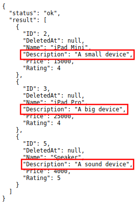

|

It returns a list of records where the description of an item ends with "device".

Now let's search the substring "Device" where D is the uppercase letter and see what happens.

.. code-block:: bash

    http://api.example.com/{ROOT_URL}/api/d/item/read/?description__endswith=Device

Result:

.. code-block:: JSON

    {
        "result": [],
        "status": "ok"
    }

It returns an empty array because __endswith operator searches for an exact match string value. It is case sensitive. If you want to search a string value that is not case sensitive, go to `__iendswith`_ for an example.

**__re**
^^^^^^^^
`Back to Top (List of Operators)`_

Regular expression or regex. It is a sequence of characters that define a search pattern.

Structure:

.. code-block:: bash

    # d stands for data
    http://api.example.com/{ROOT_URL}/api/d/{MODEL_NAME}/read/?{FIELD_NAME__re=VALUE}

    # ! is a negate symbol equivalent to SQL NOT
    # WHERE field_name NOT REGEXP value
    http://api.example.com/{ROOT_URL}/api/d/{MODEL_NAME}/read/?!{FIELD_NAME__re=VALUE}

Suppose you have five records in the Item model.

.. image:: dapi/assets/itemfiverecords.png

|

Run your application and call this URL to read record(s) where the name of an item starts with "iPad" followed by letter M or P in the second word.

.. code-block:: bash

    # item is a model name
    # name is a field name
    # __re is an operator that defines a search pattern
    # %20 represents a space in an encoded URL
    # [M,P] is a list that can be letter M or P
    http://api.example.com/{ROOT_URL}/api/d/item/?name__re=iPad%20[M,P]

Result:

.. image:: dapi/assets/reresult.png
   :align: center

|

It returns a list of records where the name of an item starts with "iPad" followed by letter M or P in the second word.

**__icontains**
^^^^^^^^^^^^^^^
`Back to Top (List of Operators)`_

Will search for string values that contract. This is case insensitive. Applies to: string

Structure:

.. code-block:: bash

    # d stands for data
    http://api.example.com/{ROOT_URL}/api/d/{MODEL_NAME}/read/?{FIELD_NAME__icontains=VALUE}

    # ! is a negate symbol equivalent to SQL NOT
    # WHERE UPPER(field_name) LIKE %value%
    http://api.example.com/{ROOT_URL}/api/d/{MODEL_NAME}/read/?!{FIELD_NAME__icontains=VALUE}

Suppose you have five records in the Item model.

.. image:: dapi/assets/itemfiverecords.png

|

Run your application and call this URL to read record(s) where the name of an item contains the substring "iPad".

.. code-block:: bash

    # item is a model name
    # name is a field name
    # __icontains is an operator that will search for string values that contract
    # __icontains is case insensitive
    http://api.example.com/{ROOT_URL}/api/d/item/read/?name__icontains=iPad

Result:

|

It returns a list of records where the name of an item contains the substring "iPad".

Now let's search the substring "ipad" where p is the lowercase letter and see what happens.

.. code-block:: bash

    http://api.example.com/{ROOT_URL}/api/d/item/read/?name__icontains=ipad

Result:

|

It returns the same thing.

**__istartswith**
^^^^^^^^^^^^^^^^^
`Back to Top (List of Operators)`_

Will search for string values that starts with a given substring. This is case insensitive. Applies to: string

Structure:

.. code-block:: bash

    # d stands for data
    http://api.example.com/{ROOT_URL}/api/d/{MODEL_NAME}/read/?{FIELD_NAME__istartswith=VALUE}

    # ! is a negate symbol equivalent to SQL NOT
    # WHERE UPPER(field_name) LIKE value%
    http://api.example.com/{ROOT_URL}/api/d/{MODEL_NAME}/read/?!{FIELD_NAME__istartswith=VALUE}

Suppose you have five records in the Item model.

.. image:: dapi/assets/itemfiverecords.png

|

Run your application and call this URL to read record(s) where the name of an item starts with "iPad".

.. code-block:: bash

    # item is a model name
    # name is a field name
    # __istartswith is an operator that will search for string values that
    # starts with a given substring. This is case insensitive.
    http://api.example.com/{ROOT_URL}/api/d/item/read/?name__istartswith=iPad

Result:

.. image:: dapi/assets/startswithresult.png
   :align: center

|

It returns a list of records where the name of an item starts with "iPad".

Now let's search the substring "ipad" where p is the lowercase letter and see what happens.

.. code-block:: bash

    http://api.example.com/{ROOT_URL}/api/d/item/?name__istartswith=ipad

Result:

.. image:: dapi/assets/startswithresult.png
   :align: center

|

It returns the same thing.

**__iendswith**
^^^^^^^^^^^^^^^
`Back to Top (List of Operators)`_

.. _Back to Top (List of Operators): https://uadmin-docs.readthedocs.io/en/latest/dapi.html#list-of-operators

Will search for string values that ends with a given substring. This is case insensitive. Applies to: string

Structure:

.. code-block:: bash

    # d stands for data
    http://api.example.com/{ROOT_URL}/api/d/{MODEL_NAME}/read/?{FIELD_NAME__iendswith=VALUE}

    # ! is a negate symbol equivalent to SQL NOT
    # WHERE UPPER(field_name) LIKE %value
    http://api.example.com/{ROOT_URL}/api/d/{MODEL_NAME}/read/?!{FIELD_NAME__iendswith=VALUE}

Suppose you have five records in the Item model.

.. image:: dapi/assets/itemfiverecords.png

|

Run your application and call this URL to read record(s) where the description of an item ends with "device".

.. code-block:: bash

    # item is a model name
    # description is a field name
    # __iendswith is an operator that will search for string values that
    # ends with a given substring. This is case insensitive.
    http://api.example.com/{ROOT_URL}/api/d/item/?description__iendswith=device

Result:

|

It returns a list of records where the description of an item ends with "device".

Now let's search the substring "Device" where D is the uppercase letter and see what happens.

.. code-block:: bash

    http://api.example.com/{ROOT_URL}/api/d/item/read/?description__iendswith=Device

Result:

|

It returns the same thing.

Read One
--------
`Back to Top`_

Structure:

.. code-block:: bash

    # d stands for data
    http://api.example.com/{ROOT_URL}/api/d/{MODEL_NAME}/read/{ID}/

**Method**: GET, POST

**Authentication**: Cookie, URL parameter "?code=abcd" or POST parameter "code=abcd"

Suppose you have five records in the Item model.

.. image:: dapi/assets/itemfiverecords.png

|

Run your application and call this URL to read the second record in the Item model.

.. code-block:: bash

    # item is a model name
    # 2 is an ID number
    http://api.example.com/{ROOT_URL}/api/d/item/read/2/

Result:

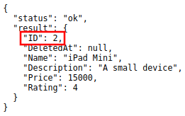

|

It returns a JSON object representing an item where ID=2.

Return Format
-------------
`Back to Top`_

The return format is always JSON in this format:

.. code-block:: JSON

    {
        "status": "ok",
        "result": {}
    }

Where **value** has the return value of the call. Not all calls will have a return value. In case of error you will get a JSON result that looks like this:

.. code-block:: JSON

    {
        "status": "error",
        "err_msg": "error message",
        "err_f": "Name"
    }

If the API should return a single result, then the value of items could be either an object or null.

.. code-block:: JSON

    {
        "status": "ok",
        "result": {
            "name": "item 1",
            "description": "description 1"
        }
    }

.. code-block:: JSON

    {
        "status": "ok",
        "items": null
    }

If the API should return multiple results, then the value of items is always an array that could be of length 0.

.. code-block:: JSON

    {
        "status": "ok",
        "result": []
    }

Schema
------
`Back to Top`_

Structure:

.. code-block:: bash

    # d stands for data
    http://api.example.com/{ROOT_URL}/api/d/{MODEL_NAME}/schema/

**Method**: GET, POST

**Authentication**: Cookie, URL parameter "?code=abcd" or POST parameter "code=abcd"

By default this is disabled for all users unless it is enabled with method **APIDisabledSchema** and **APIPublicSchema**.

Suppose you have five records in the Item model.

.. image:: dapi/assets/itemfiverecords.png

|

Run your application and call this URL to read the full schema of the Item model.

.. code-block:: bash

    # item is a model name
    http://api.example.com/{ROOT_URL}/api/d/item/schema/

Result:

.. image:: dapi/assets/schemaresult.png
   :align: center

|

It returns a JSON object representing uAdmin's ModelSchema of the Item model.

API Permissions
---------------
`Back to Top`_

The API should check the user's permissions to ensure proper permissions before executing any queries or returning data. If there is not proper permissions then the API will return an error message detailing lack of access.

Logging
-------
`Back to Top`_

The API can log all access to data in the built in Logs system on uAdmin. This behavior could be controlled using 5 system wide settings:

* APILogRead = false
* APILogEdit = true
* APILogAdd = true
* APILogDelete = true
* APILogSchema = true

This can also be customized for any single model by implementing one of five methods:

* `API Log Read`_
* `API Log Edit`_
* `API Log Add`_
* `API Log Delete`_
* `API Log Schema`_

.. _API Log Add: https://uadmin-docs.readthedocs.io/en/latest/system-reference/setting.html#api-log-add
.. _API Log Delete: https://uadmin-docs.readthedocs.io/en/latest/system-reference/setting.html#api-log-delete
.. _API Log Edit: https://uadmin-docs.readthedocs.io/en/latest/system-reference/setting.html#api-log-edit
.. _API Log Read: https://uadmin-docs.readthedocs.io/en/latest/system-reference/setting.html#api-log-read
.. _API Log Schema: https://uadmin-docs.readthedocs.io/en/latest/system-reference/setting.html#api-log-schema

Methods
-------
`Back to Top`_

* `Model Methods`_
* `Custom Methods`_

**Model Methods**
^^^^^^^^^^^^^^^^^
`Back to Top (Methods)`_

* `APIDisabledAdd`_
* `APIDisabledDelete`_
* `APIDisabledEdit`_
* `APIDisabledRead`_
* `APIDisabledSchema`_
* `APILogAdd`_
* `APILogDelete`_
* `APILogEdit`_
* `APILogRead`_
* `APILogSchema`_
* `APIPreQueryAdd`_
* `APIPreQueryDelete`_
* `APIPreQueryEdit`_
* `APIPreQueryRead`_
* `APIPreQuerySchema`_
* `APIPostQueryAdd`_
* `APIPostQueryDelete`_
* `APIPostQueryEdit`_
* `APIPostQueryRead`_
* `APIPostQuerySchema`_
* `APIPublicAdd`_
* `APIPublicDelete`_
* `APIPublicEdit`_
* `APIPublicRead`_
* `APIPublicSchema`_

**APIDisabledAdd**
""""""""""""""""""
`Back to Top (Model Methods)`_

APIDisabledAdd controls the data API's disabled for add commands.

Structure:

.. code-block:: go

    // Return the value to true to disable access to add method
    func (m *Model) APIDisabledAdd(r *http.Request) bool {
        return true
    }

**APIDisabledDelete**
"""""""""""""""""""""
`Back to Top (Model Methods)`_

APIDisabledDelete controls the data API's disabled for delete commands.

Structure:

.. code-block:: go

    // Return the value to true to disable access to delete method
    func (m *Model) APIDisabledDelete(r *http.Request) bool {
        return true
    }

**APIDisabledEdit**
"""""""""""""""""""
`Back to Top (Model Methods)`_

APIDisabledEdit controls the data API's disabled for edit commands.

Structure:

.. code-block:: go

    // Return the value to true to disable access to edit method
    func (m *Model) APIDisabledEdit(r *http.Request) bool {
        return true
    }

**APIDisabledRead**
"""""""""""""""""""
`Back to Top (Model Methods)`_

APIDisabledRead controls the data API's disabled for read commands.

Structure:

.. code-block:: go

    // Return the value to true to disable access to read method
    func (m *Model) APIDisabledRead(r *http.Request) bool {
        return true
    }

**APIDisabledSchema**
"""""""""""""""""""""
`Back to Top (Model Methods)`_

APIDisabledSchema controls the data API's disabled for schema commands.

Structure:

.. code-block:: go

    // Return the value to true to disable access to schema method
    func (m *Model) APIDisabledSchema(r *http.Request) bool {
        return true
    }

**APILogAdd**
"""""""""""""
`Back to Top (Model Methods)`_

APILogAdd controls the data API's logging for add commands.

Structure:

.. code-block:: go

    // Return the value to true to record add action in logs
    func (m *Model) APILogAdd(r *http.Request) bool {
        return true
    }

**APILogDelete**
""""""""""""""""
`Back to Top (Model Methods)`_

APILogDelete controls the data API's logging for delete commands.

Structure:

.. code-block:: go

    // Return the value to true to record delete action in logs
    func (m *Model) APILogDelete(r *http.Request)  {
        return true
    }

**APILogEdit**
""""""""""""""
`Back to Top (Model Methods)`_

APILogEdit controls the data API's logging for edit commands.

Structure:

.. code-block:: go

    // Return the value to true to record edit action in logs
    func (m *Model) APILogEdit(r *http.Request) bool {
        return true
    }

**APILogRead**
""""""""""""""
`Back to Top (Model Methods)`_

APILogRead controls the data API's logging for read commands.

Structure:

.. code-block:: go

    // Return the value to true to record read action in logs
    func (m *Model) APILogRead(r *http.Request) bool {
        return true
    }

**APILogSchema**
""""""""""""""""
`Back to Top (Model Methods)`_

APILogSchema controls the data API's logging for schema commands.

Structure:

.. code-block:: go

    // Return the value to true to record schema action in logs
    func (m *Model) APILogSchema(r *http.Request) bool {
        return true
    }

**APIPreQueryAdd**
""""""""""""""""""
`Back to Top (Model Methods)`_

APIPreQueryAdd controls the data API's pre query for add commands.

Structure:

.. code-block:: go

    // Return the value to true to enable pre query access to add method
    func (m *Model) APIPreQueryAdd(r *http.Request) bool {
        return true
    }

**APIPreQueryDelete**
"""""""""""""""""""""
`Back to Top (Model Methods)`_

APIPreQueryDelete controls the data API's pre query for delete commands.

Structure:

.. code-block:: go

    // Return the value to true to enable pre query access to delete method
    func (m *Model) APIPreQueryDelete(r *http.Request)  {
        return true
    }

**APIPreQueryEdit**
"""""""""""""""""""
`Back to Top (Model Methods)`_

APIPreQueryEdit controls the data API's pre query for edit commands.

Structure:

.. code-block:: go

    // Return the value to true to enable pre query access to edit method
    func (m *Model) APIPreQueryEdit(r *http.Request) bool {
        return true
    }

**APIPreQueryRead**
"""""""""""""""""""
`Back to Top (Model Methods)`_

APIPreQueryRead controls the data API's pre query for read commands.

Structure:

.. code-block:: go

    // Return the value to true to enable pre query access to read method
    func (m *Model) APIPreQueryRead(r *http.Request) bool {
        return true
    }

**APIPreQuerySchema**
"""""""""""""""""""""
`Back to Top (Model Methods)`_

APIPreQuerySchema controls the data API's pre query for schema commands.

Structure:

.. code-block:: go

    // Return the value to true to enable pre query access to schema method
    func (m *Model) APIPreQuerySchema(r *http.Request) bool {
        return true
    }

**APIPostQueryAdd**
"""""""""""""""""""
`Back to Top (Model Methods)`_

APIPostQueryAdd controls the data API's post query for add commands.

Structure:

.. code-block:: go

    // Return the value to true to enable post query access to add method
    func (m *Model) APIPostQueryAdd(r *http.Request) bool {
        return true
    }

**APIPostQueryDelete**
""""""""""""""""""""""
`Back to Top (Model Methods)`_

APIPostQueryDelete controls the data API's post query for delete commands.

Structure:

.. code-block:: go

    // Return the value to true to enable post query access to delete method
    func (m *Model) APIPostQueryDelete(r *http.Request)  {
        return true
    }

**APIPostQueryEdit**
""""""""""""""""""""
`Back to Top (Model Methods)`_

APIPostQueryEdit controls the data API's post query for edit commands.

Structure:

.. code-block:: go

    // Return the value to true to enable post query access to edit method
    func (m *Model) APIPostQueryEdit(r *http.Request) bool {
        return true
    }

**APIPostQueryRead**
""""""""""""""""""""
`Back to Top (Model Methods)`_

APIPostQueryRead controls the data API's post query for read commands.

Structure:

.. code-block:: go

    // Return the value to true to enable post query access to read method
    func (m *Model) APIPostQueryRead(r *http.Request) bool {
        return true
    }

**APIPostQuerySchema**
""""""""""""""""""""""
`Back to Top (Model Methods)`_

APIPostQuerySchema controls the data API's post query for schema commands.

Structure:

.. code-block:: go

    // Return the value to true to enable post query access to schema method
    func (m *Model) APIPostQuerySchema(r *http.Request) bool {
        return true
    }

**APIPublicAdd**
""""""""""""""""
`Back to Top (Model Methods)`_

APIPublicAdd controls the data API's public for add commands.

Structure:

.. code-block:: go

    // Return the value to true to enable public access to add method
    func (m *Model) APIPublicAdd(r *http.Request) bool {
        return true
    }

**APIPublicDelete**
"""""""""""""""""""
`Back to Top (Model Methods)`_

APIPublicDelete controls the data API's public for delete commands.

Structure:

.. code-block:: go

    // Return the value to true to enable public access to delete method
    func (m *Model) APIPublicDelete(r *http.Request) bool {
        return true
    }

**APIPublicEdit**
"""""""""""""""""
`Back to Top (Model Methods)`_

APIPublicEdit controls the data API's public for edit commands.

Structure:

.. code-block:: go

    // Return the value to true to enable public access to edit method
    func (m *Model) APIPublicEdit(r *http.Request) bool {
        return true
    }

**APIPublicRead**
"""""""""""""""""
`Back to Top (Model Methods)`_

APIPublicRead controls the data API's public for read commands.

Structure:

.. code-block:: go

    // Return the value to true to enable public access to read method
    func (m *Model) APIPublicRead(r *http.Request) bool {
        return true
    }

**APIPublicSchema**
"""""""""""""""""""
`Back to Top (Model Methods)`_

.. _Back to Top (Model Methods): https://uadmin-docs.readthedocs.io/en/latest/dapi.html#model-methods

APIPublicSchema controls the data API's public for schema commands.

Structure:

.. code-block:: go

    // Return the value to true to enable public access to schema method
    func (m *Model) APIPublicSchema(r *http.Request) bool {
        return true
    }

It is necessary to have http.Request parameter in these methods for allowing and blocking the IP of a user on accessing an API. For instance, you want to access the built-in APIs for an employee within the company. If the user is outside the company, he cannot access the API.

**Custom Methods**
^^^^^^^^^^^^^^^^^^
`Back to Top (Methods)`_

.. _Back to Top (Methods): https://uadmin-docs.readthedocs.io/en/latest/dapi.html#methods

Structure:

.. code-block:: bash

    # d stands for data
    http://api.example.com/{ROOT_URL}/api/d/{MODEL_NAME}/method/{METHOD_NAME}/{ID}

Special Parameters
------------------
`Back to Top`_

* `$or`_
* `$limit`_
* `$order (Ascending)`_
* `$order (Descending)`_
* `$order (List of Fields)`_
* `Limit, offset, order`_
* `$f`_
    * `__sum`_
    * `__avg`_
    * `__min`_
    * `__max`_
    * `__count`_
* `$groupby`_
* `$join`_
* `$deleted`_
* `$m2m`_
* `$q`_
* `$next`_
* `$preload`_
* `$stat`_
* `$allmodels`_

**$or**
^^^^^^^
`Back to Top (Special Parameters)`_

$or compares which of the parameters matches the specified criteria.

Structure:

.. code-block:: bash

    # d stands for data
    # $ represents a symbol for special parameters
    # | is a symbol for OR operator ($or)
    http://api.example.com/{ROOT_URL}/api/d/{MODEL_NAME}/read/?$or=(field_name)=(value)|(field_name)=(value)

    # ! is a negate symbol equivalent to SQL NOT
    # WHERE field_name1 = value1 NOT OR field_name2 = value2
    http://api.example.com/{ROOT_URL}/api/d/{MODEL_NAME}/read/?$!or=(field_name)=(value)|(field_name)=(value)

    # + is a symbol for AND operator
    # WHERE (field_name1 = value1 AND field_name2 = value2) OR (field_name1 = value1 AND field_name2 = value2)
    http://api.example.com/{ROOT_URL}/api/d/{MODEL_NAME}/read/?$or=(field_name1)=(value1)+(field_name2)=(value2)|(field_name1)=(value1)+(field_name2)=(value2)

Suppose you have five records in the Item model.

.. image:: dapi/assets/itemfiverecords.png

|

Run your application and call this URL to read record(s) where the name of an item is equal to "Robot" or the rating of an item is 5.

.. code-block:: bash

    # item is a model name
    # name and rating are field names
    http://api.example.com/{ROOT_URL}/api/d/item/read/?$or=name=Robot|rating=5

Result:

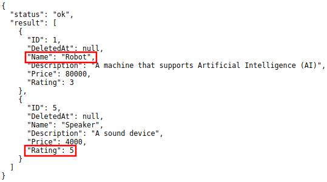

|

It returns a list of records where the name of an item is equal to "Robot" or the rating of an item is 5.

**$limit**
^^^^^^^^^^
`Back to Top (Special Parameters)`_

Structure:

.. code-block:: bash

    # d stands for data
    # $ represents a symbol for special parameters
    http://api.example.com/{ROOT_URL}/api/d/{MODEL_NAME}/read/?$limit=(integer_value)

Suppose you have five records in the Item model.

.. image:: dapi/assets/itemfiverecords.png

|

Run your application and call this URL to read up to 3 records.

.. code-block:: bash

    # item is the model name
    # 3 is the limit value
    http://api.example.com/{ROOT_URL}/api/d/item/read/?$limit=3

Result:

.. image:: dapi/assets/limitresult.png
   :align: center

|

It returns up to 3 records.

**$order (Ascending)**
^^^^^^^^^^^^^^^^^^^^^^
`Back to Top (Special Parameters)`_

Structure:

.. code-block:: bash

    # d stands for data
    # $ represents a symbol for special parameters
    http://api.example.com/{ROOT_URL}/api/d/{MODEL_NAME}/read/?$order=(field_name)

Suppose you have five records in the Item model.

.. image:: dapi/assets/itemfiverecords.png

|

Run your application and call this URL to read record(s) where ID number is sorted in ascending order.

.. code-block:: bash

    # item is the model name
    # id is the field name
    http://api.example.com/{ROOT_URL}/api/d/item/read/?$order=id

Result:

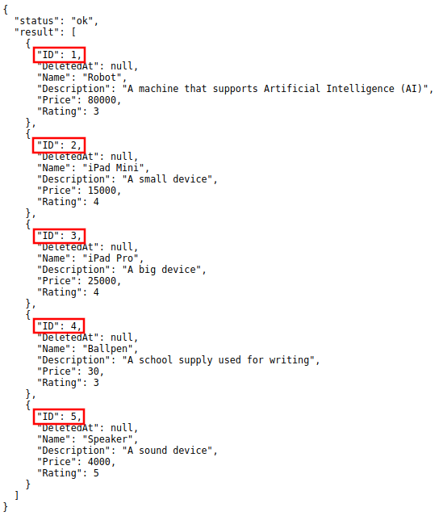

|

It returns a list of records where ID number is sorted in ascending order.

**$order (Descending)**
^^^^^^^^^^^^^^^^^^^^^^^
`Back to Top (Special Parameters)`_

Structure:

.. code-block:: bash

    # d stands for data
    # $ represents a symbol for special parameters
    # - is a symbol for descending order
    http://api.example.com/{ROOT_URL}/api/d/{MODEL_NAME}/read/?$order=-(field_name)

Suppose you have five records in the Item model.

.. image:: dapi/assets/itemfiverecords.png

|

Run your application and call this URL to read record(s) where ID number is sorted in descending order.

.. code-block:: bash

    # item is the model name
    # id is the field name
    http://api.example.com/{ROOT_URL}/api/d/item/read/?$order=-id

Result:

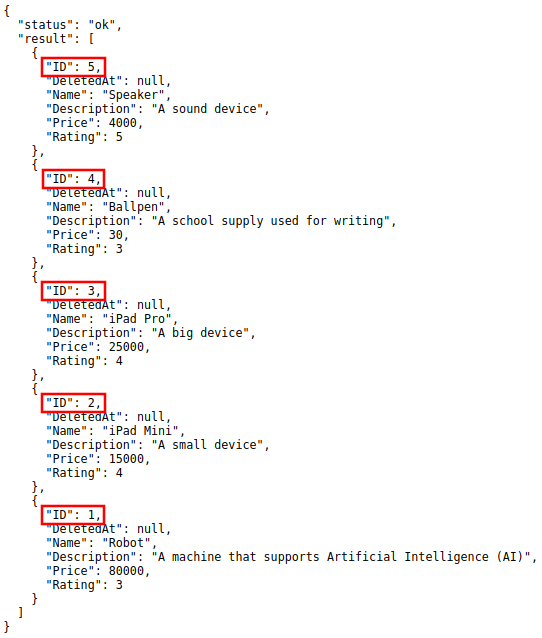

|

It returns a list of records where ID number is sorted in descending order.

**$order (List of Fields)**
^^^^^^^^^^^^^^^^^^^^^^^^^^^
`Back to Top (Special Parameters)`_

Structure:

.. code-block:: bash

    # d stands for data
    # $ represents a symbol for special parameters
    http://api.example.com/{ROOT_URL}/api/d/{MODEL_NAME}/read/?$order=(field_name1),(field_name2)

Suppose you have five records in the Item model.

.. image:: dapi/assets/itemfiverecords.png

|

Run your application and call this URL to read record(s) where price is sorted in descending order and rating is sorted in ascending order.

.. code-block:: bash

    # item is the model name
    # - is a symbol for descending order
    # price and rating are field names
    http://api.example.com/{ROOT_URL}/api/d/item/read/?$order=-price,rating

Result:

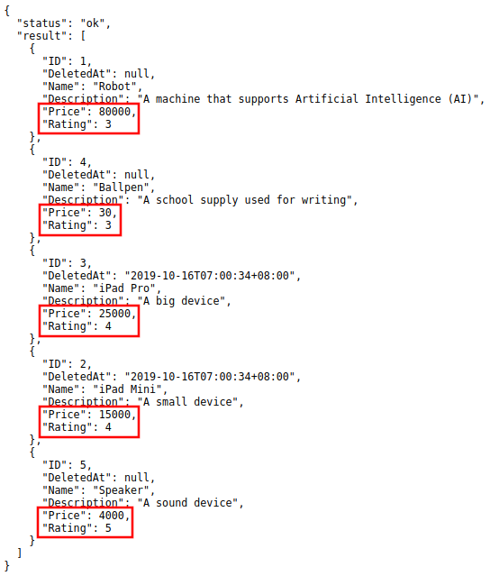

|

It returns a list of records where price is sorted in descending order and rating is sorted in ascending order

**Limit, offset, order**
^^^^^^^^^^^^^^^^^^^^^^^^
`Back to Top (Special Parameters)`_

Limit is the number of records that you want to return.

Offset is the starting point to read in the list of records. It is equivalent to an index number. For instance, if you put the offset value as 2, your application will start reading on the third record.

Order is used to sort the result-set in ascending or descending order. [#f4]_

Structure:

.. code-block:: bash

    # d stands for data
    # $ represents a symbol for special parameters
    http://api.example.com/{ROOT_URL}/api/d/{MODEL_NAME}/read/?$limit=(integer_value)&$offset=(integer_value)&$order=(field_name)

Suppose you have five records in the Item model.

.. image:: dapi/assets/itemfiverecords.png

|

Run your application and call this URL to return three records starting from the third record that sorts the ID number in ascending order.

.. code-block:: bash

    # item is the model name
    # 3 is the limit value to display up to three records
    # 2 is the offset value to start reading the third record
    # id is the field name to sort in ascending order
    http://api.example.com/{ROOT_URL}/api/d/item/read/?$limit=3&$offset=2&$order=id

Result:

.. image:: dapi/assets/limitoffsetorderresult.png
   :align: center

|

It returns the list of up to three records starting from the third record that sorts the ID number in ascending order.

**$f**
^^^^^^
`Back to Top (Special Parameters)`_

$f is a special parameter for selecting fields.

Structure:

.. code-block:: bash

    # d stands for data
    # $ represents a symbol for special parameters
    http://api.example.com/{ROOT_URL}/api/d/{MODEL_NAME}/read/?$f=(field_name1),(field_name2)

Supported Operators
^^^^^^^^^^^^^^^^^^^
`Back to Top ($f)`_

.. _Back to Top ($f): https://uadmin-docs.readthedocs.io/en/latest/dapi.html#f

* `__sum`_
* `__avg`_
* `__min`_
* `__max`_
* `__count`_

**__sum**
"""""""""
`Back to Top (Supported Operators)`_

Returns the total sum of a numeric field. [#f1]_ The formula to calculate this is (value1 +  value2 + ... + value(n)). Example: (3 + 4 + 5) = 12

Structure:

.. code-block:: bash

    # d stands for data
    # $ represents a symbol for special parameters
    http://api.example.com/{ROOT_URL}/api/d/{MODEL_NAME}/read/?$f={FIELD_NAME__sum}

Suppose you have five records in the Item model.

.. image:: dapi/assets/itemfiverecords.png

|

Run your application and call this URL to return the total price of all items.

.. code-block:: bash

    # item is the model name
    # price is the field name
    # __sum is an operator that returns the total sum of a numeric field
    http://api.example.com/{ROOT_URL}/api/d/item/read/?$f=price__sum

Result:

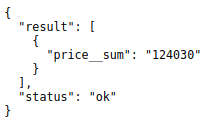

|

It returns a record that displays the total price of all items.

**__avg**
"""""""""
`Back to Top (Supported Operators)`_

Returns the average value of a numeric field. [#f1]_ The formula to calculate this is (value1 +  value2 + ... + value(n)) / (number of values). Example: (3 + 4 + 5) / 3 = 4

Structure:

.. code-block:: bash

    # d stands for data
    # $ represents a symbol for special parameters
    http://api.example.com/{ROOT_URL}/api/d/{MODEL_NAME}/read/?$f={FIELD_NAME__avg}

Suppose you have five records in the Item model.

.. image:: dapi/assets/itemfiverecords.png

|

Run your application and call this URL to return the average price of all items.

.. code-block:: bash

    # item is the model name
    # price is the field name
    # __avg is an operator that returns the average value of a numeric field
    http://api.example.com/{ROOT_URL}/api/d/item/read/$f=price__avg

Result:

.. image:: dapi/assets/avgresult.png
   :align: center

|

It returns a record that displays the average price of all items.

**__min**
"""""""""
`Back to Top (Supported Operators)`_

Returns the smallest value of the selected column [#f2]_

Structure:

.. code-block:: bash

    # d stands for data
    # $ represents a symbol for special parameters
    http://api.example.com/{ROOT_URL}/api/d/{MODEL_NAME}/read/?$f={FIELD_NAME__min}

Suppose you have five records in the Item model.

.. image:: dapi/assets/itemfiverecords.png

|

Run your application and call this URL to read which record has the minimum price value.

.. code-block:: bash

    # item is the model name
    # price is the field name
    http://api.example.com/{ROOT_URL}/api/d/item/read/?$f=price__min

Result:

.. image:: dapi/assets/minresult.png
   :align: center

|

It returns a record with the minimum price value.

**__max**
"""""""""
`Back to Top (Supported Operators)`_

Returns the largest value of the selected column [#f2]_

Structure:

.. code-block:: bash

    # d stands for data
    # $ represents a symbol for special parameters
    http://api.example.com/{ROOT_URL}/api/d/{MODEL_NAME}/read/?$f={FIELD_NAME__max}

Suppose you have five records in the Item model.

.. image:: dapi/assets/itemfiverecords.png

|

Run your application and call this URL to read which record has the maximum price value.

.. code-block:: bash

    # item is the model name
    # price is the field name
    http://api.example.com/{ROOT_URL}/api/d/item/read/?$f=price__max

Result:

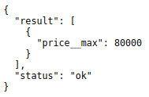

|

It returns a record with the maximum price value.

**__count**
"""""""""""
`Back to Top (Supported Operators)`_

.. _Back to Top (Supported Operators): https://uadmin-docs.readthedocs.io/en/latest/dapi.html#supported-operators

Returns the number of rows that matches a specified criteria [#f1]_

Structure:

.. code-block:: bash

    # d stands for data
    # $ represents a symbol for special parameters
    http://api.example.com/{ROOT_URL}/api/d/{MODEL_NAME}/read/?$f={FIELD_NAME__count}

Suppose you have five records in the Item model.

.. image:: dapi/assets/itemfiverecords.png

|

Run your application and call this URL to read a record that displays the number of all records you have in the Item model.

.. code-block:: bash

    # item is the model name
    # id is the field name
    # __count is an operator that counts the number of rows that matches
    # a specified criteria
    http://api.example.com/{ROOT_URL}/api/d/item/read/?$f=id__count

Result:

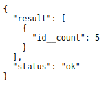

|

It returns a record that displays the number of all records you have in the Item model.

**$groupby**
^^^^^^^^^^^^
`Back to Top (Special Parameters)`_

The GROUP BY statement groups rows that have the same values into summary rows, like "find the number of purchased items in each transaction".

The GROUP BY statement is often used with aggregate functions (COUNT, MAX, MIN, SUM, AVG) to group the result-set by one or more columns. [#f3]_

Structure:

.. code-block:: bash

    # d stands for data
    # $ represents a symbol for special parameters
    http://api.example.com/{ROOT_URL}/api/d/{MODEL_NAME}/read/?$groupby={FIELD_NAME}

Suppose you have five records in the Item model.

.. image:: dapi/assets/itemfiverecords.png

|

Run your application and call this URL to read a record that contains how many rows that matches a specified rating.

.. code-block:: bash

    # item is the model name
    # id and rating are field names
    # $f is a parameter for selecting fields
    # __count is an operator that counts the number of rows that matches
    # a specified rating
    # SELECT COUNT(id), rating FROM items GROUP BY rating
    http://api.example.com/{ROOT_URL}/api/d/item/read/?$f=id__count,rating&$groupby=rating

Result:

.. image:: dapi/assets/groupbyresult.png
   :align: center

|

We found out that there are two records that has a rating of 3, two records that has a rating of 4, and one record that has a rating of 5.

**$join**
^^^^^^^^^
`Back to Top (Special Parameters)`_

The JOIN statement joins results from another model based on a foreign key.

Structure:

.. code-block:: bash

    # d stands for data
    # $join syntax
    # {} required
    # [] optional
    # $join={to_table_name}__[join_method]__{[from_table.]from_column}__[[to
    # _table.]to_column]
    # inner stands for INNER JOIN
    # m stands for model
    # f stands for field
    http://api.example.com/{ROOT_URL}/api/d/{MODEL_NAME}/read/?$join={to_table_name}__
    [join_method]__{[from_table.]from_column}__[[to_table.]to_column]

Suppose you have 10 records in the Todo model and our goal is to fetch the records that have the Friend value.

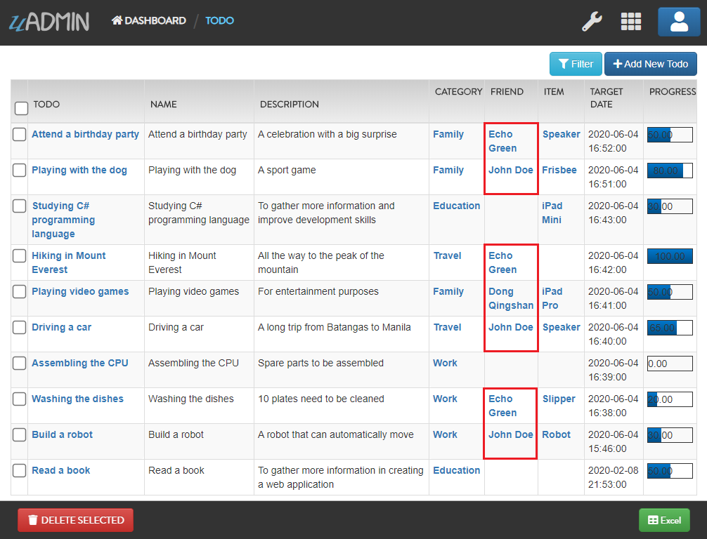

|

Run your application and call this URL to read a record to join the Todo model and Friend model.

.. code-block:: bash

    # d stands for data
    # friends is the table name
    # friend__id is the column name from the friends table
    http://api.example.com/{ROOT_URL}/api/d/{MODEL_NAME}/read/?$join=friends__friend_id

Result:

.. image:: dapi/assets/joinresultjson.png

|

We can clean this up. Let's fetch only the Friend ID, Todo ID, Todo Name, and Todo Progress.

.. code-block:: bash

    # d stands for data
    # friends is the table name
    # friend__id is the column name from the friends table
    # {TABLE_NAME}.{COLUMN.NAME}
    http://api.example.com/{ROOT_URL}/api/d/{MODEL_NAME}/read/?$join=friends__friend_id&$f=friends.id,todos.id,todos.name,todos.progress

Result:

.. image:: dapi/assets/joinresultjson2.png

|

We can rearrange the order of the Friend ID in ascending order.

.. code-block:: bash

    # d stands for data
    # friends is the table name
    # friend__id is the column name from the friends table
    # {TABLE_NAME}.{COLUMN.NAME}
    # $order to order the given column name
    http://api.example.com/{ROOT_URL}/api/d/{MODEL_NAME}/read/?$join=friends__friend_id&$f=friends.id,todos.id,todos.name,todos.progress&$order=friends__id

Result:

.. image:: dapi/assets/joinresultjson3.png

**$deleted**
^^^^^^^^^^^^
`Back to Top (Special Parameters)`_

$deleted displays the list of deleted records in the database based on the assigned model.

Structure:

.. code-block:: bash

    # d stands for data
    # $ represents a symbol for special parameters
    # value can be either 0 (disabled) or 1 (enabled)
    http://api.example.com/{ROOT_URL}/api/d/{MODEL_NAME}/read/?$deleted={VALUE}

If the value is 0, it will return the list of deleted records. If the value is 1, it will return the list of deleted and existing records.

Suppose you have five records in the Item model.

.. image:: dapi/assets/itemfiverecords.png

|

Now let's delete the iPad Mini and iPad Pro items.

.. image:: dapi/assets/ipaddeleteselected.png

|

.. image:: dapi/assets/ipadconfirmdelete.png

|

Result:

.. image:: dapi/assets/deletemultipleresult.png

|

Run your application and call this URL to read a record that displays the list of existing records in the Item model.

.. code-block:: bash

    # item is the model name
    # id and rating are field names
    # 0 is the value to display the list of existing records
    http://api.example.com/{ROOT_URL}/api/d/item/read/?$deleted=0

Result:

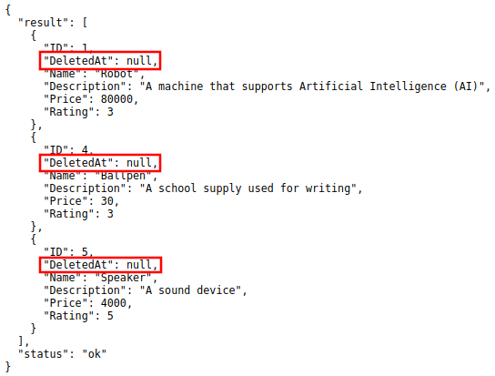

Now let's call this URL to read a record that displays the list of both deleted and existing records in the Item model.

.. code-block:: bash

    # item is the model name
    # id and rating are field names
    # 1 is the value to display the list of both deleted and existing records
    http://api.example.com/{ROOT_URL}/api/d/item/read/?$deleted=1

Result:

.. image:: dapi/assets/deleted1result.png
   :align: center

**$m2m**
^^^^^^^^
`Back to Top (Special Parameters)`_

$m2m returns results from a specific M2M field.

Structure:

.. code-block:: bash

    # d stands for data
    # Returns results from M2M fields where:
    # 0       : Don't return
    # [1,fill]: Return all fields
    # id      : Only return IDs
    http://api.example.com/{ROOT_URL}/api/d/{MODEL_NAME}/read/?$m2m={0,1,fill,id}

    # Returns results from a specific M2M field
    http://api.example.com/{ROOT_URL}/api/d/{MODEL_NAME}/read/?$m2m=f__{id,fill}

Suppose you have m2m values in Speaker and Ballpen categories.

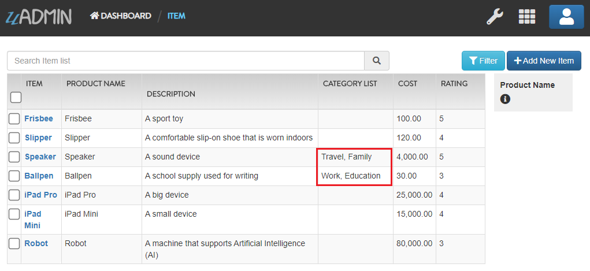

|

Call this URL to read a record that will not display the values of Category M2M field.

.. code-block:: bash

    # item is the model name
    # 0 is the value that will not display the values of m2m fields
    http://api.example.com/{ROOT_URL}/api/d/item/read/?$m2m=0

Result:

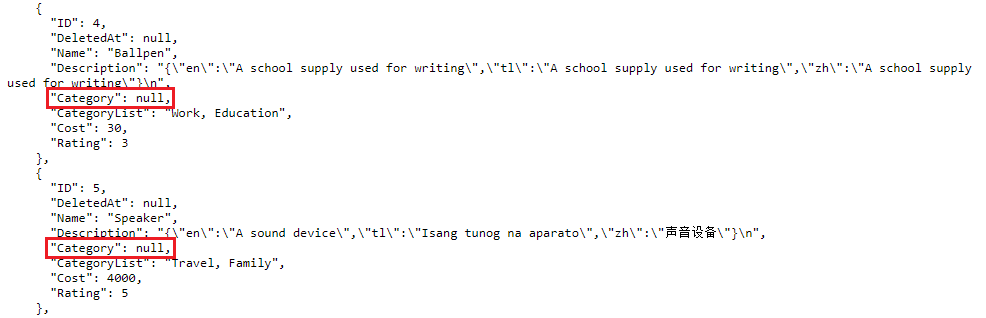

|

Now call this URL to read a record that will display the values of Category M2M field.

.. code-block:: bash

    # item is the model name
    # 1, fill, or category__fill is the value that will display the values of m2m fields
    http://api.example.com/{ROOT_URL}/api/d/item/read/?$m2m={1,fill,category__fill};

Result:

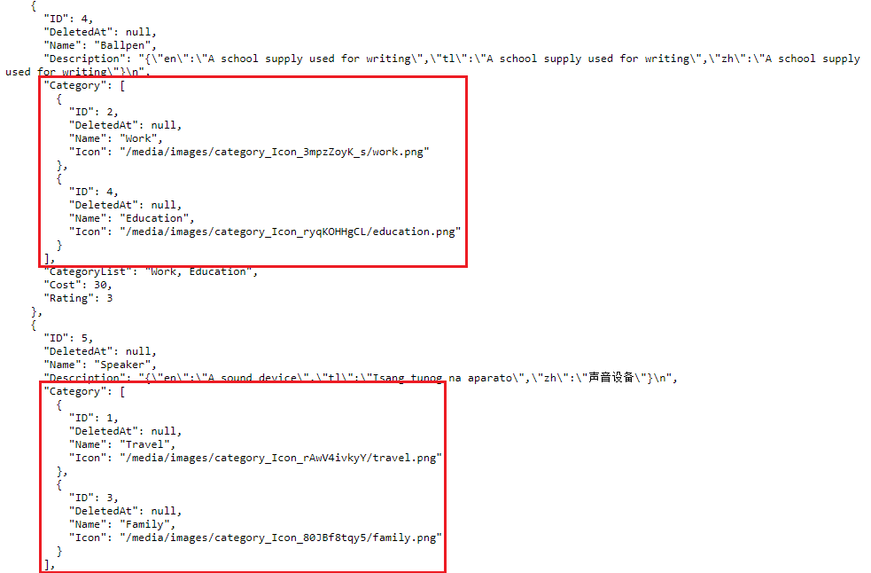

|

You can also display only the ID values of Category M2M field.

.. code-block:: bash

    # item is the model name
    # 1, or category__id is the value that will display only the ID values of m2m fields
    http://api.example.com/{ROOT_URL}/api/d/item/read/?$m2m={id,category__id};

Result:

.. image:: dapi/assets/m2midresultjson.png

**$q**
^^^^^^
`Back to Top (Special Parameters)`_

$q searches all string based fields for read, edit, and delete requests.

Structure:

.. code-block:: bash

    # d stands for data
    # Searches all string based fields for read, edit, and delete requests
    http://api.example.com/{ROOT_URL}/api/d/{MODEL_NAME}/read/?$q=abc

**$next**
^^^^^^^^^
`Back to Top (Special Parameters)`_

$next redirects the user to the specified path after processing the request.

Structure:

.. code-block:: bash

    # d stands for data
    # Redirects the user to the specified path after processing the request
    http://api.example.com/{ROOT_URL}/api/d/{MODEL_NAME}/method/{METHOD_NAME}/?$next=/

    # Send the user back
    http://api.example.com/{ROOT_URL}/api/d/{MODEL_NAME}/method/{METHOD_NAME}/?$next=$back

**$preload**
^^^^^^^^^^^^
`Back to Top (Special Parameters)`_

$preload fills the data from foreign keys into structs.

Structure:

.. code-block:: bash

    # d stands for data
    # 0: Don't return
    # 1: Return preloaded data
    http://api.example.com/{ROOT_URL}/api/d/{MODEL_NAME}/read/?$preload={0,1}

Suppose you have 10 records in Todo model.

.. image:: tutorial/assets/tendataintodomodel.png

|

Call this URL to read the second record that only fills the base model, not the foreign keys.

.. code-block:: bash

    # todo is the model name
    # 2 is the value from id field to read the second record
    # 0 is the value from $preload not to return preloaded data
    http://api.example.com/{ROOT_URL}/api/d/todo/read/?id=2&$preload=0

Result:

.. image:: dapi/assets/preload0resultjson.png
   :align: center

|

Now call this URL to read the second record that fills the data from foreign key models.

.. code-block:: bash

    # todo is the model name
    # 2 is the value from id field to read the second record
    # 1 is the value from $preload to return preloaded data
    http://api.example.com/{ROOT_URL}/api/d/todo/read/?id=2&$preload=1

Result:

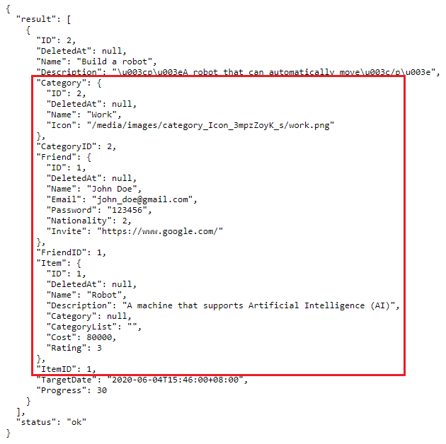

**$stat**
^^^^^^^^^
`Back to Top (Special Parameters)`_

$stat checks the query execution time and its related details.

Structure:

.. code-block:: bash

    # d stands for data
    # $ represents a symbol for special parameters
    # stat_value can be either 0 (disabled) or 1 (enabled)
    http://api.example.com/{ROOT_URL}/api/d/{MODEL_NAME}/?$stat=(stat_value)

Suppose you have five records in the Item model.

.. image:: dapi/assets/itemfiverecords.png

|

Run your application and call this URL to check the query execution time and its related details when you perform an action that reads all records in the Item model.

.. code-block:: bash

    # item is the model name
    # To enable stat, ?$stat=1
    http://api.example.com/{ROOT_URL}/api/d/item/?$stat=1

Result:

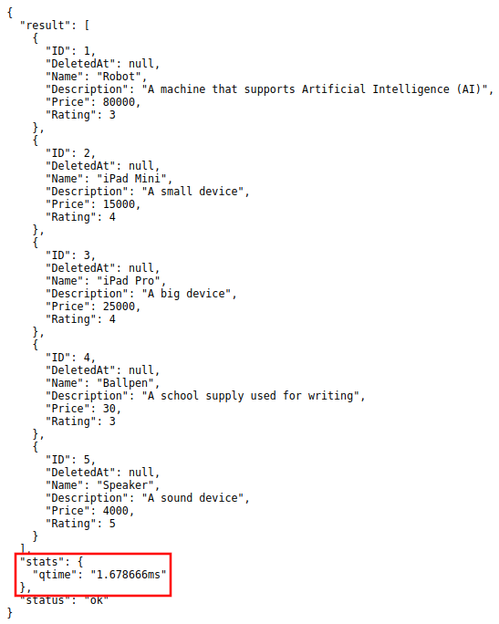

|

It returns a record that reads all item records and stat containing the query execution time and its related details when you perform an action that reads all records in the Item model.

"qtime" is in milliseconds.

**$allmodels**
^^^^^^^^^^^^^^
`Back to Top (Special Parameters)`_

.. _Back to Top (Special Parameters): https://uadmin-docs.readthedocs.io/en/latest/dapi.html#special-parameters

Structure:

.. code-block:: bash

    # d stands for data
    # $ represents a symbol for special parameters
    # allmodels is a parameter to get all models
    http://api.example.com/{ROOT_URL}/api/d/?$allmodels

Suppose you have the following models in the uAdmin dashboard.

.. image:: dapi/assets/uadmindashboardupdate.png

|

Run your application and call this URL to read the full schema of all models.

.. code-block:: bash

    http://api.example.com/{ROOT_URL}/api/d/$allmodels

Result:

.. image:: dapi/assets/allmodelsresult.png
   :align: center

|

It returns a JSON array representing uAdmin's ModelSchema of all models.

Writing Data Symbol
-------------------
`Back to Top`_

For writing data (Add/Edit), we need to put _ symbol before the field name after the WHERE symbol (?) in the URL.

.. code-block:: bash

    # d stands for data
    # _name is a field name to be added with the value of "John"
    http://api.example.com/{ROOT_URL}/api/d/{MODEL_NAME}/add/?_name=John

    # d stands for data
    # name is a field name that was selected for updating
    # _name is a field name to be added with the value of "Adam"
    http://api.example.com/{ROOT_URL}/api/d/{MODEL_NAME}/edit/?name=John&_name=Adam

Without the _ symbol, that field is a selector.

uAdmin Functions
----------------
`Back to Top`_

.. _Back To Top: https://uadmin-docs.readthedocs.io/en/latest/dapi.html#dapi-reference

Here are all public uAdmin functions, their format, and how to use them in the project.

* `Full List`_
* `Categorized List`_

**Full List**
^^^^^^^^^^^^^
`Back To Top (uAdmin Functions)`_

* `uadmin.APIDisabledAdd`_
* `uadmin.APIDisabledAdder`_
* `uadmin.APIDisabledDelete`_
* `uadmin.APIDisabledDeleter`_
* `uadmin.APIDisabledEdit`_
* `uadmin.APIDisabledEditor`_
* `uadmin.APIDisabledRead`_
* `uadmin.APIDisabledReader`_
* `uadmin.APIDisabledSchema`_
* `uadmin.APIDisabledSchemer`_
* `uadmin.APILogAdd`_
* `uadmin.APILogAdder`_
* `uadmin.APILogDelete`_
* `uadmin.APILogDeleter`_
* `uadmin.APILogEdit`_
* `uadmin.APILogEditor`_
* `uadmin.APILogRead`_
* `uadmin.APILogReader`_
* `uadmin.APILogSchema`_
* `uadmin.APILogSchemer`_
* `uadmin.APIPostQueryAdd`_
* `uadmin.APIPostQueryAdder`_
* `uadmin.APIPostQueryDelete`_
* `uadmin.APIPostQueryDeleter`_
* `uadmin.APIPostQueryEdit`_
* `uadmin.APIPostQueryEditor`_
* `uadmin.APIPostQueryRead`_
* `uadmin.APIPostQueryReader`_
* `uadmin.APIPostQuerySchema`_
* `uadmin.APIPostQuerySchemer`_
* `uadmin.APIPreQueryAdd`_
* `uadmin.APIPreQueryAdder`_
* `uadmin.APIPreQueryDelete`_
* `uadmin.APIPreQueryDeleter`_
* `uadmin.APIPreQueryEdit`_
* `uadmin.APIPreQueryEditor`_
* `uadmin.APIPreQueryRead`_
* `uadmin.APIPreQueryReader`_
* `uadmin.APIPreQuerySchema`_
* `uadmin.APIPreQuerySchemer`_
* `uadmin.APIPublicAdd`_
* `uadmin.APIPublicAdder`_
* `uadmin.APIPublicDelete`_
* `uadmin.APIPublicDeleter`_
* `uadmin.APIPublicEdit`_
* `uadmin.APIPublicEditor`_
* `uadmin.APIPublicRead`_
* `uadmin.APIPublicReader`_
* `uadmin.APIPublicSchema`_
* `uadmin.APIPublicSchemer`_
* `uadmin.CKey`_

**uadmin.CKey**
"""""""""""""""
`Back To Top (Individual List)`_

.. _Back To Top (Individual List): https://uadmin-docs.readthedocs.io/en/latest/dapi.html#individual-list

CKey is the standard key used in uAdmin for context keys.

Type:

.. code-block:: go

    string

**Categorized List**
^^^^^^^^^^^^^^^^^^^^
`Back To Top (uAdmin Functions)`_

.. _Back To Top (uAdmin Functions): https://uadmin-docs.readthedocs.io/en/latest/dapi.html#uadmin-functions

* `Disabled Functions`_
* `Log Functions`_
* `Post Query Functions`_
* `Pre Query Functions`_
* `Public Functions`_

**Disabled Functions**
""""""""""""""""""""""
`Back To Top (Categorized List)`_

* `uadmin.APIDisabledAdd`_
* `uadmin.APIDisabledAdder`_
* `uadmin.APIDisabledDelete`_
* `uadmin.APIDisabledDeleter`_
* `uadmin.APIDisabledEdit`_
* `uadmin.APIDisabledEditor`_
* `uadmin.APIDisabledRead`_
* `uadmin.APIDisabledReader`_
* `uadmin.APIDisabledSchema`_
* `uadmin.APIDisabledSchemer`_

**Log Functions**
"""""""""""""""""
`Back To Top (Categorized List)`_

* `uadmin.APILogAdd`_
* `uadmin.APILogAdder`_
* `uadmin.APILogDelete`_
* `uadmin.APILogDeleter`_
* `uadmin.APILogEdit`_
* `uadmin.APILogEditor`_
* `uadmin.APILogRead`_
* `uadmin.APILogReader`_
* `uadmin.APILogSchema`_
* `uadmin.APILogSchemer`_

**Post Query Functions**
""""""""""""""""""""""""
`Back To Top (Categorized List)`_

* `uadmin.APIPostQueryAdd`_
* `uadmin.APIPostQueryAdder`_
* `uadmin.APIPostQueryDelete`_
* `uadmin.APIPostQueryDeleter`_
* `uadmin.APIPostQueryEdit`_
* `uadmin.APIPostQueryEditor`_
* `uadmin.APIPostQueryRead`_
* `uadmin.APIPostQueryReader`_
* `uadmin.APIPostQuerySchema`_
* `uadmin.APIPostQuerySchemer`_

**Pre Query Functions**
"""""""""""""""""""""""
`Back To Top (Categorized List)`_

* `uadmin.APIPreQueryAdd`_
* `uadmin.APIPreQueryAdder`_
* `uadmin.APIPreQueryDelete`_
* `uadmin.APIPreQueryDeleter`_
* `uadmin.APIPreQueryEdit`_
* `uadmin.APIPreQueryEditor`_
* `uadmin.APIPreQueryRead`_
* `uadmin.APIPreQueryReader`_
* `uadmin.APIPreQuerySchema`_
* `uadmin.APIPreQuerySchemer`_

**Public Functions**
""""""""""""""""""""
`Back To Top (Categorized List)`_

.. _Back To Top (Categorized List): https://uadmin-docs.readthedocs.io/en/latest/dapi.html#categorized-list

* `uadmin.APIPublicAdd`_
* `uadmin.APIPublicAdder`_
* `uadmin.APIPublicDelete`_
* `uadmin.APIPublicDeleter`_
* `uadmin.APIPublicEdit`_
* `uadmin.APIPublicEditor`_
* `uadmin.APIPublicRead`_
* `uadmin.APIPublicReader`_
* `uadmin.APIPublicSchema`_
* `uadmin.APIPublicSchemer`_

Page:

.. toctree::
   :maxdepth: 1

   dapi/disabled_functions
   dapi/log_functions
   dapi/post_query_functions
   dapi/pre_query_functions
   dapi/public_functions

.. _uadmin.APIDisabledAdd: https://uadmin-docs.readthedocs.io/en/latest/dapi/disabled_functions.html#uadmin-apidisabledadd
.. _uadmin.APIDisabledAdder: https://uadmin-docs.readthedocs.io/en/latest/dapi/disabled_functions.html#uadmin-apidisabledadder
.. _uadmin.APIDisabledDelete: https://uadmin-docs.readthedocs.io/en/latest/dapi/disabled_functions.html#uadmin-apidisableddelete
.. _uadmin.APIDisabledDeleter: https://uadmin-docs.readthedocs.io/en/latest/dapi/disabled_functions.html#uadmin-apidisableddeleter
.. _uadmin.APIDisabledEdit: https://uadmin-docs.readthedocs.io/en/latest/dapi/disabled_functions.html#uadmin-apidisablededit
.. _uadmin.APIDisabledEditor: https://uadmin-docs.readthedocs.io/en/latest/dapi/disabled_functions.html#uadmin-apidisablededitor
.. _uadmin.APIDisabledRead: https://uadmin-docs.readthedocs.io/en/latest/dapi/disabled_functions.html#uadmin-apidisabledread
.. _uadmin.APIDisabledReader: https://uadmin-docs.readthedocs.io/en/latest/dapi/disabled_functions.html#uadmin-apidisabledreader
.. _uadmin.APIDisabledSchema: https://uadmin-docs.readthedocs.io/en/latest/dapi/disabled_functions.html#uadmin-apidisabledschema
.. _uadmin.APIDisabledSchemer: https://uadmin-docs.readthedocs.io/en/latest/dapi/disabled_functions.html#uadmin-apidisabledschemer
.. _uadmin.APILogAdd: https://uadmin-docs.readthedocs.io/en/latest/dapi/log_functions.html#uadmin-apilogadd
.. _uadmin.APILogAdder: https://uadmin-docs.readthedocs.io/en/latest/dapi/log_functions.html#uadmin-apilogadder
.. _uadmin.APILogDelete: https://uadmin-docs.readthedocs.io/en/latest/dapi/log_functions.html#uadmin-apilogdelete
.. _uadmin.APILogDeleter: https://uadmin-docs.readthedocs.io/en/latest/dapi/log_functions.html#uadmin-apilogdeleter
.. _uadmin.APILogEdit: https://uadmin-docs.readthedocs.io/en/latest/dapi/log_functions.html#uadmin-apilogedit
.. _uadmin.APILogEditor: https://uadmin-docs.readthedocs.io/en/latest/dapi/log_functions.html#uadmin-apilogeditor
.. _uadmin.APILogRead: https://uadmin-docs.readthedocs.io/en/latest/dapi/log_functions.html#uadmin-apilogread
.. _uadmin.APILogReader: https://uadmin-docs.readthedocs.io/en/latest/dapi/log_functions.html#uadmin-apilogreader
.. _uadmin.APILogSchema: https://uadmin-docs.readthedocs.io/en/latest/dapi/log_functions.html#uadmin-apilogschema
.. _uadmin.APILogSchemer: https://uadmin-docs.readthedocs.io/en/latest/dapi/log_functions.html#uadmin-apilogschemer
.. _uadmin.APIPostQueryAdd: https://uadmin-docs.readthedocs.io/en/latest/dapi/post_query_functions.html#uadmin-apipostqueryadd
.. _uadmin.APIPostQueryAdder: https://uadmin-docs.readthedocs.io/en/latest/dapi/post_query_functions.html#uadmin-apipostqueryadder
.. _uadmin.APIPostQueryDelete: https://uadmin-docs.readthedocs.io/en/latest/dapi/post_query_functions.html#uadmin-apipostquerydelete
.. _uadmin.APIPostQueryDeleter: https://uadmin-docs.readthedocs.io/en/latest/dapi/post_query_functions.html#uadmin-apipostquerydeleter
.. _uadmin.APIPostQueryEdit: https://uadmin-docs.readthedocs.io/en/latest/dapi/post_query_functions.html#uadmin-apipostqueryedit
.. _uadmin.APIPostQueryEditor: https://uadmin-docs.readthedocs.io/en/latest/dapi/post_query_functions.html#uadmin-apipostqueryeditor
.. _uadmin.APIPostQueryRead: https://uadmin-docs.readthedocs.io/en/latest/dapi/post_query_functions.html#uadmin-apipostqueryread
.. _uadmin.APIPostQueryReader: https://uadmin-docs.readthedocs.io/en/latest/dapi/post_query_functions.html#uadmin-apipostqueryreader
.. _uadmin.APIPostQuerySchema: https://uadmin-docs.readthedocs.io/en/latest/dapi/post_query_functions.html#uadmin-apipostqueryschema
.. _uadmin.APIPostQuerySchemer: https://uadmin-docs.readthedocs.io/en/latest/dapi/post_query_functions.html#uadmin-apipostqueryschemer
.. _uadmin.APIPreQueryAdd: https://uadmin-docs.readthedocs.io/en/latest/dapi/pre_query_functions.html#uadmin-apiprequeryadd
.. _uadmin.APIPreQueryAdder: https://uadmin-docs.readthedocs.io/en/latest/dapi/pre_query_functions.html#uadmin-apiprequeryadder
.. _uadmin.APIPreQueryDelete: https://uadmin-docs.readthedocs.io/en/latest/dapi/pre_query_functions.html#uadmin-apiprequerydelete
.. _uadmin.APIPreQueryDeleter: https://uadmin-docs.readthedocs.io/en/latest/dapi/pre_query_functions.html#uadmin-apiprequerydeleter
.. _uadmin.APIPreQueryEdit: https://uadmin-docs.readthedocs.io/en/latest/dapi/pre_query_functions.html#uadmin-apiprequeryedit
.. _uadmin.APIPreQueryEditor: https://uadmin-docs.readthedocs.io/en/latest/dapi/pre_query_functions.html#uadmin-apiprequeryeditor
.. _uadmin.APIPreQueryRead: https://uadmin-docs.readthedocs.io/en/latest/dapi/pre_query_functions.html#uadmin-apiprequeryread
.. _uadmin.APIPreQueryReader: https://uadmin-docs.readthedocs.io/en/latest/dapi/pre_query_functions.html#uadmin-apiprequeryreader
.. _uadmin.APIPreQuerySchema: https://uadmin-docs.readthedocs.io/en/latest/dapi/pre_query_functions.html#uadmin-apiprequeryschema
.. _uadmin.APIPreQuerySchemer: https://uadmin-docs.readthedocs.io/en/latest/dapi/pre_query_functions.html#uadmin-apiprequeryschemer
.. _uadmin.APIPublicAdd: https://uadmin-docs.readthedocs.io/en/latest/dapi/public_functions.html#uadmin-apipublicadd
.. _uadmin.APIPublicAdder: https://uadmin-docs.readthedocs.io/en/latest/dapi/public_functions.html#uadmin-apipublicadder
.. _uadmin.APIPublicDelete: https://uadmin-docs.readthedocs.io/en/latest/dapi/public_functions.html#uadmin-apipublicdelete
.. _uadmin.APIPublicDeleter: https://uadmin-docs.readthedocs.io/en/latest/dapi/public_functions.html#uadmin-apipublicdeleter
.. _uadmin.APIPublicEdit: https://uadmin-docs.readthedocs.io/en/latest/dapi/public_functions.html#uadmin-apipublicedit
.. _uadmin.APIPublicEditor: https://uadmin-docs.readthedocs.io/en/latest/dapi/public_functions.html#uadmin-apipubliceditor
.. _uadmin.APIPublicRead: https://uadmin-docs.readthedocs.io/en/latest/dapi/public_functions.html#uadmin-apipublicread
.. _uadmin.APIPublicReader: https://uadmin-docs.readthedocs.io/en/latest/dapi/public_functions.html#uadmin-apipublicreader
.. _uadmin.APIPublicSchema: https://uadmin-docs.readthedocs.io/en/latest/dapi/public_functions.html#uadmin-apipublicschema
.. _uadmin.APIPublicSchemer: https://uadmin-docs.readthedocs.io/en/latest/dapi/public_functions.html#uadmin-apipublicschemer

Reference
---------
.. [#f1] Refsnes Data (2019). SQL COUNT(), AVG() and SUM() Functions. Retrieved from https://www.w3schools.com/sql/sql_count_avg_sum.asp
.. [#f2] Refsnes Data (2019). SQL ORDER BY Keyword. Retrieved from https://www.w3schools.com/sql/sql_orderby.asp
.. [#f3] Refsnes Data (2019). SQL GROUP BY Statement. Retrieved from https://www.w3schools.com/sql/sql_groupby.asp
.. [#f4] Refsnes Data (2019). SQL ORDER BY Keyword. Retrieved from https://www.w3schools.com/sql/sql_orderby.asp
.. [#f5] Refsnes Data (2019). SQL BETWEEN Operator. Retrieved from https://www.w3schools.com/sql/sql_between.asp
