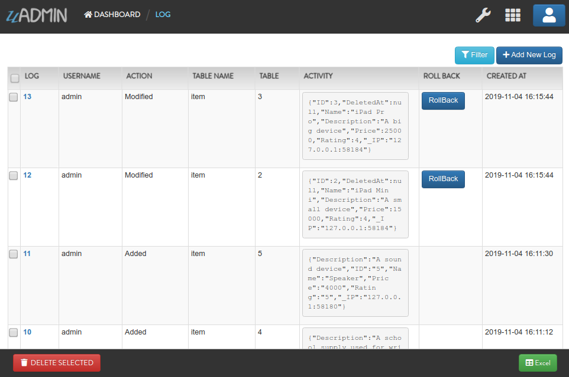

Log Functions
=============
`Back To uAdmin Functions List`_

.. _Back To uAdmin Functions List: https://uadmin-docs.readthedocs.io/en/latest/dapi.html#uadmin-functions

In this section, we will cover the following functions in-depth listed below:

* `uadmin.APILogAdd`_
* `uadmin.APILogAdder`_
* `uadmin.APILogDelete`_
* `uadmin.APILogDeleter`_
* `uadmin.APILogEdit`_
* `uadmin.APILogEditor`_
* `uadmin.APILogRead`_
* `uadmin.APILogReader`_
* `uadmin.APILogSchema`_
* `uadmin.APILogSchemer`_

uadmin.APILogAdd
----------------
`Back To Top`_

APILogAdd controls the data API's logging for add commands. By default, APILogAdd returns **true**.

Type:

.. code-block:: go

    bool

To assign a value within an application, visit `API Log Add`_ page for an example.

.. _API Log Add: https://uadmin-docs.readthedocs.io/en/latest/system-reference/setting.html#api-log-add

To assign a value in the code, follow this approach:

Prerequisites:

* `Add Multiple`_
* `Add One`_

.. _Add Multiple: https://uadmin-docs.readthedocs.io/en/latest/dapi.html#add-multiple
.. _Add One: https://uadmin-docs.readthedocs.io/en/latest/dapi.html#add-one

Go to the main.go and assign the value of the API Log Add to true.

.. code-block:: go

    func main(){
        uadmin.APILogAdd = true
        // Some codes
    }

Run your application. Let's call this URL in the address bar to add multiple records in the Document model with the following information below:

**First Record**

* Name: Golang
* Author: John

**Second Record**

* Name: uAdmin
* Author: Adam

.. code-block:: bash

    # document is a model name
    # name and author are field names
    # __0 is the first index
    # __1 is the second index
    http://api.example.com/api/d/document/add/?_name__0=Golang&_author__0=John&_name__1=uAdmin&_author__1=Adam

Result:

.. code-block:: JSON

    {
        "id": [
            1,
            2
        ],
        "rows_count": 2,
        "status": "ok"
    }

It returns an array with a list of IDs for the newly created records.

Now go back to the uAdmin dashboard. Click on "LOGS".

.. image:: ../assets/logshighlighted.png

|

As expected, the user's action in adding records through HTTP API was recorded in the Log model.

.. image:: ../system-reference/assets/apilogaddenabled.png

|

Exit your application. Go to the main.go and assign the value of the API Log Add to false.

.. code-block:: go

    func main(){
        uadmin.APILogAdd = false
        // Some codes
    }

Run your application. Let's call this URL to add a new record in the Document model with the following information below:

* Name: Programming
* Author: Admin

.. code-block:: bash

    # document is a model name
    # name and author are field names
    http://api.example.com/api/d/document/add/?_name=Programming&_author=Admin

Result:

.. code-block:: JSON

    {
        "id": 3,
        "rows_count": 1,
        "status": "ok"
    }

It returns the ID of the newly created record.

Check the "LOGS" to see the result.

.. image:: ../system-reference/assets/apilogadddisabled.png

|

As expected, the user's action in adding a record through HTTP API was not recorded in the Log model.

uadmin.APILogAdder
------------------
`Back To Top`_

APILogAdder is an interface for models to control logging their add function in dAPI.

Type:

.. code-block:: go

    interface

uadmin.APILogDelete
-------------------
`Back To Top`_

APILogDelete controls the data API's logging for delete commands. By default, APILogDelete returns **true**.

Type:

.. code-block:: go

    bool

To assign a value within an application, visit `API Log Delete`_ page for an example.

.. _API Log Delete: https://uadmin-docs.readthedocs.io/en/latest/system-reference/setting.html#api-log-delete

To assign a value in the code, follow this approach:

Prerequisites:

* `Delete Multiple`_
* `Delete One`_

.. _Delete Multiple: https://uadmin-docs.readthedocs.io/en/latest/dapi.html#delete-multiple
.. _Delete One: https://uadmin-docs.readthedocs.io/en/latest/dapi.html#delete-one

Go to the main.go and assign the value of the API Log Delete to true.

.. code-block:: go

    func main(){
        uadmin.APILogDelete = true
        // Some codes
    }

Run your application. Suppose you have five records in the Item model.

.. image:: assets/itemfiverecords.png

|

Call this URL in the address bar to delete records where the name of an item contains "iPad".

.. code-block:: bash

    # item is a model name
    # name is a field name
    # __contains is an operator that will search for string values that contract
    http://api.example.com/api/d/item/delete/?name__contains=iPad

Result:

.. code-block:: JSON

    {
        "rows_count": 2,
        "status": "ok",
    }

It returns the status and the rows affected by your query.

Now go back to the uAdmin dashboard. Click on "LOGS".

.. image:: ../assets/logshighlighted.png

|

As expected, the user's action in deleting records through HTTP API that contains "iPad" in the item name was recorded in the Log model.

.. image:: ../system-reference/assets/apilogdeleteenabled.png

|

Exit your application. Go to the main.go and assign the value of the API Log Delete to false.

.. code-block:: go

    func main(){
        uadmin.APILogDelete = false
        // Some codes
    }

Run your application. Let's call this URL in the address bar to delete the fourth record in the database.

.. code-block:: bash

    # item is a model name
    # 4 is an ID number
    http://api.example.com/api/d/item/delete/4/

Result:

.. code-block:: JSON

    {
        "rows_count": 1,
        "status": "ok"
    }

It returns the status and the rows affected by your query.

Check the "LOGS" to see the result.

.. image:: ../system-reference/assets/apilogdeletedisabled.png

|

As expected, the user's action in deleting the fourth record through HTTP API was not recorded in the Log model.

uadmin.APILogDeleter
--------------------
`Back To Top`_

APILogDeleter is an interface for models to control logging their delete function in dAPI.

Type:

.. code-block:: go

    interface

uadmin.APILogEdit
-----------------
`Back To Top`_

APILogEdit controls the data API's logging for edit commands. By default, APILogEdit returns **true**.

Type:

.. code-block:: go

    bool

To assign a value within an application, visit `API Log Edit`_ page for an example.

.. _API Log Edit: https://uadmin-docs.readthedocs.io/en/latest/system-reference/setting.html#api-log-edit

To assign a value in the code, follow this approach:

Prerequisites:

* `Edit Multiple`_
* `Edit One`_

.. _Edit Multiple: https://uadmin-docs.readthedocs.io/en/latest/dapi.html#edit-multiple
.. _Edit One: https://uadmin-docs.readthedocs.io/en/latest/dapi.html#edit-one

Go to the main.go and assign the value of the API Log Edit to true.

.. code-block:: go

    func main(){
        uadmin.APILogEdit = true
        // Some codes
    }

Run your application. Suppose you have five records in the Item model where all iPad items have a rating of 4.

.. image:: assets/itemipadoldrating.png

|

Call this URL to edit the rating of all iPad items to a value of 5.

.. code-block:: bash

    # item is a model name
    # name is a field name
    # __contains is an operator that will search for string values that contract
    # rating=4&_rating=5 means that where rating is equal to 4, change the
    # rating value to 5
    http://api.example.com/api/d/item/edit/?rating=4&_rating=5

Result:

.. code-block:: JSON

    {
        "rows_count": 2,
        "status": "ok"
    }

It returns the status and the rows affected by your query.

Now go back to the uAdmin dashboard. Click on "LOGS".

.. image:: ../assets/logshighlighted.png

|

As expected, the user's action in editing records through HTTP API was recorded in the Log model.

.. image:: ../system-reference/assets/apilogeditenabled.png

|

Exit your application. Go to the main.go and assign the value of the API Log Edit to false.

.. code-block:: go

    func main(){
        uadmin.APILogEdit = false
        // Some codes
    }

Run your application. Suppose the first record in the Item model is named as "Robot".

.. image:: assets/itemfirstrecordrobot.png

|

Call this URL to edit the name of the first record in the database from "Robot" to "Supercomputer".

.. code-block:: bash

    # item is a model name
    # 1 is an ID number
    # name is a field name
    http://api.example.com/api/d/item/edit/1/?_name=Supercomputer

Result:

.. code-block:: JSON

    {
        "rows_count": 1,
        "status": "ok"
    }

It returns the status and the rows affected by your query.

Check the "LOGS" to see the result.

|

As expected, the user's action in editing the first record through HTTP API was not recorded in the Log model.

uadmin.APILogEditor
-------------------
`Back To Top`_

APILogEditor is an interface for models to control logging their edit function in dAPI.

Type:

.. code-block:: go

    interface

uadmin.APILogRead
-----------------
`Back To Top`_

APILogRead controls the data API's logging for read commands. By default, APILogRead returns **false**.

Type:

.. code-block:: go

    bool

To assign a value within an application, visit `API Log Read`_ page for an example.

.. _API Log Read: https://uadmin-docs.readthedocs.io/en/latest/system-reference/setting.html#api-log-read

To assign a value in the code, follow this approach:

Prerequisites:

* `Read Multiple`_
* `Read One`_

.. _Read Multiple: https://uadmin-docs.readthedocs.io/en/latest/dapi.html#read-multiple
.. _Read One: https://uadmin-docs.readthedocs.io/en/latest/dapi.html#read-one

Go to the main.go and assign the value of the API Log Read to true.

.. code-block:: go

    func main(){
        uadmin.APILogRead = true
        // Some codes
    }

Run your application. Suppose you have five records in the Item model.

.. image:: assets/itemfiverecords.png

|

Call this URL to read record(s) where rating is equal to 3.

.. code-block:: bash

    # item is a model name
    # rating is a field name
    http://api.example.com/api/d/item/read/?rating=3

Result:

.. image:: assets/readmultipleresult.png
   :align: center

|

It returns a list of records where rating is equal to 3.

Now go back to the uAdmin dashboard. Click on "LOGS".

.. image:: ../assets/logshighlighted.png

|

As expected, the user's action in reading records through HTTP API was recorded in the Log model.

.. image:: ../system-reference/assets/apilogreadenabled.png

|

Exit your application. Go to the main.go and assign the value of the API Log Read to false.

.. code-block:: go

    func main(){
        uadmin.APILogRead = false
        // Some codes
    }

Run your application. Call this URL to read the second record in the Item model.

.. code-block:: bash

    # item is a model name
    # 2 is an ID number
    http://api.example.com/api/d/item/read/2/

Result:

.. image:: assets/readoneresult.png
   :align: center

|

It returns a JSON object representing an item where ID=2.

Check the "LOGS" to see the result.

.. image:: ../system-reference/assets/apilogreaddisabled.png

|

As expected, the user's action in reading the second record through HTTP API was not recorded in the Log model.

uadmin.APILogReader
-------------------
`Back To Top`_

APILogReader is an interface for models to control logging their read function in dAPI.

Type:

.. code-block:: go

    interface

uadmin.APILogSchema
-------------------
`Back To Top`_

APILogSchema controls the data API's logging for schema commands. By default, APILogSchema returns **true**.

Type:

.. code-block:: go

    bool

To assign a value within an application, visit `API Log Schema`_ page for an example.

.. _API Log Schema: https://uadmin-docs.readthedocs.io/en/latest/system-reference/setting.html#api-log-schema

To assign a value in the code, follow this approach:

Prerequisite:

* `Schema`_

.. _Schema: https://uadmin-docs.readthedocs.io/en/latest/dapi.html#schema

Go to the main.go and assign the value of the API Log Schema to true.

.. code-block:: go

    func main(){
        uadmin.APILogSchema = true
        // Some codes
    }

Run your application. Suppose you have five records in the Item model.

.. image:: assets/itemfiverecords.png

|

Call this URL to read the full schema of the Item model.

.. code-block:: bash

    # item is a model name
    http://api.example.com/api/d/item/schema/

Result:

.. image:: assets/schemaresult.png
   :align: center

|

It returns a JSON object representing uAdmin's ModelSchema of the Item model.

Now go back to the uAdmin dashboard. Click on "LOGS".

.. image:: ../assets/logshighlighted.png

|

As expected, the user's action in getting the schema of the Item model through HTTP API was recorded in the Log model.

.. image:: ../system-reference/assets/apilogschemaenabled.png

|

Exit your application. Go to the main.go and assign the value of the API Log Schema to false.

.. code-block:: go

    func main(){
        uadmin.APILogSchema = false
        // Some codes
    }

Run your application. Recall this URL to read the full schema of the Item model.

.. code-block:: bash

    # item is a model name
    http://api.example.com/api/d/item/schema/

Check the "LOGS" to see the result.

.. image:: ../system-reference/assets/apilogschemadisabled.png

|

As expected, the user's action in getting the schema of the Item model through HTTP API was not recorded in the Log model.

uadmin.APILogSchemer
--------------------
`Back To Top`_

.. _Back To Top: https://uadmin-docs.readthedocs.io/en/latest/dapi/log_functions.html#log-functions

APILogSchemer is an interface for models to control logging their schema function in dAPI.

Type:

.. code-block:: go

    interface
