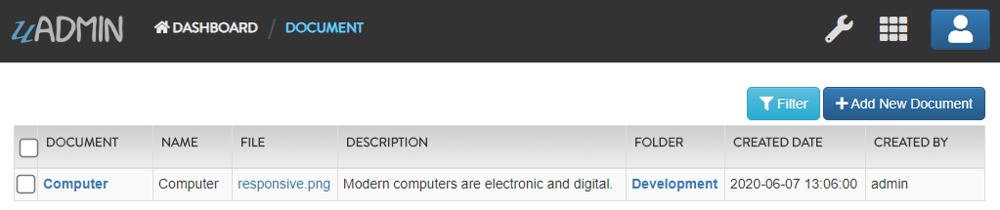

Document System Tutorial Part 7 - Register Inlines (Current Progress)
=====================================================================
`Back to Previous Page`_

.. _Back to Previous Page: https://uadmin-docs.readthedocs.io/en/latest/document_system/tutorial/part7.html

Structure:

* `models`_
    * `channel.go`_
    * `document_group.go`_
    * `document_user.go`_
    * `document_version.go`_
    * `document.go`_
    * `folder_group.go`_
    * `folder_user.go`_
    * `folder.go`_
* `main.go`_
* `uadmin.db`_
    * `Channels`_
    * `Documents`_
    * `Document Groups`_
    * `Document Users`_
    * `Document Versions`_
    * `Folder Groups`_
    * `Folder Users`_
    * `Folders`_
    * `Users`_

models
------
**channel.go**
^^^^^^^^^^^^^^
`Back to Top`_

.. code-block:: go

    package models

    import (
        "github.com/uadmin/uadmin"
    )

    // Channel !
    type Channel struct {
        uadmin.Model
        Name string `uadmin:"required"`
    }

**document_group.go**
^^^^^^^^^^^^^^^^^^^^^
`Back to Top`_

.. code-block:: go

    package models

    import (
        "github.com/uadmin/uadmin"
    )

    // DocumentGroup !
    type DocumentGroup struct {
        uadmin.Model
        Group      uadmin.UserGroup
        GroupID    uint
        Document   Document
        DocumentID uint
        Read       bool
        Add        bool
        Edit       bool
        Delete     bool
    }

    // DocumentGroup function that returns string value
    func (d *DocumentGroup) String() string {

        // Gives access to the fields in another model
        uadmin.Preload(d)

        // Returns the GroupName from the Group model
        return d.Group.GroupName
    }

**document_user.go**
^^^^^^^^^^^^^^^^^^^^
`Back to Top`_

.. code-block:: go

    package models

    import (
        "github.com/uadmin/uadmin"
    )

    // DocumentUser !
    type DocumentUser struct {
        uadmin.Model
        User       uadmin.User
        UserID     uint
        Document   Document
        DocumentID uint
        Read       bool
        Add        bool
        Edit       bool
        Delete     bool
    }

    // DocumentUser function that returns string value
    func (d *DocumentUser) String() string {

        // Gives access to the fields in another model
        uadmin.Preload(d)

        // Returns the full name from the User model
        return d.User.String()
    }

**document_version.go**
^^^^^^^^^^^^^^^^^^^^^^^
`Back to Top`_

.. code-block:: go

    package models

    import (
        "fmt"
        "time"

        "github.com/uadmin/uadmin"
    )

    // DocumentVersion !
    type DocumentVersion struct {
        uadmin.Model
        Document   Document
        DocumentID uint
        File       string `uadmin:"file"`
        Number     int    `uadmin:"help:version number"`
        Date       time.Time
    }

    // Returns the version number
    func (d DocumentVersion) String() string {
        return fmt.Sprint(d.Number)
    }

**document.go**
^^^^^^^^^^^^^^^
`Back to Top`_

.. code-block:: go

    package models

    import (
        "time"

        "github.com/uadmin/uadmin"
    )

    // Document !
    type Document struct {
        uadmin.Model
        Name        string
        File        string `uadmin:"file"`
        Description string `uadmin:"html"`
        RawText     string `uadmin:"list_exclude"`
        Folder      Folder `uadmin:"filter"`
        FolderID    uint
        CreatedDate time.Time
        Channel     Channel `uadmin:"list_exclude"`
        ChannelID   uint
        CreatedBy   string
    }

**folder_group.go**
^^^^^^^^^^^^^^^^^^^
`Back to Top`_

.. code-block:: go

    package models

    import (
        "github.com/uadmin/uadmin"
    )

    // FolderGroup !
    type FolderGroup struct {
        uadmin.Model
        Group    uadmin.UserGroup
        GroupID  uint
        Folder   Folder
        FolderID uint
        Read     bool
        Add      bool
        Edit     bool
        Delete   bool
    }

    // FolderGroup function that returns string value
    func (f *FolderGroup) String() string {

        // Gives access to the fields in another model
        uadmin.Preload(f)

        // Returns the GroupName from the Group model
        return f.Group.GroupName
    }

**folder_user.go**
^^^^^^^^^^^^^^^^^^
`Back to Top`_

.. code-block:: go

    package models

    import (
        "github.com/uadmin/uadmin"
    )

    // FolderUser !
    type FolderUser struct {
        uadmin.Model
        User     uadmin.User
        UserID   uint
        Folder   Folder
        FolderID uint
        Read     bool
        Add      bool
        Edit     bool
        Delete   bool
    }

    // FolderUser function that returns string value
    func (f *FolderUser) String() string {

        // Gives access to the fields in another model
        uadmin.Preload(f)

        // Returns the full name from the User model
        return f.User.String()
    }

**folder.go**
^^^^^^^^^^^^^
`Back to Top`_

.. code-block:: go

    package models

    import (
        "github.com/uadmin/uadmin"
    )

    // Folder !
    type Folder struct {
        uadmin.Model
        Name     string
        Parent   *Folder
        ParentID uint
    }

main.go
-------
`Back to Top`_

.. code-block:: go

    package main

    import (
        // Specify the username that you used inside github.com folder
        "github.com/username/document_system/models"
        "github.com/uadmin/uadmin"
    )

    func main() {
        // Register models to uAdmin
        uadmin.Register(
            models.Folder{},
            models.FolderGroup{},
            models.FolderUser{},
            models.Channel{},
            models.Document{},
            models.DocumentGroup{},
            models.DocumentUser{},
            models.DocumentVersion{},
        )

        // Register FolderGroup and FolderUser to Folder model
        uadmin.RegisterInlines(
            models.Folder{},
            map[string]string{
                "foldergroup": "FolderID",
                "folderuser":  "FolderID",
            },
        )

        // Register DocumentVersion, DocumentGroup, and DocumentUser to Document
        // model
        uadmin.RegisterInlines(
            models.Document{},
            map[string]string{
                "documentgroup":   "DocumentID",
                "documentuser":    "DocumentID",
                "documentversion": "DocumentID",
            },
        )

        // Assign Site Name value as "Document System"
        // NOTE: This code works only if database does not exist yet.
        uadmin.SiteName = "Document System"

        // Activates a uAdmin server
        uadmin.StartServer()
    }

uadmin.db
---------
**Channels**
^^^^^^^^^^^^
`Back to Top`_

.. image:: assets/channelmodelupdate.png

**Documents**
^^^^^^^^^^^^^
`Back to Top`_

**Document Groups**
^^^^^^^^^^^^^^^^^^^
`Back to Top`_

.. image:: assets/documentgroupmodelupdate.png

**Document Users**
^^^^^^^^^^^^^^^^^^
`Back to Top`_

.. image:: assets/documentusermodelupdate.png

**Document Versions**
^^^^^^^^^^^^^^^^^^^^^
`Back to Top`_

.. image:: assets/documentversionmodelupdate.png

**Folder Groups**
^^^^^^^^^^^^^^^^^
`Back to Top`_

.. image:: assets/foldergroupmodelupdate.png

**Folder Users**
^^^^^^^^^^^^^^^^
`Back to Top`_

.. image:: assets/folderusermodelupdate.png

**Folders**
^^^^^^^^^^^
`Back to Top`_

.. image:: assets/foldermodelupdate.png

**Users**
^^^^^^^^^
`Back to Top`_

.. _Back To Top: https://uadmin-docs.readthedocs.io/en/latest/document_system/tutorial/full_code/part7.html#document-system-tutorial-part-7-register-inlines-current-progress

.. image:: assets/usermodelupdate.png
