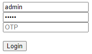

Login System Tutorial Part 3 - Sending Request
==============================================
In this tutorial, we will talk about sending data from login form in HTML to the LoginHandler.

First of all, let's create another input field in **login.html** for the OTP.

.. code-block:: html

    <form method="POST">
      <!-- Some codes -->

      <!-- ADD THIS CODE HERE -->
      <input type="text" name="otp" placeholder="OTP"> 
      <!------------------------>

       <button type="submit">Login</button> 
    </form>

Go to **login.go** in views folder and add the post form value parameters for the login request if the form request method is POST then check the results.

.. code-block:: go

    // LoginHandler verifies login data and creating sessions for users.
    func LoginHandler(w http.ResponseWriter, r *http.Request) {
        //  Some codes

        // ----------------- ADD THIS CODE HERE ------------------- //
        // If the request method is POST
        if r.Method == "POST" {
            // This is a login request from the user.
            username := r.PostFormValue("username")
            username = strings.TrimSpace(strings.ToLower(username))
            password := r.PostFormValue("password")
            otp := r.PostFormValue("otp")

            // Display the results here.
            uadmin.Trail(uadmin.DEBUG, "Username: %s", username)
            uadmin.Trail(uadmin.DEBUG, "Password: %s", password)
            uadmin.Trail(uadmin.DEBUG, "OTP: %s", otp)
        }
        // -------------------------------------------------------- //

        // Render the login filepath and pass the context data object to the HTML file.
        uadmin.RenderHTML(w, r, "templates/login.html", c)
    }

Run your application and go to the login path in the address bar (e.g. http://0.0.0.0:8080/login_system/). Assign the username, password, and OTP password in the login form (e.g. admin, admin, 123456). Click Login button to submit.

.. image:: assets/adminloginformdatatest.png
   :align: center

|

Check your terminal for the result.

.. code-block:: bash

    [  DEBUG ]   Username: admin
    [  DEBUG ]   Password: admin
    [  DEBUG ]   OTP: 123456

Now let's apply the login request to the Login2FA function in **login.go**. Login2FA login using username, password and otp for users with OTPRequired = true. This function will return the session key if the credentials are valid.

.. code-block:: go

    // If the request method is POST
    if r.Method == "POST" {
        // This is a login request from the user.
        username := r.PostFormValue("username")
        username = strings.TrimSpace(strings.ToLower(username))
        password := r.PostFormValue("password")
        otp := r.PostFormValue("otp")

        // -------------- ADD THIS CODE HERE -------------- //
        // Login2FA login using username, password and otp for users with OTPRequired = true.
        session := uadmin.Login2FA(r, username, password, otp)

        // Display the results here.
        uadmin.Trail(uadmin.DEBUG, "Session: %s", session)
        // ----------------------------------------------- //
    }

Run your application. Because we do not have a valid OTP yet, let's input only the valid username and the password (e.g. admin, admin).

|

Check your terminal for the result.

.. code-block:: bash

    [  DEBUG ]   Session: Ux6R9B0U3P70hXhMua7r9Fp3

Click `here`_ to view our progress so far.

In the `next part`_, we will discuss about checking the status of the user login with and without OTP validation.

.. _next part: https://uadmin-docs.readthedocs.io/en/latest/login_system_views/tutorial/part4.html

.. _here: https://uadmin-docs.readthedocs.io/en/latest/login_system_views/tutorial/full_code/part3.html

.. toctree::
   :maxdepth: 1

   full_code/part3
