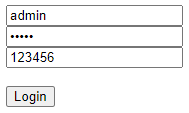

Login System Tutorial Part 5 - Home Page Access
===============================================
In this tutorial, we will talk about accessing the home page after the user logins an account with valid credentials.

Create a new file in the views folder named **home.go**. Inside the file, create a handler for the home page.

.. code-block:: go

    package views

    import (
        "net/http"

        "github.com/uadmin/uadmin"
    )

    // HomeHandler handles the home page.
    func HomeHandler(w http.ResponseWriter, r *http.Request, session *uadmin.Session) {
        // Initialize the fields that we need in the custom struct.
        type Context struct {
            User        string
            OTPRequired bool
        }

        // Call the custom struct and assign the full name in the User field under the context object.
        c := Context{}
        c.User = session.User.FirstName + " " + session.User.LastName

        // Check if the user has OTPRequired enabled in the database.
        if session.User.OTPRequired {
            /* Assign a boolean value to OTPRequired field. We will use this to manipulate the grammar
            in the UI. */
            c.OTPRequired = true
        }

        // Render the home filepath and pass the context data object to the HTML file.
        uadmin.RenderHTML(w, r, "templates/home.html", c)
        return
    }

Create a new file in the templates folder named **home.html**. Inside the file, let the user know that the user is logged in by displaying their full name and if the OTPRequired is enabled or not.

.. code-block:: html

    <!DOCTYPE html>
    <html lang="en">
      <head>
        <meta charset="UTF-8">
        <meta name="viewport" content="width=device-width, initial-scale=1.0">
        <meta http-equiv="X-UA-Compatible" content="ie=edge">
        <title>Home Page</title>
      </head>
      <body>
        <!-- .User is a field that came from the HomeHandler in Golang -->
        <h1>Login as {{.User}}

        <!-- Validate if the OTP is enabled in the user. Use "with" if the
        use has OTPRequired enabled in the database. Otherwise, use "without". -->
        {{if eq .OTPRequired true}} with {{else}} without {{end}}
        2FA Authentication</h1>
      </body>
    </html>

In **login.go**, add redirection to say that if the OTP has inputted properly, it will go to the path based on the value of the next.

.. code-block:: go

    // Check for OTP
    if session.PendingOTP {
        // Some codes

    } else {
        // ----------------- ADD THIS CODE HERE ----------------- //
        /* If the next value is empty, redirect the page that omits the logout keyword in the
        last part. */
        if r.URL.Query().Get("next") == "" {
            http.Redirect(w, r, strings.TrimSuffix(r.RequestURI, "logout"), http.StatusSeeOther)
            return
        }

        // Redirect to the page depending on the value of the next.
        http.Redirect(w, r, r.URL.Query().Get("next"), http.StatusSeeOther)
        return
        // ----------------------------------------------------- //
    }

Lastly, add an authentication in the **main.go** to say that this session is preloaded with a user. Otherwise, load the LoginHandler.

.. code-block:: go

    // MainHandler is the main handler for the login system.
    func MainHandler(w http.ResponseWriter, r *http.Request) {
        // r.URL.Path creates a new path called "/login_system/"
        r.URL.Path = strings.TrimPrefix(r.URL.Path, "/login_system")
        r.URL.Path = strings.TrimSuffix(r.URL.Path, "/")

        // -------------- ADD THIS CODE HERE -------------- //
        // Authentication : This session is preloaded with a user.
        session := uadmin.IsAuthenticated(r)
        if session == nil {
            // LoginHandler verifies login data and creating sessions for users.
            LoginHandler(w, r)
            return
        }

        // HomeHandler handles the home page.
        HomeHandler(w, r, session)
        return
        // ----------------------------------------------- //
    }

Now run your application and login your account.

.. image:: assets/adminuserpasshiddenotp.png
   :align: center

|

After the system validates the username and password, it will display the OTP input field in the UI. Check your terminal or Google Authenticator for the OTP (e.g. 123456).

|

Result

.. image:: assets/loginwith2faresult.png

|

Now go to the admin path in the address bar (e.g. http://localhost:8080/admin/). Inside the "USERS" model, disable the OTPRequired in the System Admin user.

.. image:: assets/otprequiredfalse.png

|

Go back to the login system path in the address bar (e.g. http://localhost:8080/login_system/). Assign the username and password in the login form (e.g. admin, admin). Click Login button to submit.

.. image:: assets/adminuserpasshiddenotp.png
   :align: center

|

Result

.. image:: assets/loginwithout2faresult.png

|

Click `here`_ to view our progress so far.

In the `next part`_, we will discuss about logging out a user account from the home page.

.. _next part: https://uadmin-docs.readthedocs.io/en/latest/login_system_views/tutorial/part6.html

.. _here: https://uadmin-docs.readthedocs.io/en/latest/login_system_views/tutorial/full_code/part5.html

.. toctree::
   :maxdepth: 1

   full_code/part5
