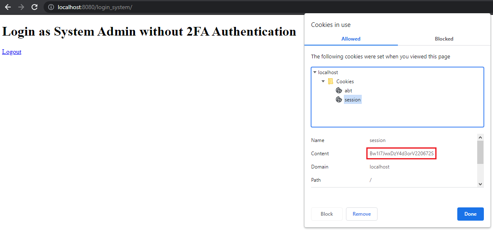
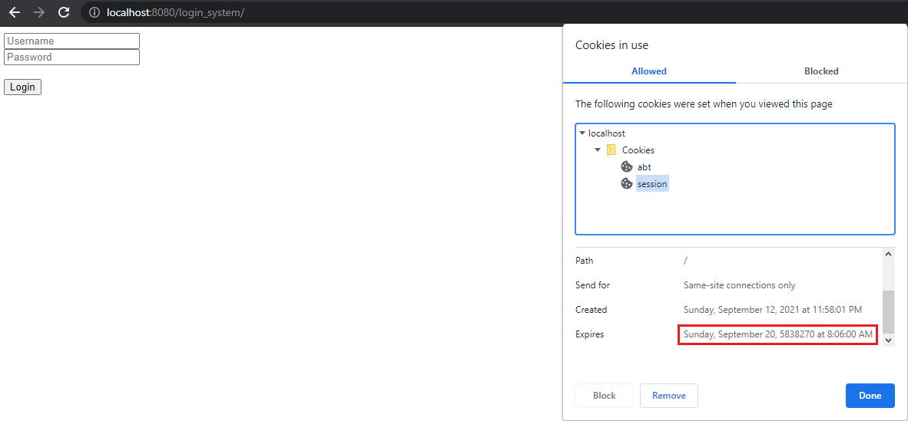

Login System Tutorial Part 6 - Logout
=====================================
In this tutorial, we will discuss about logging out a user account from the home page.

First of all, go to **home.html** in the templates folder and add the logout link text in the code.

.. code-block:: html

  <body>
    <!-- Some codes here -->

    <!-- ADD THIS CODE -->
    <a href="/login_system/logout" type="button">Logout</a>
    <!------------------->
  </body>

Create a new file in the views folder named **logout.go**. Inside the file, create a handler for the logout process.

.. code-block:: go

    package views

    import (
        "net/http"

        "github.com/uadmin/uadmin"
    )

    // LogoutHandler !
    func LogoutHandler(w http.ResponseWriter, r *http.Request, session *uadmin.Session) {
        // Log out the user.
        uadmin.Logout(r)

        // Expire all cookies on logout by setting MaxAge to be less than 0.
        for _, cookie := range r.Cookies() {
            c := &http.Cookie{
                Name:   cookie.Name,
                MaxAge: -1,
            }

            http.SetCookie(w, c)
        }
        http.Redirect(w, r, "/login_system/", http.StatusSeeOther)
    }

Lastly, add a validation depending on the request URL path in **main.go** under views folder.

.. code-block:: go

    // MainHandler is the main handler for the login system.
    func MainHandler(w http.ResponseWriter, r *http.Request) {
        // Some codes

        // ------------- ADD THIS CODE ------------- //
        if r.URL.Path == "" {
            // HomeHandler handles the home page.
            HomeHandler(w, r, session)
            return

        } else if r.URL.Path == "/logout" {
            /* If the request URL Path is /logout after the /login_system/, it will proceed to this part.
            e.g. localhost:8080/login_system/logout */

            // LogoutHandler handles the logout process for the user.
            LogoutHandler(w, r, session)
            return
        }
        // ---------------------------------------- //
    }

Now run your application and login your account where OTPRequired is disabled.

.. image:: assets/adminuserpasshiddenotp.png
   :align: center

|

Result

.. image:: assets/loginwithout2fawithlogout.png
   :align: center

|

Now let's try to manipulate the system. To ensure that login process really works, let's refresh the page and see what happens.

.. image:: assets/loginwithout2fawithlogout.png
   :align: center

|

Nice! The webpage sticks to the home page after we refresh it. Let's check if the session cookie is created in the browser.

|

Now let's click Logout and see what happens.

.. image:: assets/customloginform.png
   :align: center

|

Refresh the page one more time to ensure if logout process really works.

.. image:: assets/customloginform.png
   :align: center

|

Nice! The webpage sticks to the login page after we refresh it. Let's check if the session cookie is removed in the browser.

|

The session cookie is there by now but once you did anything in the browser such as clicking the login button or refreshing the page, the session cookie will disappear.

Same thing goes if the account you login has OTPRequired enabled.

.. image:: assets/adminuserpasshiddenotp.png
   :align: center

|

.. image:: assets/adminloginformdatatest.png
   :align: center

|

Result

.. image:: assets/sessioncookiebrowserloginotp.png
   :align: center

|

And if you click logout

|

Congrats, now you know how to do the following in the entire series:

* Preparing uAdmin files in the project folder
* Build an application from scratch
* Change the dashboard title
* Create custom login form in HTML
* Sending request from front-end to back-end
* Getting the session key based on the user credentials
* Setting an HTTP cookie
* OTP Scanning
* Logout user
* Deleting the cookie
* Maintaining the webpage based on the user login status

Click `here`_ to view the full progress of this application.

.. _here: https://uadmin-docs.readthedocs.io/en/latest/login_system_views/tutorial/full_code/part6.html

.. toctree::
   :maxdepth: 1

   full_code/part6

If you want to learn more and discover about the concepts of uAdmin, you may go to these references with examples:

* `API Reference`_
* `Quick Reference`_
* `System Reference`_
* `Tag Reference`_

.. _API Reference: https://uadmin-docs.readthedocs.io/en/latest/api.html
.. _Quick Reference: https://uadmin-docs.readthedocs.io/en/latest/quick_reference.html
.. _System Reference: https://uadmin-docs.readthedocs.io/en/latest/system_reference.html
.. _Tag Reference: https://uadmin-docs.readthedocs.io/en/latest/tags.html
