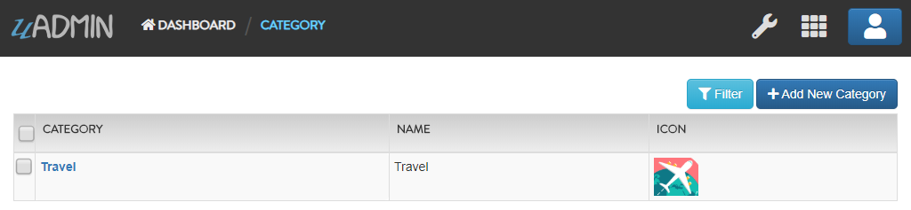
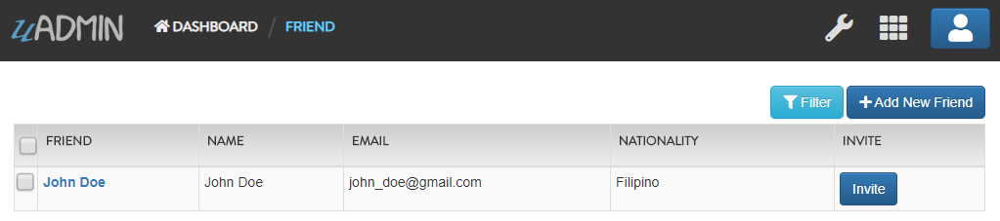
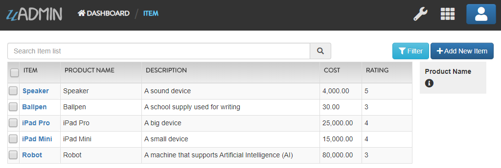
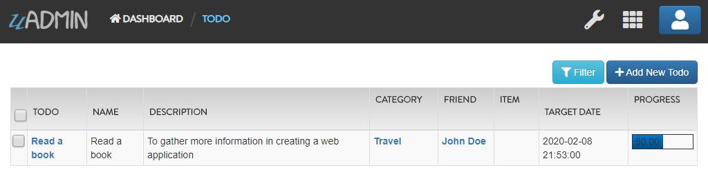

<<<<<<< HEAD
uAdmin Tutorial Part 6 - Applying uAdmin Tags (Current Progress)
================================================================
`Back to Previous Page`_

.. _Back to Previous Page: https://uadmin-docs.readthedocs.io/en/latest/tutorial/part6.html

Structure:

* `models`_
    * `category.go`_
    * `friend.go`_
    * `item.go`_
    * `todo.go`_
* `main.go`_
* `uadmin.db`_
    * `Categories`_
    * `Friends`_
    * `Items`_
    * `Todos`_

.. _models: https://uadmin-docs.readthedocs.io/en/latest/tutorial/full_code/part6.html#id1
.. _category.go: https://uadmin-docs.readthedocs.io/en/latest/tutorial/full_code/part6.html#id2
.. _friend.go: https://uadmin-docs.readthedocs.io/en/latest/tutorial/full_code/part6.html#id3
.. _item.go: https://uadmin-docs.readthedocs.io/en/latest/tutorial/full_code/part6.html#id4
.. _todo.go: https://uadmin-docs.readthedocs.io/en/latest/tutorial/full_code/part6.html#id5
.. _main.go: https://uadmin-docs.readthedocs.io/en/latest/tutorial/full_code/part6.html#id6
.. _uadmin.db: https://uadmin-docs.readthedocs.io/en/latest/tutorial/full_code/part6.html#id7
.. _Categories: https://uadmin-docs.readthedocs.io/en/latest/tutorial/full_code/part6.html#id8
.. _Friends: https://uadmin-docs.readthedocs.io/en/latest/tutorial/full_code/part6.html#id9
.. _Items: https://uadmin-docs.readthedocs.io/en/latest/tutorial/full_code/part6.html#id10
.. _Todos: https://uadmin-docs.readthedocs.io/en/latest/tutorial/full_code/part6.html#id11

models
------

**category.go**
^^^^^^^^^^^^^^^
`Back to Top`_

.. code-block:: go

    package models

    import (
        "github.com/uadmin/uadmin"
    )

    // Category Model !
    type Category struct {
        uadmin.Model
        Name string `uadmin:"required"`
        Icon string `uadmin:"image"`
    }

**friend.go**
^^^^^^^^^^^^^^^
`Back to Top`_

.. code-block:: go

    package models

    import (
        "github.com/uadmin/uadmin"
    )

    // Nationality Field !
    type Nationality int

    // Chinese !
    func (Nationality) Chinese() Nationality {
        return 1
    }

    // Filipino !
    func (Nationality) Filipino() Nationality {
        return 2
    }

    // Others !
    func (Nationality) Others() Nationality {
        return 3
    }

    // Friend Model !
    type Friend struct {
        uadmin.Model
        Name        string `uadmin:"required"`
        Email       string `uadmin:"email"`
        Password    string `uadmin:"password;list_exclude"`
        Nationality Nationality
        Invite      string `uadmin:"link"`
    }

    // Save !
    func (f *Friend) Save() {
        f.Invite = "https://www.google.com/"
        uadmin.Save(f)
    }

**item.go**
^^^^^^^^^^^
`Back to Top`_

.. code-block:: go

    package models

    import (
        "github.com/uadmin/uadmin"
    )

    // Item Model !
    type Item struct {
        uadmin.Model
        Name        string `uadmin:"required;search;categorical_filter;filter;display_name:Product Name;default_value:Computer"`
        Description string `uadmin:"multilingual"`
        Cost        int    `uadmin:"money;pattern:^[0-9]*$;pattern_msg:Your input must be a number.;help:Input numeric characters only in this field."`
        Rating      int    `uadmin:"min:1;max:5"`
    }

**todo.go**
^^^^^^^^^^^
`Back to Top`_

.. code-block:: go

    package models

    import (
        "time"

        "github.com/uadmin/uadmin"
    )

    // Todo Model !
    type Todo struct {
        uadmin.Model
        Name        string
        Description string `uadmin:"html"`
        Category    Category
        CategoryID  uint
        Friend      Friend `uadmin:"help:Who will be a part of your activity?"`
        FriendID    uint
        Item        Item `uadmin:"help:What are the requirements needed in order to accomplish your activity?"`
        ItemID      uint
        TargetDate  time.Time
        Progress    int `uadmin:"progress_bar"`
    }

main.go
-------
`Back to Top`_

.. code-block:: go

    package main

    import (
        // Specify the username that you used inside github.com folder
        "github.com/username/todo/models"

        "github.com/uadmin/uadmin"
    )

    func main() {
        uadmin.Register(
            models.Todo{},
            models.Category{},
            models.Friend{},
            models.Item{},
        )

        uadmin.RegisterInlines(models.Category{}, map[string]string{
            "Todo": "CategoryID",
        })
        uadmin.RegisterInlines(models.Friend{}, map[string]string{
            "Todo": "FriendID",
        })
        uadmin.RegisterInlines(models.Item{}, map[string]string{
            "Todo": "ItemID",
        })

        uadmin.StartServer()
    }

uadmin.db
---------

**Categories**
^^^^^^^^^^^^^^
`Back to Top`_

**Friends**
^^^^^^^^^^^
`Back to Top`_

**Items**
^^^^^^^^^
`Back to Top`_

**Todos**
^^^^^^^^^
`Back to Top`_

.. _Back To Top: https://uadmin-docs.readthedocs.io/en/latest/tutorial/full_code/part6.html#uadmin-tutorial-part-6-applying-uadmin-tags-current-progress

=======
uAdmin Tutorial Part 6 - Applying uAdmin Tags (Current Progress)
================================================================
`Back to Previous Page`_

.. _Back to Previous Page: https://uadmin-docs.readthedocs.io/en/latest/tutorial/part6.html

Structure:

* `models`_
    * `category.go`_
    * `friend.go`_
    * `item.go`_
    * `todo.go`_
* `main.go`_
* `uadmin.db`_
    * `Categories`_
    * `Friends`_
    * `Items`_
    * `Todos`_

.. _models: https://uadmin-docs.readthedocs.io/en/latest/tutorial/full_code/part6.html#id1
.. _category.go: https://uadmin-docs.readthedocs.io/en/latest/tutorial/full_code/part6.html#id2
.. _friend.go: https://uadmin-docs.readthedocs.io/en/latest/tutorial/full_code/part6.html#id3
.. _item.go: https://uadmin-docs.readthedocs.io/en/latest/tutorial/full_code/part6.html#id4
.. _todo.go: https://uadmin-docs.readthedocs.io/en/latest/tutorial/full_code/part6.html#id5
.. _main.go: https://uadmin-docs.readthedocs.io/en/latest/tutorial/full_code/part6.html#id6
.. _uadmin.db: https://uadmin-docs.readthedocs.io/en/latest/tutorial/full_code/part6.html#id7
.. _Categories: https://uadmin-docs.readthedocs.io/en/latest/tutorial/full_code/part6.html#id8
.. _Friends: https://uadmin-docs.readthedocs.io/en/latest/tutorial/full_code/part6.html#id9
.. _Items: https://uadmin-docs.readthedocs.io/en/latest/tutorial/full_code/part6.html#id10
.. _Todos: https://uadmin-docs.readthedocs.io/en/latest/tutorial/full_code/part6.html#id11

models
------

**category.go**
^^^^^^^^^^^^^^^
`Back to Top`_

.. code-block:: go

    package models

    import (
        "github.com/uadmin/uadmin"
    )

    // Category Model !
    type Category struct {
        uadmin.Model
        Name string `uadmin:"required"`
        Icon string `uadmin:"image"`
    }

**friend.go**
^^^^^^^^^^^^^^^
`Back to Top`_

.. code-block:: go

    package models

    import (
        "github.com/uadmin/uadmin"
    )

    // Nationality Field !
    type Nationality int

    // Chinese !
    func (Nationality) Chinese() Nationality {
        return 1
    }

    // Filipino !
    func (Nationality) Filipino() Nationality {
        return 2
    }

    // Others !
    func (Nationality) Others() Nationality {
        return 3
    }

    // Friend Model !
    type Friend struct {
        uadmin.Model
        Name        string `uadmin:"required"`
        Email       string `uadmin:"email"`
        Password    string `uadmin:"password;list_exclude"`
        Nationality Nationality
        Invite      string `uadmin:"link"`
    }

    // Save !
    func (f *Friend) Save() {
        f.Invite = "https://www.google.com/"
        uadmin.Save(f)
    }

**item.go**
^^^^^^^^^^^
`Back to Top`_

.. code-block:: go

    package models

    import (
        "github.com/uadmin/uadmin"
    )

    // Item Model !
    type Item struct {
        uadmin.Model
        Name        string `uadmin:"required;search;categorical_filter;filter;display_name:Product Name;default_value:Computer"`
        Description string `uadmin:"multilingual"`
        Cost        int    `uadmin:"money;pattern:^[0-9]*$;pattern_msg:Your input must be a number.;help:Input numeric characters only in this field."`
        Rating      int    `uadmin:"min:1;max:5"`
    }

**todo.go**
^^^^^^^^^^^
`Back to Top`_

.. code-block:: go

    package models

    import (
        "time"

        "github.com/uadmin/uadmin"
    )

    // Todo Model !
    type Todo struct {
        uadmin.Model
        Name        string
        Description string `uadmin:"html"`
        Category    Category
        CategoryID  uint
        Friend      Friend `uadmin:"help:Who will be a part of your activity?"`
        FriendID    uint
        Item        Item `uadmin:"help:What are the requirements needed in order to accomplish your activity?"`
        ItemID      uint
        TargetDate  time.Time
        Progress    int `uadmin:"progress_bar"`
    }

main.go
-------
`Back to Top`_

.. code-block:: go

    package main

    import (
        // Specify the username that you used inside github.com folder
        "github.com/username/todo/models"

        "github.com/uadmin/uadmin"
    )

    func main() {
        uadmin.Register(
            models.Todo{},
            models.Category{},
            models.Friend{},
            models.Item{},
        )

        uadmin.RegisterInlines(models.Category{}, map[string]string{
            "Todo": "CategoryID",
        })
        uadmin.RegisterInlines(models.Friend{}, map[string]string{
            "Todo": "FriendID",
        })
        uadmin.RegisterInlines(models.Item{}, map[string]string{
            "Todo": "ItemID",
        })

        uadmin.StartServer()
    }

uadmin.db
---------

**Categories**
^^^^^^^^^^^^^^
`Back to Top`_

**Friends**
^^^^^^^^^^^
`Back to Top`_

**Items**
^^^^^^^^^
`Back to Top`_

**Todos**
^^^^^^^^^
`Back to Top`_

.. _Back To Top: https://uadmin-docs.readthedocs.io/en/latest/tutorial/full_code/part6.html#uadmin-tutorial-part-6-applying-uadmin-tags-current-progress

>>>>>>> de25cdd8a29ca2bb2c2df08be00b703b967aaed5
