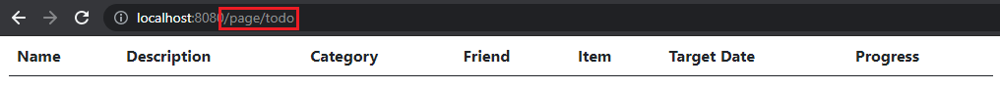

<<<<<<< HEAD
uAdmin Tutorial Part 13 - Accessing an HTML file
================================================
In this part, we will talk about establishing a connection to the HTTP Handler, setting the URL path name, and executing an HTML file.

Go to view.go inside the views folder with the following codes below:

.. code-block:: go

    package views

    import (
        "net/http"
        "strings"
    )

    // HTTPHandler !
    func HTTPHandler(w http.ResponseWriter, r *http.Request) {
        // r.URL.Path creates a new path called "/http_handler"
        r.URL.Path = strings.TrimPrefix(r.URL.Path, "/http_handler")
        r.URL.Path = strings.TrimSuffix(r.URL.Path, "/")
    }

Establish a connection in the main.go to the views by using http.HandleFunc. It should be placed after the uadmin.Register and before the StartServer.

.. code-block:: go

    import (
        "net/http"

        // Specify the username that you used inside github.com folder
        "github.com/username/todo/api"
        "github.com/username/todo/models"

        // Import this library
        "github.com/username/todo/views"

        "github.com/uadmin/uadmin"
    )

    func main() {
        // Some codes

        // HTTP UI Handler
        http.HandleFunc("/http_handler/", uadmin.Handler(views.HTTPHandler))
    }

Create a file named todo_view.go inside the views folder with the following codes below:

.. code-block:: go

    package views

    import (
        "html/template"
        "net/http"
        "strings"

        "github.com/uadmin/uadmin"
    )

    // TodoHandler !
    func TodoHandler(w http.ResponseWriter, r *http.Request) {
        // TodoList field inside the Context that will be used in Golang
        // HTML template
        type Context struct {
            TodoList []map[string]interface{}
        }

        // Assigns Context struct to the c variable
        c := Context{}

        // Pass TodoList data object to the specified HTML path
        uadmin.RenderHTML(w, r, "templates/todo.html", c)
    }

Finally, add this piece of code in the view.go shown below. This will establish a communication between the HTTPHandler and the TodoHandler.

.. code-block:: go

    // HTTPHandler !
    func HTTPHandler(w http.ResponseWriter, r *http.Request) {
        // r.URL.Path creates a new path called "/http_handler/"
        r.URL.Path = strings.TrimPrefix(r.URL.Path, "/http_handler")
        r.URL.Path = strings.TrimSuffix(r.URL.Path, "/")

        if strings.HasPrefix(r.URL.Path, "/todo") {
            TodoHandler(w, r)
            return
        }
    }

Now run your application, go to http://localhost:8080/http_handler/todo path and see what happens.

|

Click `here`_ to view our progress so far.

In the `next part`_, we will discuss about fetching the records in the API and migrating the data from API to HTML that will display the records using Go template.

.. _here: https://uadmin-docs.readthedocs.io/en/latest/tutorial/full_code/part13.html
.. _next part: https://uadmin-docs.readthedocs.io/en/latest/tutorial/part14.html

.. toctree::
   :maxdepth: 1

   full_code/part13
=======
uAdmin Tutorial Part 13 - Accessing an HTML file
================================================
In this part, we will talk about establishing a connection to the HTTP Handler, setting the URL path name, and executing an HTML file.

Go to view.go inside the views folder with the following codes below:

.. code-block:: go

    package views

    import (
        "net/http"
        "strings"
    )

    // HTTPHandler !
    func HTTPHandler(w http.ResponseWriter, r *http.Request) {
        // r.URL.Path creates a new path called "/http_handler"
        r.URL.Path = strings.TrimPrefix(r.URL.Path, "/http_handler")
        r.URL.Path = strings.TrimSuffix(r.URL.Path, "/")
    }

Establish a connection in the main.go to the views by using http.HandleFunc. It should be placed after the uadmin.Register and before the StartServer.

.. code-block:: go

    import (
        "net/http"

        // Specify the username that you used inside github.com folder
        "github.com/username/todo/api"
        "github.com/username/todo/models"

        // Import this library
        "github.com/username/todo/views"

        "github.com/uadmin/uadmin"
    )

    func main() {
        // Some codes

        // HTTP UI Handler
        http.HandleFunc("/http_handler/", uadmin.Handler(views.HTTPHandler))
    }

Create a file named todo_view.go inside the views folder with the following codes below:

.. code-block:: go

    package views

    import (
        "html/template"
        "net/http"
        "strings"

        "github.com/uadmin/uadmin"
    )

    // TodoHandler !
    func TodoHandler(w http.ResponseWriter, r *http.Request) {
        // TodoList field inside the Context that will be used in Golang
        // HTML template
        type Context struct {
            TodoList []map[string]interface{}
        }

        // Assigns Context struct to the c variable
        c := Context{}

        // Pass TodoList data object to the specified HTML path
        uadmin.RenderHTML(w, r, "templates/todo.html", c)
    }

Finally, add this piece of code in the view.go shown below. This will establish a communication between the HTTPHandler and the TodoHandler.

.. code-block:: go

    // HTTPHandler !
    func HTTPHandler(w http.ResponseWriter, r *http.Request) {
        // r.URL.Path creates a new path called "/http_handler/"
        r.URL.Path = strings.TrimPrefix(r.URL.Path, "/http_handler")
        r.URL.Path = strings.TrimSuffix(r.URL.Path, "/")

        if strings.HasPrefix(r.URL.Path, "/todo") {
            TodoHandler(w, r)
            return
        }
    }

Now run your application, go to http://localhost:8080/http_handler/todo path and see what happens.

|

Click `here`_ to view our progress so far.

In the `next part`_, we will discuss about fetching the records in the API and migrating the data from API to HTML that will display the records using Go template.

.. _here: https://uadmin-docs.readthedocs.io/en/latest/tutorial/full_code/part13.html
.. _next part: https://uadmin-docs.readthedocs.io/en/latest/tutorial/part14.html

.. toctree::
   :maxdepth: 1

   full_code/part13
>>>>>>> de25cdd8a29ca2bb2c2df08be00b703b967aaed5
