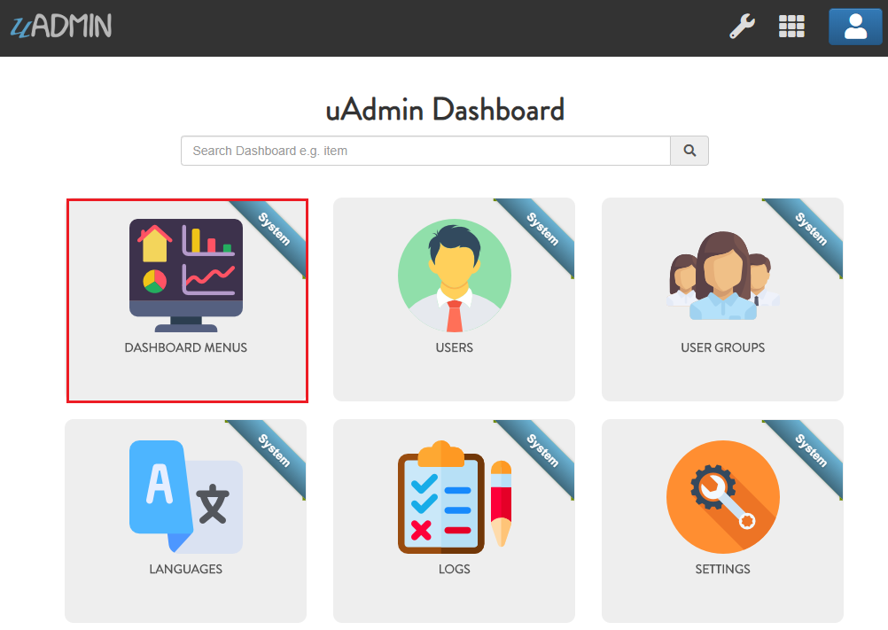
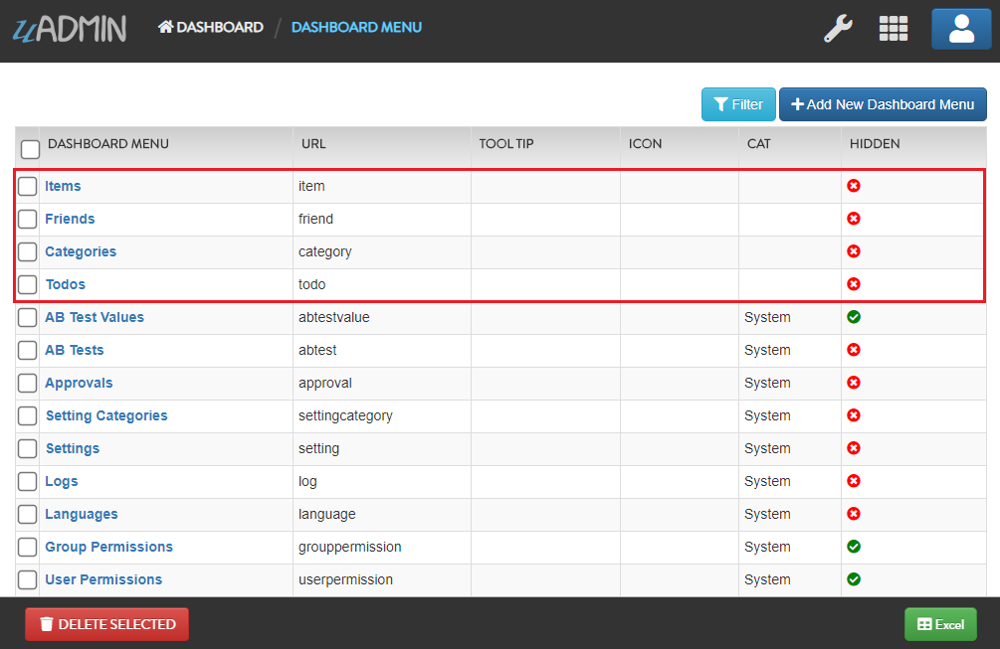
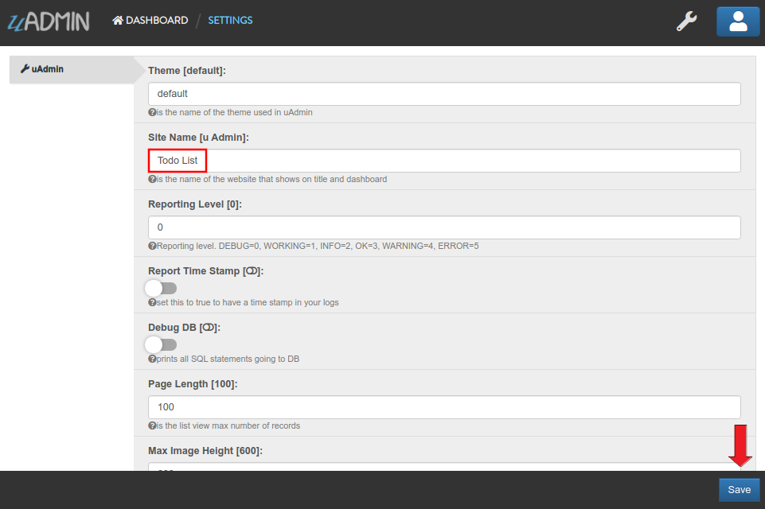

uAdmin Tutorial Part 17 - Wrapping Up Your Application
======================================================
So far you have developed this really cool application that you want to show to your your customer or even to the world. Before you dockerize your application, let's customize your dashboard in a fashionable way. Making it look good and customizing it to meet your customers requirements is important to the success of your app.

First of all, open **DASHBOARD MENUS**.

|

Open the models that you have created and let's add the Tool Tip that means the information you want to show when you hover the mouse to the model, an icon that you like to represent in the dashboard, and Cat which is the highlight of your model.

|

By default any model that does not have an icon gets this icon:

.. image:: assets/defaulticon.png
   :align: center

If you don't have any pictures or icons in your computer, I would recommend you to go over `flaticon.com`_, but you can browse anywhere online. Once you search for an icon, download the PNG version and choose the size 128 pixels.

.. _flaticon.com: https://www.flaticon.com/

.. image:: assets/flaticon128px.png

|

Result of my dashboard setup

.. image:: assets/uadmindashboardtodo.png

|

Let's change the title of the dashboard in general. Choose **ANY** of these methods that you prefer.

* `Method 1: Within the Application Settings`_
* `Method 2: ParseFormValue Function`_

**Method 1: Within the Application Settings**
---------------------------------------------
Run your application. From uAdmin dashboard, click the wrench icon on the top right side to go to the settings.

.. image:: ../system-reference/assets/wrenchiconfromdashboard.png

|

Assign the Site Name in the input field. Save it afterwards.

**Method 2: ParseFormValue Function**
-------------------------------------
Go to the main.go and assign site name in the settings.

.. code-block:: go

    func main() {
        // RegisterInlines codes

        // Call InitializeSiteName function to assign the SiteName value in the Settings model.
        InitializeSiteName()

        // UI Handlers
    }

    func InitializeSiteName() {
        // Assign Site Name in the Settings
        setting = uadmin.Setting{}
        uadmin.Get(&setting, "code = ?", "uAdmin.SiteName")
        setting.ParseFormValue([]string{"Todo List"})
        setting.Save()
    }

Result

.. image:: assets/todolisttitle.png

Once you are done with the setup, it's about time to dockerize your application for the world to see. Go to the `Docker Website`_ for more details.

.. _Docker Website: https://www.docker.com/

Congrats, now you know how to do the following in the entire series:

* Preparing uAdmin files in the project folder
* Build an application from scratch
* Creating external models
* Crop an image
* Using Register Inlines
* Adding a drop down list to the field manually
* Applying different uAdmin tags
* Using M2M (Many-to-many) for multiselection feature
* Functional back-end validation
* API setup and configuration
* HTML Template concepts
* Access an HTML file
* Migration of data
* Generate a self-signed SSL certificate
* Implementing two factor authentication (2FA)
* Reset your password by email
* Hash salt
* Encrypt your database
* Change the dashboard title
* Customize your dashboard
* Dockerize your application online

Click `here`_ to view the full progress of this application.

.. _here: https://uadmin-docs.readthedocs.io/en/latest/tutorial/full_code/part17.html

.. toctree::
   :maxdepth: 1

   full_code/part17

If you want to learn more and discover about the concepts of uAdmin, you may go to these references with examples:

* `API Reference`_
* `Quick Reference`_
* `System Reference`_
* `Tag Reference`_

.. _API Reference: https://uadmin-docs.readthedocs.io/en/latest/api.html
.. _Quick Reference: https://uadmin-docs.readthedocs.io/en/latest/quick_reference.html
.. _System Reference: https://uadmin-docs.readthedocs.io/en/latest/system_reference.html
.. _Tag Reference: https://uadmin-docs.readthedocs.io/en/latest/tags.html
