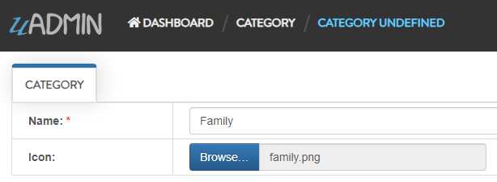
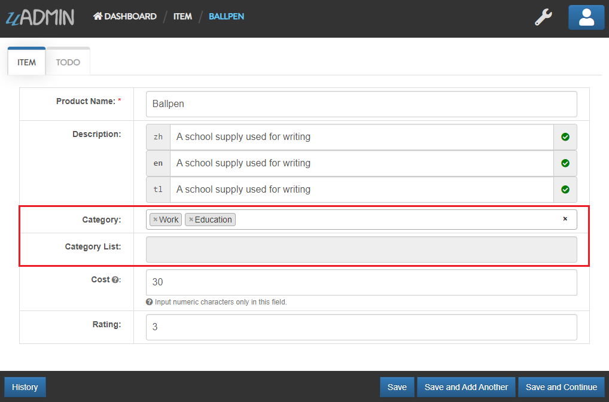

uAdmin Tutorial Part 7 - M2M (Many-to-many)
===========================================
uAdmin has a multiselection feature that allows you to select multiple values inside an input box field.

Before we proceed, run your application first. Let's add more records in the Category model.

**First Record**

.. image:: assets/addnewworkrecord.png
   :align: center

|

**Second Record**

|

**Third Record**

.. image:: assets/addneweducationrecord.png
   :align: center

|

Result

.. image:: assets/addnewcategoryresult.png
   :align: center

|

Exit your application. Let's add **Category** field with the array data type of the Category model, set the type tag as "list_exclude", and add **CategoryList** field as well with the type tag "read_only" in **models/category.go** so we can see the result in the list page after you save the record.

.. code-block:: go

    Category     []Category `uadmin:"list_exclude"`
    CategoryList string     `uadmin:"read_only"`

Expected result
 
.. code-block:: go

    // Item Model !
    type Item struct {
        uadmin.Model
        Name         string     `uadmin:"search;categorical_filter;filter;display_name:Product Name"`
        Description  string     `uadmin:"multilingual"`

        // FIELDS ADDED
        Category     []Category `uadmin:"list_exclude"`
        CategoryList string     `uadmin:"read_only"`

        Cost         int        `uadmin:"money;pattern:^[0-9]*$;pattern_msg:Your input must be a number."`
        Rating       int        `uadmin:"min:1;max:5"`
    }

Copy this one as well and paste it below the Item struct.

.. code-block:: go

    // Save !
    func (i *Item) Save() {
        // Add a new string array type variable called categoryList
        categoryList := []string{}

        // Append every element to the categoryList array
        for c := range i.Category {
            categoryList = append(categoryList, i.Category[c].Name)
        }

        // Concatenate the categoryList to a single string separated by comma
        joinList := strings.Join(categoryList, ", ")

        // Store the joined string to the CategoryList field
        i.CategoryList = joinList

        // Save it to the database
        uadmin.Save(i)
    }

Now run your application, go to **ITEMS** model from uAdmin dashboard, and inside it, click **Add New Item** button on the top right corner. In the Category field, add new tag there.

|

Result

.. image:: assets/m2mtagappliedoutput.png

|

Well done! Now you know how to create multiple elements in M2M tag field and concatenate into a single string stored in another field to display in the list page.

Click `here`_ to view our progress so far.

In the `next part`_, we will discuss on how to apply validation in the back-end.

.. _here: https://uadmin-docs.readthedocs.io/en/latest/tutorial/full_code/part7.html
.. _next part: https://uadmin-docs.readthedocs.io/en/latest/tutorial/part8.html

.. toctree::
   :maxdepth: 1

   full_code/part7
